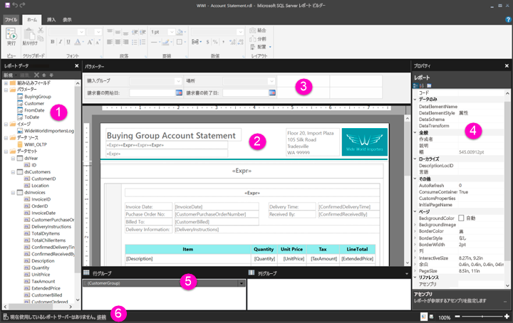

# ページ分割されたレポート用のレポート デザイン ビュー内を移動する

[!INCLUDE [applies-to](../includes/applies-to.md)] [!INCLUDE [yes-service](../includes/yes-service.md)] [!INCLUDE [yes-paginated](../includes/yes-paginated.md)] [!INCLUDE [yes-premium](../includes/yes-premium.md)] [!INCLUDE [no-desktop](../includes/no-desktop.md)] 

Power BI レポート ビルダーのレポート デザイン ビューは、Power BI サービスに発行できるページ分割されたレポートを作成するためのデザイン領域です。 デザイン サーフェイスはレポート ビルダーの中央に表示され、周囲にはリボンやペインがあります。 デザイン画面は、レポート アイテムの追加や整理を行うための領域です。 この記事では、レポート リソースの追加、選択、整理や、レポート アイテムのプロパティの変更に使用するペインについて説明します。  

1. [[レポート データ] ペイン](#1-report-data-pane) 
2. [レポート デザイン サーフェイス](#2-report-design-surface)  
3. [[パラメーター] ペイン](#3-parameters-pane) 
4. [プロパティ ペイン](#4-properties-pane) 
5. [グループ化ペイン](#5-grouping-pane) 
6. [現在のレポートのステータス バー](#6-current-report-status-bar)  
  
## 1 [レポート データ] ペイン  
 レポート データ ペインから、レポート レイアウトをデザインする前にレポートに必要なレポート データおよびレポート リソースを定義します。 たとえば、レポート データ ペインに、データ ソース、データセット、計算フィールド、レポート パラメーター、および画像を追加することができます。  
  
 レポート データ ペインにアイテムを追加した後、レポート内でデータが表示される場所を制御するにはデザイン画面のレポート アイテムにフィールドをドラッグします。  
  
> [!TIP]  
>  フィールドをテーブルやグラフなどのデータ領域に配置せずに、レポート データ ペインからレポート デザイン画面に直接ドラッグすると、レポートを実行する際に、そのフィールドのデータの最初の値のみが表示されます。  
  
 組み込みフィールドをレポート データ ペインからレポート デザイン画面にドラッグすることもできます。 これらのフィールドを表示すると、レポート名、レポートの総ページ数、現在のページ番号など、レポートに関する情報が示されます。  
  
 対応するアイテムをレポート デザイン画面に追加すると、レポート データ ペインに自動的に追加されるものもあります。 たとえば、レポートに画像を埋め込むと、[レポート データ] ペインの画像フォルダーに追加されます。  
  
> [!NOTE]  
>  レポート データ ペインに新しいアイテムを追加するには、 **[新規作成]** ボタンを使用します。 同一のデータ ソースまたは別のデータ ソースから複数のデータセットをレポートに追加できます。 同じデータ ソースから新しいデータセットを追加するには、データ ソースを右クリックして、 **[データセットの追加]** を選択します。  
  
## 2 レポート デザイン サーフェイス  
 レポート ビルダーのレポート デザイン画面は、レポートをデザインするためのメイン作業領域です。 データ領域、サブレポート、テキスト ボックス、画像、四角形、線などのレポート アイテムをレポートに配置するには、それらのアイテムをリボンまたはレポート パーツ ギャラリーからデザイン画面に追加します。 その場合、グループ、式、パラメーター、フィルター、アクション、表示設定、および書式設定をレポート アイテムに追加できます。  
  
 また、次のものを変更することもできます。  
  
-   罫線や塗りつぶし色などのレポート本文のプロパティ。デザイン サーフェイスでレポート アイテムの外側の空白領域を右クリックして、 **[本文のプロパティ]** を選択します。  
  
-   罫線や塗りつぶし色などのヘッダーとフッターのプロパティ。デザイン サーフェイスでレポート アイテムの外側のヘッダーまたはフッター領域の空白領域を右クリックして、 **[ヘッダーのプロパティ]** または **[フッターのプロパティ]** を選択します。  
  
-   ページ設定などのレポート自体のプロパティ。デザイン サーフェイスの周りの灰色の領域を右クリックして、 **[レポートのプロパティ]** を選択します。  
  
-   レポート アイテムのプロパティ。アイテムを右クリックして、 **[プロパティ]** を選択します。  
  
### デザイン サーフェイスのサイズと印刷領域  
デザイン画面のサイズは、レポートを印刷する際に指定するページ サイズの印刷領域とは異なる場合があります。 デザイン画面のサイズを変更しても、レポートの印刷領域は変わりません。 レポートの印刷領域に設定したサイズに関係なく、デザイン領域全体のサイズは変わりません。 詳細については、レンダリングの動作に関する記事を参照してください。 
  
- ルーラーを表示するには、 **[表示]** タブの **[ルーラー]** チェック ボックスをオンにします。  
  
## 3 [パラメーター] ペイン  
 レポート パラメーターを使用すると、レポート データの制御、他のレポートとの関連付け、レポートの表示方法の変更が可能になります。 パラメーター ペインでは、レポート パラメーターを自由自在に配置できます。  
  
 詳細については、レポート パラメーターに関する記事を参照してください   
  
## 4 [プロパティ] ペイン
 データ領域、画像、テキスト ボックス、レポート本文など、レポート内のすべてのアイテムには、対応するプロパティが存在します。 たとえば、テキスト ボックスの BorderColor プロパティには、テキスト ボックスの境界線の色値が表示され、レポートの PageSize プロパティには、レポートのページ サイズが表示されます。  
  
 これらのプロパティは、[プロパティ] ペインに表示されます。 このペインに表示されるプロパティは、選択されたレポート アイテムによって変化します。  
  
- [プロパティ] ペインを表示するには、 **[表示]** タブの **[表示/非表示]** グループで **[プロパティ]** を選択します。  
  
### プロパティ値の変更  
 レポート ビルダーでは、いくつかの方法でレポート アイテムのプロパティを変更できます。  
  
-   リボンのボタンとリストを選択します。  
  
-   ダイアログ ボックスで設定を変更する。  
  
-   [プロパティ] ペインでプロパティ値を変更する。  
  
 使用頻度の高いプロパティについては、ダイアログ ボックスおよびリボンで設定できるようになっています。  
  
 プロパティにより、ドロップダウン リストからプロパティ値を設定したり、値を入力したり、`<Expression>` を選択して式を作成したりできます。  
  
### [プロパティ] ペインの表示の変更  
 既定では、[プロパティ] ペインに表示されるプロパティが、[アクション]、[罫線]、[塗りつぶし]、[フォント]、[全般] など、大まかなカテゴリ別に表示されます。 各カテゴリには、一連のプロパティが関連付けられています。 たとえば、[フォント] カテゴリには、Color、FontFamily、FontSize、FontStyle、FontWeight、LineHeight、TextDecoration などのプロパティが一覧表示されます。 必要であれば、このペイン内のすべてのプロパティをアルファベット順に表示することもできます。 この場合、カテゴリは非表示になり、すべてのプロパティがカテゴリに関係なく、アルファベット順に一覧表示されます。  
  
 [プロパティ] ペインの上部には、 **[カテゴリ]** 、 **[Alphabetize]\(アルファベット順\)** 、 **[Property Page]\(プロパティ ページ\)** の 3 つのボタンがあります。 [プロパティ] ペインの表示を切り替えるには、[カテゴリ] ボタンと [Alphabetize]\(アルファベット順\) ボタンを選択します。 選択したレポート アイテムの [プロパティ] ダイアログ ボックスを開くには、 **[Property Page]\(プロパティ ページ\)** 選択します。  
  
  
## 5 [グループ化] ペイン

 グループは、レポート データを整理して階層構造で表示したり、合計を計算したりする際に使用します。 データ領域内の行グループおよび列グループは、デザイン画面で表示できるほか、グループ化ペインで表示することもできます。 グループ化ペインには、行グループ ペインと列グループ ペインという 2 つのペインがあります。 データ領域を選択すると、グループ化ペインに、そのデータ領域内のすべてのグループが階層リストとして表示され、子グループが対応する親グループの下に表示されます。  
  
 グループは、レポート データ ペインからフィールドをドラッグし、デザイン画面またはグループ化ペインにドロップすることによって作成できます。 グループ化ペインでは、親グループ、隣接グループ、および子グループを追加できるほか、グループ プロパティの変更およびグループの削除を行えます。  
  
 [グループ化] ペインは既定で表示されますが、[表示] タブで [グループ化ペイン] チェック ボックスをオフにして閉じることができます。グラフまたはゲージ データ領域については、[グループ化] ペインを使用できません。  
  
 詳細については、グループ化ペインおよびグループの概要に関する記事を参照してください。  
  
## 6 現在のレポート ステータス バー

現在のレポート ステータス バーには、レポートの接続先サーバーの名前または "現在使用しているレポート サーバーはありません" が表示されます。 **[接続]** を選択して、サーバーに接続できます。

## 次の手順

[Power BI Premium のページ分割されたレポートとは](paginated-reports-report-builder-power-bi.md) 

  
  
