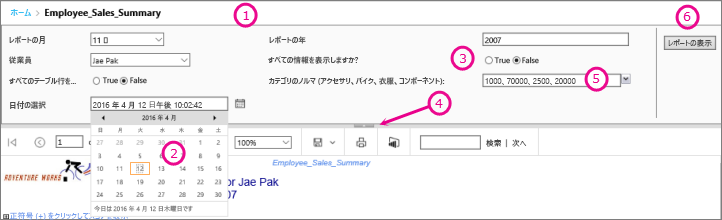
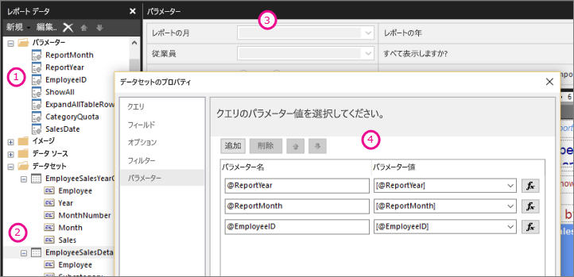

# Power BI レポート ビルダーでのレポート パラメーター

[!INCLUDE [applies-to](../includes/applies-to.md)] [!INCLUDE [yes-service](../includes/yes-service.md)] [!INCLUDE [yes-paginated](../includes/yes-paginated.md)] [!INCLUDE [yes-premium](../includes/yes-premium.md)] [!INCLUDE [no-desktop](../includes/no-desktop.md)] 

このトピックでは、Power BI Report Builder のレポート パラメーターの一般的な用途や設定できるプロパティなどについて説明します。 レポート パラメーターを使用すると、レポート データの制御、他のレポートとの関連付け、およびレポートの表示方法の変更が可能になります。 レポート パラメーターは、レポート ビルダーで作成するページ分割されたレポートで使用できます。

##  パラメーターの一般的な用途

 パラメーターの一般的な使用方法を以下に示します。  
  
**ページ分割されたレポートのデータ**
  
- 変数が含まれるデータセット クエリを記述して、データ ソース側で改ページ調整されたレポート データをフィルター処理する。  
  
- ユーザーが値を指定して改ページ調整されたレポートのデータをカスタマイズできるようにする (2 つのパラメーターを用意して売上データの開始日と終了日を指定できるようにするなど)。  
  
**レポートの表示方法を変更する**
  
- ユーザーが値を指定してレポートの外観をカスタマイズできるようにする (ブール型のパラメーターを用意して、テーブルの入れ子になった行グループを展開するか折りたたむかを指定できるようにするなど)。  
  
- 式にパラメーターを含めることで、ユーザーがレポート データおよび外観をカスタマイズできるようにする。  
  
##  パラメーターがあるページ分割されたレポートの表示

パラメーターを持つレポートを表示する場合、各パラメーターは、ユーザーが値を対話的に指定できるように、レポート ビューアー ツール バーに示されます。 次の図は、@ReportMonth、@ReportYear、@EmployeeID、@ShowAll、@ExpandTableRows、@CategoryQuota、および @SalesDate というパラメーターを持つレポートのパラメーター領域を示しています。  

  
1. **パラメーター ペイン** 各パラメーターのプロンプトと既定値がレポート ビューアー ツール バーに表示されます。 パラメーター ペインのパラメーターのレイアウトをカスタマイズすることができます。  
  
2. **@SalesDate パラメーター**: @SalesDate パラメーターは **DateTime** データ型です。 テキスト ボックスの横に [日付を選択] というプロンプトが表示されます。 日付を変更するには、テキスト ボックスに新しい日付を入力するか、カレンダー コントロールを使用します。  
  
3. **@ShowAll パラメーター**: @ShowAll パラメーターは **Boolean** データ型です。 オプション ボタンを使用して、 **True** または **False** を指定します。  
  
4. **[パラメーター エリアの表示/非表示の切り替え] ハンドル** レポート ビューアー ツール バーでこの矢印をクリックすると、パラメーター ペインの表示/非表示を切り替えることができます。  
  
5. **@CategoryQuota パラメーター**: @CategoryQuota パラメーターは **Float** データ型であるため、数値が使用されます。  @CategoryQuota には、複数の値を設定できます。  
  
6. **レポートの表示**  パラメーター値を入力した後にレポートを実行するには、 **[レポートの表示]** をクリックします。 すべてのパラメーターに既定値が定義されている場合、レポートは最初に表示するときに自動的に実行されます。  
  
##  パラメーターを作成する

レポート パラメーターは、いくつかの異なる方法で作成できます。
  
> [!NOTE]
>  一部のデータ ソースでは、パラメーターがサポートされていません。
  
**パラメーターを持つデータセット クエリまたはストアド プロシージャ**
  
 変数を含むデータセット クエリまたは入力パラメーターを含むデータセットのストアド プロシージャを追加する。 データセット パラメーターは変数または入力パラメーターごとに作成され、レポート パラメーターはデータセット パラメーターごとに作成されます。  
  

  
 レポート ビルダーのこのイメージには、以下のものが示されています。  
  
1.  レポート データ ペインのレポート パラメーター。  
  
2.  パラメーターを持つデータセット。  
  
3.  パラメーター ペイン。  
  
4.  [データセットのプロパティ] ダイアログ ボックスにリストされているパラメーター。  
  
**パラメーターを手動で作成する**
  
パラメーターを手動でレポート データ ペインから作成する。 レポート パラメーターを構成すると、ユーザーが値を対話的に入力してレポートの内容や外観をカスタマイズできるようにすることができます。 構成済みの値をユーザーが変更できないようにすることもできます。  
  
> [!NOTE]  
>  パラメーターは、サーバーで個別に管理されるため、新しいパラメーター設定でメイン レポートを再発行しても、レポートの既存のパラメーター設定が上書きされることはありません。  

### パラメーターの値

 レポートのパラメーター値を選択するときに使用できるオプションを次に示します。  
  
- ドロップダウン リストから 1 つのパラメーター値を選択する。  
  
- ドロップダウン リストから複数のパラメーター値を選択する。  
  
- 1 つのパラメーターのドロップダウン リストから値を選択する。この値は、別のパラメーターのドロップダウン リストで使用できる値を決定します。 これらはカスケード型パラメーターです。 カスケード型パラメーターを使用すると、何千ものパラメーター値を管理しやすい数まで連続的にフィルター処理することができます。 詳細については、「[ページ分割されたレポートでカスケード型パラメーターを使用する](../guidance/paginated-report-cascading-parameter.md)」を参照してください。
  
- パラメーターの既定値は作成済みなので、パラメーター値を最初に選択しないでレポートを実行する。  
  
##  レポート パラメーターのプロパティ

 [レポートのプロパティ] ダイアログ ボックスを使用して、レポート パラメーター プロパティを変更できます。 次の表に、各パラメーターに設定できるプロパティの概要を示します。  
  
|プロパティ|説明|  
|--------------|-----------------|  
|名前|パラメーターの名前を入力します (大文字と小文字が区別されます)。 名前は文字で始まる必要があります。また、名前には、文字、数字、アンダースコア (_) を使用できます。 空白は使用しないでください。 自動的に生成されたパラメーターの名前は、データセット クエリのパラメーターと同じ名前になります。 既定では、手動で作成されたパラメーターの名前は、ReportParameter1 のようになります。|  
|Prompt|レポート ビューアー ツール バーでパラメーターの横に表示されるテキストです。|  
|データ型|レポート パラメーターのデータ型は、次のいずれかである必要があります。   **[Boolean]** 。 オプション ボタンから True または False を選択します。   **DateTime**。 カレンダー コントロールから日付を選択します。   **Integer**。 テキスト ボックスに値を入力します。   **Float**。 テキスト ボックスに値を入力します。   **Text**。 テキスト ボックスに値を入力します。   パラメーターに有効な値を定義した場合は、データ型が **DateTime** であっても、ユーザーはドロップダウン リストから値を選択することになります。|  
|[空白の値を許可]|パラメーターの値に空の文字列 (空白) を許可する場合に選択します。   パラメーターの有効な値の一覧を指定する場合に空白を有効な値にするには、指定する値の中に含める必要があります。 このオプションを選択しても、空白が使用可能な値として自動的に含まれることはありません。|  
|[NULL 値を許可]|パラメーターの値に NULL 値を許可する場合に選択します。   パラメーターの有効な値の一覧を指定する場合に NULL を有効な値にするには、指定する値の中に含める必要があります。 このオプションを選択しても、null が使用可能な値として自動的に含まれることはありません。|  
|[複数の値を許可]|使用可能な値を指定して、ユーザーがドロップダウン リストから値を選択できるようにすると、 データセット クエリで有効な値のみが送信されるようにすることができます。   パラメーターの値に、ドロップダウン リストに表示される複数の値を指定できる場合に選択します。 NULL 値は許容されません。 このチェック ボックスがオンの場合、パラメーターのドロップダウン リストで、使用可能な値の一覧にチェック ボックスが追加されます。 一覧の一番上には、 **[すべて選択]** チェック ボックスが表示されます。 ユーザーは、必要な値のチェック ボックスをオンにすることができます。   値を提供するデータが急速に変化する場合は、ユーザーに最新の一覧が表示されるとは限りません。|  
|Visible|レポートが実行されたときに、レポートの上部にレポート パラメーターを表示するには、このオプションを選択します。 このオプションを選択すると、実行時にパラメーター値を選択できます。|  
|[非表示]|パブリッシュ済みレポート内のレポート パラメーターを非表示にする場合に選択します。 このレポート パラメーターの値は、レポートの URL やサブスクリプション定義で設定できます。また、レポート サーバーで設定することもできます。|  
|内部|レポート パラメーターを非表示にする場合に選択します。 パブリッシュ済みレポートでは、レポート パラメーターはレポート定義でのみ参照できます。|  
|使用できる値|パラメーターに使用できる値を指定した場合、それらの値は常にドロップダウン リストとして表示されます。 たとえば、 **DateTime** パラメーターに使用できる値を指定すると、カレンダー コントロールの代わりに日付のドロップダウン リストがパラメーター ペインに表示されます。   レポートとサブレポートの間で値の一覧の一貫性を確保するには、データ ソースのオプションを設定して、データ ソースに関連付けられているデータセットのすべてのクエリに対して 1 つのトランザクションが使用されるようにします。   **セキュリティ上の注意**: **Text** データ型のパラメーターが含まれるレポートでは、使用可能な値の一覧 (有効な値の一覧とも呼ばれます) が使用され、レポートを実行するすべてのユーザーがレポートにデータを表示するために必要なアクセス許可のみを持っていることを確認します。|  
|既定の値|クエリまたは静的な一覧から既定値を設定します。   各パラメーターに既定値が指定されていれば、レポートは最初に表示したときに自動的に実行されます。|  
|上級|このパラメーターがレポートのデータに直接的または間接的に影響するかどうかを示す値、レポート定義属性 **UsedInQuery** を設定します。   **[更新のタイミングを自動的に決定する]**  レポート プロセッサでこの値の設定が決定されるようにする場合に選択します。 このパラメーターへの直接参照または間接参照が含まれているデータセット クエリがレポート プロセッサで検出された場合、またはレポートにサブレポートがある場合は、この値が **True** になります。   **[常に更新する]**  データセット クエリまたはパラメーター式でレポート パラメーターを直接的または間接的に使用する場合に選択します。 このオプションを選択すると、 **UsedInQuery** が True に設定されます。   **[更新しない]**  データセット クエリまたはパラメーター式でレポート パラメーターを直接的にも間接的にも使用しない場合に選択します。 このオプションを選択すると、 **UsedInQuery** が False に設定されます。   **注意**: **[更新しない]** は慎重に使用してください。 レポート サーバーでは、 **UsedInQuery** を使用してレポート データと表示レポートのキャッシュ オプション、およびスナップショット レポートのパラメーター オプションが制御されます。 **[更新しない]** を正しく設定しないと、正しいレポート データまたはレポートがキャッシュされなかったり、スナップショット レポートのデータの一貫性が損なわれたりする可能性があります。 |  
  
##   データセット クエリ  
 データセット クエリのデータをフィルター処理するには、結果セットに追加するか、結果セットから除外する値を指定して、取得データを制限する制限句を含めることができます。  
  
 データ ソースのクエリ デザイナーを使用すると、パラメーター化クエリの作成に役立ちます。  
  
-   Transact SQL クエリでは、さまざまなデータ ソースで、異なるパラメーターの構文がサポートされます。 サポートは、位置または名前によってクエリ内で識別されるパラメーターに応じて異なります。 リレーショナル クエリ デザイナーで、フィルターのパラメーター オプションを選択してパラメーター化クエリを作成する必要があります。   
  
-   Microsoft SQL Server Analysis Services などの多次元データ ソースに基づくクエリでは、クエリ デザイナーで指定したフィルターに基づいてパラメーターを作成するかどうかを指定できます。 
  
##   発行されたレポートのパラメーターの管理  
 レポートをデザインするときは、レポート パラメーターはレポート定義に保存されます。 レポートをパブリッシュするときは、レポート パラメーターはレポート定義とは別に保存され管理されます。  
  
 パブリッシュ済みのレポートには、以下を使用できます。  
  
-   **レポート パラメーターのプロパティ。** レポート パラメーターの値を (レポート定義とは関係なく) レポート サーバー上で直接変更する。  
  
-   **レポート サブスクリプション。** データをフィルター処理してレポートをサブスクリプションで配信するためのパラメーター値を指定できます。 
  
 レポート定義を再パブリッシュした場合には、パブリッシュ済みレポートのパラメーター プロパティは保持されます。 レポート定義が同じレポートとして再パブリッシュされ、パラメーター名およびデータ型が同じである場合、プロパティ設定は保持されます。 レポート定義のパラメーターの追加や削除、または既存のパラメーターのデータ型やデータ名の変更を行った場合、パブリッシュ済みレポートのパラメーター プロパティの変更が必要になることがあります。  
  
 パラメーターは変更できない場合もあります。 レポート パラメーターがデータセット クエリから既定値を取得した場合、パブリッシュ済みレポートでその値を変更することも、レポート サーバーで変更することもできません。 実行時に使用される値は、クエリが実行されるとき (式ベースのパラメーターの場合は式が評価されるとき) に決定されます。  
  
 レポート実行オプションは、パラメーターの処理方法に影響します。 スナップショットとして実行されるレポートは、クエリがパラメーターの既定値を含まない限り、クエリから派生したパラメーターを使用できません。  
  
##  サブスクリプションのパラメーター  
 要求時レポートまたはスナップショット レポートにサブスクリプションを定義し、サブスクリプション処理で使用するパラメーター値を指定できます。  
  
-   **要求時レポート。**  要求時レポートでは、レポートに一覧表示された各パラメーターのパブリッシュされた値とは異なる、別のパラメーター値を指定できます。 たとえば、 *期間* パラメーターを使用して、顧客に現在の日付、週、または月のサービス要求を返すサービスの呼び出しレポートを保持していると仮定します。 レポートの既定のパラメーター値が **今日** に設定されている場合、サブスクリプションでは別のパラメーター値 ( **週** 、 **月** など) を使用して、週単位または月単位の数値を含むレポートを生成できます。  
  
## 次の手順

- [Power BI Premium のページ分割されたレポートとは](paginated-reports-report-builder-power-bi.md)  
- [ページ分割されたレポートでカスケード型パラメーターを使用する](../guidance/paginated-report-cascading-parameter.md)
