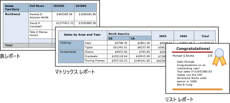

# Power BI レポート ビルダーでのテーブル、マトリックス、リスト

[!INCLUDE [applies-to](../includes/applies-to.md)] [!INCLUDE [yes-service](../includes/yes-service.md)] [!INCLUDE [yes-paginated](../includes/yes-paginated.md)] [!INCLUDE [yes-premium](../includes/yes-premium.md)] [!INCLUDE [no-desktop](../includes/no-desktop.md)] 

レポート ビルダーのテーブル、マトリックス、リストは、行と列に編成されたセルにページ分割されたレポート データが表示される " *データ領域* " です。 セルには通常、テキスト、日付、数字などのテキスト データが含まれていますが、ゲージ、グラフ、または画像などのレポート アイテムも含めることができます。 テーブル、マトリックス、リストは、総称して *Tablix* データ領域と呼ばれることがよくあります。  
  
 テーブル、マトリックス、および一覧のテンプレートは、セルにデータを表示できる柔軟なグリッドである Tablix データ領域に基づいて構築されます。 テーブルおよびマトリックスのテンプレートでは、セルは行と列で構成されます。 テンプレートは基になる汎用の Tablix データ領域の一種であるため、レポートの作成時に、テンプレート形式を組み合わせてデータを表示し、テーブル、マトリックス、または一覧を変更して別のデータ領域の機能を含めることができます。 たとえば、追加したテーブルがニーズに合わない場合は、列グループを追加してテーブルをマトリックスに変更できます。  
  
 テーブルとマトリックスのデータ領域は、テーブル、マトリックス、リスト、グラフ、ゲージを入れ子にすることで、複雑なデータ リレーションシップを表示できます。 テーブルとマトリックスは表形式のレイアウトであり、そのデータは 1 つのデータセットから取得され、1 つのデータ ソース上に構築されます。 テーブルとマトリックスの主な違いは、テーブルには行グループしか格納できないのに対し、マトリックスには行グループと列グループを格納できます。  
  
 一覧はこれとは多少異なります。 自由形式のレイアウトがサポートされており、複数のピア テーブルまたはピア マトリックスを格納でき、それぞれで異なるデータセットのデータを使用できます。 一覧は、請求書などのフォームにも使用できます。  
  
 次の図は、テーブル、マトリックス、または一覧を含んだ簡単なレポートを示しています。  

  
##   テーブル  
 テーブルを使用すると詳細データの表示やデータの行グループへの編成、またはその両方が可能です。 テーブル テンプレートには、テーブル ヘッダー行およびデータの詳細行と共に、3 つの列が含まれます。 次の図では、デザイン画面で初期のテーブル テンプレートが選択されています。  

  
 データは、1 つのフィールドまたは複数のフィールドでグループ化することも、独自の式を記述してグループ化することもできます。 入れ子になったグループや独立した隣接するグループの作成、グループ化されたデータの集計値の表示、グループへの合計の追加などを行うことができます。 たとえば、テーブルに **Category** という名前の行グループがある場合、各グループに小計を追加し、レポートに総計を追加することができます。 テーブルを見やすくし、強調するデータを強調表示するには、セルを結合し、書式をデータとテーブルの見出しに適用します。  
  
 最初は詳細データまたはグループ化されたデータを非表示にして、ユーザーが表示するデータを対話的に選択できるドリルダウンの切り替えを含めることもできます。  
  
##   マトリックス  
 PivotTable またはクロス集計と同様に、マトリックスは、行と列にグループ化した集計データ サマリの表示に使用します。 グループの行と列の数は、各行グループおよび列グループに含まれている一意の値の数によって決定します。 次の図では、デザイン画面で初期のマトリックス テンプレートが選択されています。  

 
 データは、複数のフィールドまたは式によって、行グループと列グループにグループ化できます。 実行時にレポート データとデータ領域が組み合わされると、列グループに列、行グループに行がそれぞれ追加され、マトリックスはページ上で縦横に拡大されます。 マトリックス セルには、そのセルが所属する行グループと列グループの交差部分にスコープを設定した集計値が表示されます。 たとえば、マトリックスに行グループ (Category) と売上の合計を表示する 2 つの列グループ (Territory および Year) がある場合、レポートには Category グループ内の各値に対して売上の合計を含む 2 つのセルが表示されます。 セルのスコープは 2 つの交差部分です。つまり、Category および Territory と Category および Year です。 マトリックスには、入れ子になったグループと隣接するグループを含めることができます。 入れ子になったグループには親子リレーションシップ、隣接するグループにはピア リレーションシップがあります。 マトリックス内には、入れ子になった行および列グループの任意のレベルの小計や、すべてのレベルの小計が追加できます。  
  
 マトリックス データを読みやすくし、強調するデータを強調表示するには、セルを結合するか、水平方向および垂直方向に分割し、書式をデータとグループの見出しに適用します。  
  
 ドリルダウン トグルを含めて、最初は詳細データを非表示にすることもできます。ユーザーは、トグルをクリックすることにより、表示するデータの量を調整できます。  
  
##   リスト  
 一覧は、自由形式のレイアウトの作成に使用します。 グリッド レイアウトのみに制限されず、フィールドは一覧内に自由に配置できます。 一覧は、多数のデータセット フィールドを表示するフォームの設計に使用したり、グループ化されたデータの場合は、複数のデータ領域を並列に表示するコンテナーとして使用したりすることができます。 たとえば、一覧にグループを定義し、テーブル、グラフ、およびイメージを追加し、従業員や患者のレコードを表示する際と同様に、各グループ値についてテーブルまたはグラフィック形式で値を表示することができます。  

  
##   データの準備  
 テーブル、マトリックス、および一覧のデータ領域には、データセットのデータが表示されます。 データセットのデータを取得するクエリのデータを準備することも、テーブル、マトリックス、または一覧でプロパティを設定してデータを準備することもできます。  
  
 レポートのデータセットのデータを取得するために使用する Transact-SQL などのクエリ言語では、フィルターを適用してデータのサブセットだけを取得したり、レポートを読みやすくするために null 値や空白を定数に置き換えたり、データを並べ替えたりグループ化したりすることにより、データを準備できます。  
  
 レポートのテーブル、マトリックス、または一覧のデータ領域でデータを準備する場合は、データ領域またはデータ領域内のセルのプロパティを設定します。 データのフィルター処理または並べ替えを行うには、データ領域のプロパティを設定します。 たとえば、データを並べ替えるには、並べ替える列と並べ替えの方向を指定します。 フィールドに別の値を表示する場合は、フィールドを表示するセル テキストの値を設定します。 たとえば、フィールドが空または NULL である場合に Blank と表示するには、式を使用して値を設定します。  
  
##   テーブル、マトリックス、リストの作成と構成  
 テーブルまたはマトリックスをレポートに追加するときは、テーブルとマトリックス ウィザードを使うか、レポート ビルダーで提供されているテンプレートから手動で作成することができます。 一覧は、一覧のテンプレートから手動で構築します。  
  
 ウィザードを使用すると、手順に従ってテーブルやマトリックスを簡単に構築および構成できます。 ウィザードを完了した後、または Tablix データ領域を最初から構築する場合、さらに詳細に構成および調整できます。 データ領域の右クリック メニューで表示されるダイアログ ボックスで、改ページ、ヘッダーとフッターの繰り返しと表示設定、表示オプション、フィルター、並べ替えなどの一般的に使用するプロパティを簡単に設定できます。 ただし、Tablix データ領域にはレポート ビルダーのプロパティ ペインでのみ設定できる追加のプロパティも多数含まれています。 たとえば、テーブル、マトリックス、または一覧のデータセットが空の場合にメッセージを表示するには、プロパティ ペインの NoRowsMessage Tablix プロパティでメッセージ テキストを指定します。  
  
##   Tablix テンプレート間の切り替え  
 最初に選択した Tablix テンプレートによる制限はありません。 グループ、合計、ラベルなどの追加に伴い、Tablix デザインを変更できます。 たとえば、テーブルから開始し、その後詳細行を削除したり、列グループを追加したりする場合があります。  
  
 Tablix 機能を追加することで、テーブル、マトリックス、または一覧の改良を続けることができます。 Tablix 機能には、詳細データやグループ化されたデータの集計を行および列に表示する機能が含まれます。 入れ子構造のグループ、独立した隣接するグループ、または再帰的なグループを作成できます。 グループ データのフィルター処理や並べ替えが可能なほか、複数のグループ式をグループ定義に含めることにより、グループを簡単に組み合わせることができます。  
  
 さらに、グループの合計、またはデータ領域の総合計を追加することもできます。 行や列を非表示にしてレポートを簡潔化し、ドリルダウン レポートのように非表示のデータ表示をユーザーが切り替えることができるようにすることができます。 

## 次の手順

- [Power BI Premium のページ分割されたレポートとは](paginated-reports-report-builder-power-bi.md)
