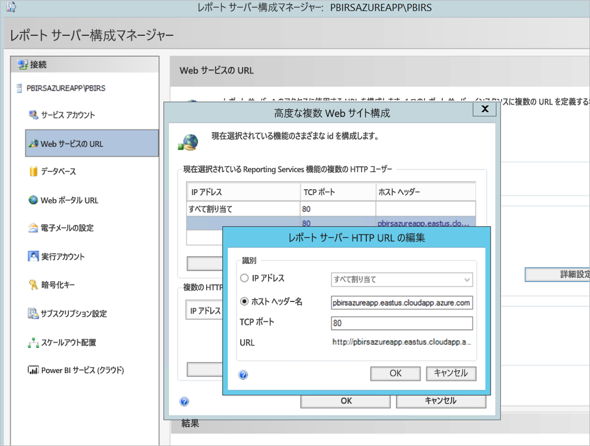
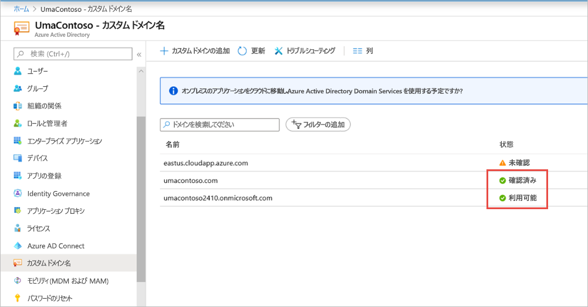
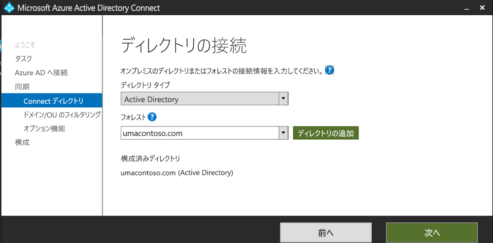
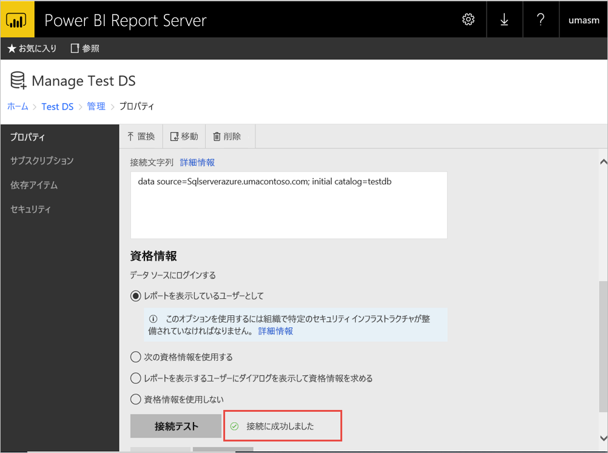

# <a name="configure-power-bi-report-server-with-azure-application-proxy"></a>Azure アプリケーション プロキシを使用して Power BI Report Server を構成する

この記事では、Azure Active Directory アプリケーション プロキシを使用して、Power BI Report Server と SQL Server Reporting Services (SSRS) 2016 以降に接続する方法について説明します。 この統合により、企業ネットワークから離れているユーザーは自分のクライアント ブラウザーから Power BI Report Server と Reporting Services レポートにアクセスでき、Azure Active Directory (AD) によって保護されます。 Azure Active Directory アプリケーション プロキシを介したオンプレミス アプリケーションへのリモート アクセスについては、[こちら](https://docs.microsoft.com/azure/active-directory/manage-apps/application-proxy)を参照してください。

## <a name="environment-details"></a>環境の詳細

作成した例では、次の値を使用しています。 

- ドメイン: umacontoso.com
- Power BI Report Server: PBIRSAZUREAPP.umacontoso.com
- SQL Server データ ソース: SQLSERVERAZURE.umacontoso.com

## <a name="configure-power-bi-report-server"></a>Power BI レポート サーバーの構成

Power BI Report Server をインストールしたら (Azure VM 上と想定)、次の手順に従って、Power BI Report Server の Web サービスおよび Web ポータル URL を構成します。

1. ポート 80 (HTTPS URL が構成されている場合はポート 443) の VM ファイアウォールに対してインバウンド規則およびアウトバウンド規則を作成します。 また、TCP プロトコルの場合は Azure portal から Azure VM 用のインバウンド規則およびアウトバウンド規則を作成します (ポート 80)。
2. この環境内の VM 用に構成された DNS 名は `pbirsazureapp.eastus.cloudapp.azure.com` です。
3. Power BI Report Server の外部 Web サービスおよび Web ポータル URL を構成します。それには、 **[詳細設定]** タブ > **[追加]** ボタン > **[Choose Host Header Name]\(ホスト ヘッダー名を選択\)** の順に選択し、次に示すようにホスト名 (DNS 名) を追加します。

    

1. Web サービスと Web ポータル セクションの両方に対して前の手順を行い、レポート サーバー構成マネージャーに登録されている URL を取得しました。

    - `https://pbirsazureapp.eastus.cloudapp.azure.com/ReportServer`
    - `https://pbirsazureapp.eastus.cloudapp.azure.com/Reports`

2. Azure portal では、ネットワーク セクションに VM の IP アドレスが 2 つ表示されます。 

    - **パブリック IP**。 
    - **プライベート IP**。 
    
    パブリック IP アドレスは、仮想マシンの外部からのアクセスに使用されます。

3. そのため、VM (Power BI Report Server) のホスト ファイル エントリを追加して、パブリック IP アドレスとホスト名 `pbirsazureapp.eastus.cloudapp.azure.com` を取り込みました。
4. VM を再起動すると、動的 IP アドレスが変更される可能性があり、ホスト ファイルに正しい IP アドレスを再度追加することが必要になる場合があるので注意してください。 これを回避するには、Azure portal でパブリック IP アドレスを "静的" に設定します。
5. 上記の変更を行った後、Web サービスと Web ポータルの URL に正常にアクセスできる必要があります。
6. サーバー上の URL `https://pbirsazureapp.eastus.cloudapp.azure.com/ReportServer` にアクセスすると、資格情報の入力を 3 回求められ、空白の画面が表示されます。
7. 次のレジストリ エントリを追加します。

    `HKEY\_LOCAL\_MACHINE \SYSTEM\CurrentControlset\Control \Lsa\ MSV1\_0` レジストリ キー

1. 複数行文字列値である新しい値 `BackConnectionHostNames` を追加し、ホスト名 `pbirsazureapp.eastus.cloudapp.azure.com` を指定します。

その後、サーバー上の URL にもアクセスできるようになります。

## <a name="configure-power-bi-report-server-to-work-with-kerberos"></a>Kerberos を使用できるように Power BI Report Server を構成する

### <a name="1-configure-the-authentication-type"></a>1. 認証の種類を構成する

Kerberos の制約付き委任に対応するように、レポート サーバーの認証の種類を構成する必要があります。 この構成は、**rsreportserver.config** ファイル内で行います。

rsreportserver.config ファイル内で、**Authentication/AuthenticationTypes** セクションを探します。

RSWindowsNegotiate が一覧に表示されていて、かつ認証の種類の一覧の先頭にあることを確認します。 次に表示例を示します。

```
<AuthenticationTypes>

    <RSWindowsNegotiate/>

</AuthenticationTypes>
```

構成ファイルを変更する必要がある場合は、レポート サーバー構成マネージャーから**レポート サーバー サービスを停止して再開**することで、変更を確実に有効にします。

### <a name="2-register-service-principal-names-spns"></a>2. サービス プリンシパル名 (SPN) を登録する

管理者としてコマンド プロンプトを開き、次の手順を行います。

次のコマンドを使用して、アカウントとしての **Power BI Report Server サービス アカウント**に次の SPN を登録します。

```
setspn -s http/ Netbios name\_of\_Power BI Report Server\_server<space> Power BI Report Server\_ServiceAccount

setspn -s http/ FQDN\_of Power BI Report Server\_server<space> Power BI Report Server\_ServiceAccount
```

次のコマンドを使用して、SQL Server サービス アカウントに次の SPN を登録します (SQL Server の既定のインスタンスの場合)。

```
setspn -s MSSQLSVC/FQDN\_of\_SQL\_Server: 1433 (PortNumber) <SQL service service account>

setspn -s MSSQLSVC/FQDN\_of\_SQL\_Server<SQL service service account>
```

### <a name="3-configure-delegation-settings"></a>3.委任設定を構成する

レポート サーバー サービス アカウントに対して委任の設定を構成する必要があります。

1. [Active Directory ユーザーとコンピューター] を開きます。
2. [Active Directory ユーザーとコンピューター] 内でレポート サーバー サービス アカウントのプロパティを開きます。
3. プロトコル遷移のある制約付き委任を構成します。 制約付き委任では、委任先のサービスを明示的に指定する必要があります。
4. **[レポート サーバー サービス アカウント]** を右クリックし、 **[プロパティ]** を選択します。
5. **[委任]** タブを選びます。
6. **[指定されたサービスへの委任でのみこのユーザーを信頼する]** を選択します。
7. **[任意の認証プロトコルを使う]** をオンにします。
8. **[このアカウントが委任された資格情報を提示できるサービス]** で **[追加]** を選択します。
9. 新しいダイアログで、 **[ユーザーまたはコンピューター]** を選択します。
10. **SQL Server サービス用のサービス アカウント**を入力し、 **[OK]** を選択します。

    それは MSSQLSVC で始まります。

1. SPN を追加します。
2. **[OK]** を選択します。 リストに SPN が表示されます。

これらの手順は、Kerberos 認証メカニズムを使用できるように Power BI Report Server を構成して、ご利用のローカル コンピューター上で動作するデータ ソースへのテスト接続を取得するのに役立ちます。

## <a name="configure-azure-application-proxy-connector"></a>Azure アプリケーション プロキシ コネクタを構成する

アプリケーション プロキシ コネクタに関連する構成については、[こちらの記事](https://docs.microsoft.com/azure/active-directory/manage-apps/application-proxy-add-on-premises-application#add-an-on-premises-app-to-azure-ad)を参照してください。

アプリケーション プロキシ コネクタは、Power BI Report Server にインストールしましたが、それを別のサーバーで構成し、委任が適切に設定されていることを確認できます。

### <a name="ensure-the-connector-is-trusted-for-delegation"></a>コネクタが委任に対して確実に信頼されるようにする

レポート サーバー アプリケーション プール アカウントに追加された SPN への委任に対してコネクタが確実に信頼されるようにします。

Azure AD アプリケーション プロキシ サービスによってユーザー ID をレポート サーバー アプリケーション プール アカウントに委任できるように、Kerberos Constrained Delegation (KCD) を構成します。 KCD を構成するには、アプリケーション プロキシ コネクタを有効にして、Azure AD で認証されているユーザーの Kerberos チケットを取得します。 その後、そのサーバーから、ターゲット アプリケーションに (この場合は Power BI Report Server に) コンテキストが渡されます。

KCD を構成するには、コネクタ コンピューターごとに以下の手順を繰り返します。

1. ドメイン管理者としてドメイン コントローラーにサインインし、 **[Active Directory ユーザーとコンピューター]** を開きます。
2. コネクタが実行されているコンピューターを見つけます。
3. そのコンピューターをダブルクリックし、 **[委任]** タブを選択します。
4. 委任設定を **[指定されたサービスへの委任でのみこのコンピューターを信頼する]** に設定します。 次に、 **[任意の認証プロトコルを使う]** を選択します。
5. **[追加]** を選択し、 **[ユーザーまたはコンピューター]** を選択します。
6. Power BI Report Server に使用しているサービス アカウントを入力します。 このアカウントは、レポート サーバー構成内で SPN の追加先としたものです。
7. **[OK]** をクリックします。 
8. 変更を保存するために、もう一度 **[OK]** をクリックします。

## <a name="publish-through-azure-ad-application-proxy"></a>Azure AD アプリケーション プロキシを介して公開する

これで Azure AD アプリケーション プロキシを構成する準備ができました。

次の設定を使用したアプリケーション プロキシを介して Power BI Report Server を公開します。 アプリケーション プロキシを使用してアプリケーションを公開する方法の詳細な手順については、[Azure AD アプリケーション プロキシを使用したアプリケーションの公開](https://docs.microsoft.com/azure/active-directory/manage-apps/application-proxy-add-on-premises-application#add-an-on-premises-app-to-azure-ad)に関する記事を参照してください。

- **内部 URL**: 企業ネットワーク内でコネクタが接続できるレポート サーバーの URL を入力します。 コネクタがインストールされているサーバーからこの URL に到達できることを確認します。 ベスト プラクティスは、`https://servername/` などのトップレベル ドメインを使用して、アプリケーション プロキシ経由で公開されていないサブパスに関する問題を回避することです。 たとえば、`https://servername/reports/` や `https://servername/reportserver/` ではなく、`https://servername/` を使用します。 この環境は `https://pbirsazureapp.eastus.cloudapp.azure.com/` を使用して構成しました。

    > [!NOTE]
    > レポート サーバーに対してセキュリティで保護された HTTPS 接続を使用することをお勧めします。 方法の詳細については、「[ネイティブ モードのレポート サーバーでの SSL 接続の構成](https://docs.microsoft.com/sql/reporting-services/security/configure-ssl-connections-on-a-native-mode-report-server?view=sql-server-2017)」を参照してください。

- **外部 URL**: Power BI Mobile アプリの接続先となるパブリック URL を入力します。 たとえば、カスタム ドメインが使用されている場合は、`https://reports.contoso.com` のようになります。 カスタム ドメインを使用するには、ドメインの証明書をアップロードし、DNS レコードがアプリケーションの既定の msappproxy.net ドメインを指すようにします。 詳細な手順については、「[Azure AD アプリケーション プロキシでのカスタム ドメインの使用](https://docs.microsoft.com/azure/active-directory/manage-apps/application-proxy-configure-custom-domain)」を参照してください。

この環境では外部 URL が `https://pbirsazureapp-umacontoso2410.msappproxy.net/` になるように構成しました。

- **事前認証方法**:Azure Active Directory。
- **コネクタ グループ**: 既定値。


**[追加設定]** セクションでは何も変更を行っていません。 既定のオプションを使用するように構成されています。

> [!IMPORTANT]
> アプリケーション プロキシを構成するとき、 **[バックエンド アプリケーションのタイムアウト]** が **[既定値]** (85 秒) に設定されていることにご留意ください。 レポートの実行に 85 秒より長い時間がかかる場合、このプロパティを **[長]** (180 秒) に設定してください。これはタイムアウト値として最も長い値です。 **[長]** が設定されていると、すべてのレポートを 180 秒以内に完了する必要があります。完了できないとタイムアウトとなり、エラーが表示されます。


### <a name="configure-single-sign-on"></a>Configure single sign-on

アプリケーションを発行したら、次の手順でシングル サインオンの設定を構成します。

1. ポータルのアプリケーション ページで **[シングル サインオン]** を選択します。
2. **シングル サインオン モード**の場合、 **[統合 Windows 認証]** を選択します。
3. **[内部アプリケーション SPN]** を先ほど設定した値に設定します。 この値を特定するには、次の手順を行います。

    - レポートを実行してみるか、またはデータ ソースへのテスト接続を実行します。これにより、Kerberos チケットが作成されます。
    - レポートまたはテスト接続の実行が正常に完了したら、コマンド プロンプトを開き、コマンド `klist` を実行します。 結果セクションに、`http/` SPN のチケットが表示されるはずです。 それが、Power BI Report Server で構成した SPN と同じである場合は、その SPN をこのセクションで使用します。

1. ユーザーの代わりに使うコネクタに**委任されたログイン ID** を選択します。 詳細については、「[さまざまなオンプレミス ID とクラウド ID の操作](https://docs.microsoft.com/azure/active-directory/manage-apps/application-proxy-configure-single-sign-on-with-kcd#working-with-different-on-premises-and-cloud-identities)」を参照してください。

    ユーザー プリンシパル名を使用することをお勧めします。 このサンプルでは、 **[ユーザー プリンシパル名]** オプションを使用するように構成しました。

    

1. **[保存]** をクリックして変更を保存します。

### <a name="finish-setting-up-your-application"></a>ご利用のアプリケーションの設定を完了する

アプリケーションの設定を完了するには、 **[ユーザーとグループ]** セクションに移動し、このアプリケーションにアクセスするユーザーを割り当てます。

1. Power BI Report Server アプリケーション用の [アプリの登録] の **[認証]** セクションで、 **[リダイレクト URL]** と **[詳細設定]** を次のように構成します。

    - 新しいリダイレクト URL を作成し、 **[種類]**  = **Web** および **[リダイレクト URI]**  = `https://pbirsazureapp-umacontoso2410.msappproxy.net/` でそれを構成します。
    - **[詳細設定]** セクションでは、 **[ログアウト URL]** を `https://pbirsazureapp-umacontoso2410.msappproxy.net/?Appproxy=logout` に構成します。

    ![[認証設定]](media/azure-application-proxy/azure-report-server-authentication-1.png)

1. 引き続き、Power BI Report Server アプリケーション用の [アプリの登録] の **[認証]** セクションで、 **[暗黙的な許可]** 、 **[既定のクライアントの種類]** 、および **[サポートされているアカウントの種類]** を次のように構成します。

    - **[暗黙的な許可]** を **[ID トークン]** に設定します。
    - **[既定のクライアントの種類]** を **[なし]** に設定します。
    - **[サポートされているアカウントの種類]** を **[この組織のディレクトリ内のアカウントのみ (UmaContoso のみ – シングル テナント)]** に設定します。

    ![[認証設定]](media/azure-application-proxy/azure-report-server-authentication-2.png)

1. シングル サインオンが設定され、URL `https://pbirsazureapp-umacontoso2410.msappproxy.net` が機能したら、Power BI Report Server でアクセス許可が提供されているアカウントとログインで使用するアカウントが同期されていることを確認する必要があります。

1. まず、ログインで使用する予定のカスタム ドメインを構成し、次にそれを確実に検証する必要があります。
2. この例では、umacontoso.com という名前のドメインを購入し、そのエントリを使用して DNS ゾーンを構成しました。 また、`onmicrosoft.com` ドメインを試しに使用して、それをオンプレミスの AD と同期させることもできます。

    リファレンスについては、「[チュートリアル: 既存のカスタム DNS 名を Azure App Service にマップする](https://docs.microsoft.com/Azure/app-service/app-service-web-tutorial-custom-domain)」を参照してください。

1. カスタム ドメインの DNS エントリの検証が正常に行われると、ポータルから、そのドメインに対応する**検証済み**の状態を確認できるはずです。

    

1. ドメイン コントローラー サーバーに Microsoft Azure AD 接続し、Azure AD と同期するように構成します。

    

1. Azure AD がオンプレミスの AD と同期されたら、Azure portal で次の状態を確認できます。

    

1. また、同期が正常に行われたら、ドメイン コントローラー上で [AD ドメインと信頼関係] を開きます。 [Active Directory ドメイン] を右クリックし、[プロパティ] > [プロパティ] の順に選択して、UPN を追加します。 この環境では、`umacontoso.com` が、購入したカスタム ドメインとなっています。

1. UPN を追加すると、Azure AD アカウントとオンプレミスの AD アカウントが接続され認証時にトークンが認識されるように、その UPN を使用してユーザー アカウントを構成できるようになります。

    前の手順を行った後、 **[ユーザー ログオン名]** セクションのドロップダウン リストに AD ドメイン名が表示されます。 ユーザー名を構成し、AD ユーザー プロパティの **[ユーザー ログオン名]** セクションのドロップダウン リストからドメインを選択します。

    

1. AD の同期が成功すると、Azure portal で、アプリケーションの **[ユーザーとグループ]** セクションの下にオンプレミスの AD アカウントが表示されるのがわかります。 アカウントのソースは **Windows Server AD** です。
2. `umasm@umacontoso.com` でログインすることは、Windows 資格情報 `Umacontoso\umasm` を使用することと同じです。

    前述の手順は、オンプレミスの AD が構成されていて、それを Azure AD と同期させる予定である場合に適用できます。

    上記の手順を実施すると、サインインが正常に行われます。

    

    次に Web ポータルが表示されます。

    

    Kerberos を認証として使用してデータ ソースへのテスト接続に成功した場合:

    

## <a name="access-from-power-bi-mobile-apps"></a>Power BI モバイル アプリからのアクセス

### <a name="configure-the-application-registration"></a>アプリケーションの登録を構成する

Power BI モバイル アプリから Power BI Report Server に接続してアクセスできるようにするには、この記事で前述した「[Azure AD アプリケーション プロキシを介して公開する](#publish-through-azure-ad-application-proxy)」で自動的に作成されたアプリケーションの登録を事前に構成しておく必要があります。

1. Azure Active Directory の **[概要]** ページで、 **[アプリの登録]** を選択します。
2. **[すべてのアプリケーション]** タブで、Power BI Report Server 用に作成したアプリケーションを検索します。
3. そのアプリケーションを選択し、 **[認証]** を選択します。
4. 使用しているプラットフォームに基づいて、次のリダイレクト URI を追加します。

    Power BI Mobile **iOS** 向けのアプリを構成する場合は、パブリック クライアント (モバイルとデスクトップ) という種類の次のリダイレクト URI を追加します。

    - `msauth://code/mspbi-adal%3a%2f%2fcom.microsoft.powerbimobile`
    - `msauth://code/mspbi-adalms%3a%2f%2fcom.microsoft.powerbimobilems`
    - `mspbi-adal://com.microsoft.powerbimobile`
    - `mspbi-adalms://com.microsoft.powerbimobilems`

    Power BI Mobile **Android** 向けのアプリを構成する場合は、パブリック クライアント (モバイルとデスクトップ) という種類の次のリダイレクト URI を追加します。

    - `urn:ietf:wg:oauth:2.0:oob`
    - `mspbi-adal://com.microsoft.powerbimobile`
    - `msauth://com.microsoft.powerbim/g79ekQEgXBL5foHfTlO2TPawrbI%3D`
    - `msauth://com.microsoft.powerbim/izba1HXNWrSmQ7ZvMXgqeZPtNEU%3D`

    Power BI Mobile iOS と Android 両方に対応したアプリを構成する場合は、iOS 用に構成されたリダイレクト URI の一覧に、パブリック クライアント (モバイルとデスクトップ) という種類のリダイレクト URI として次を追加してください。

    - `urn:ietf:wg:oauth:2.0:oob`

    > [!IMPORTANT]
    > アプリケーションが正常に動作するには、リダイレクト URI を追加する必要があります。

### <a name="connect-from-the-power-bi-mobile-apps"></a>Power BI モバイル アプリから接続する

1. Power BI モバイル アプリで、ご利用のレポート サーバー インスタンスに接続します。 接続するには、アプリケーション プロキシ経由で公開したアプリケーションの **[外部 URL]** を入力します。
2. **[接続]** を選択します。 Azure Active Directory サインイン ページが表示されます。
3. ユーザーの有効な資格情報を入力して、 **[サインイン]** を選択します。 ご利用のレポート サーバーからの要素が表示されます。

## <a name="next-steps"></a>次の手順

[Azure AD アプリケーション プロキシを使用して Power BI Mobile へのリモート アクセスを有効にする](https://docs.microsoft.com/azure/active-directory/manage-apps/application-proxy-integrate-with-power-bi)

他にわからないことがある場合は、 [Power BI コミュニティで質問してみてください](https://community.powerbi.com/)。

                
