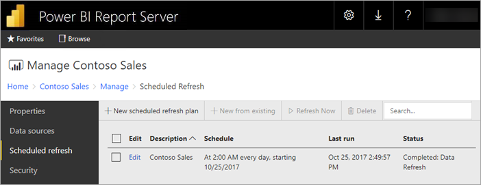

# Power BI レポートのスケジュールされた更新を構成する方法
Power BI Report Server で Power BI レポートのデータを更新するには、スケジュールされた更新計画を作成する必要があります。 この計画は、Report Server 上の Power BI レポートの *[管理]* 領域で作成します。

## データ ソースの資格情報を構成する
スケジュールされた更新計画を作成するには、必要なアクセス許可が必要です。 アクセス許可は、Report Server のロール定義で定義されています。 詳細については、SQL Server Reporting Services のドキュメントの「[ロールの定義 - 定義済みロール](/sql/reporting-services/security/role-definitions-predefined-roles)」を参照してください。

スケジュールされたデータ更新計画を作成する前に、Power BI レポートで使われている **各データ ソース** の資格情報を設定する必要があります。

1. Web ポータルで、Power BI レポートを右クリックして、 **[管理]** を選びます。
   
    ![Power BI レポートのコンテキスト メニューで [管理] を選ぶ](media/configure-scheduled-refresh/manage-power-bi-report.png)
2. 左側のメニューで、 **[データ ソース]** タブを選びます。
3. 表示される各データ ソースについて、そのデータ ソースに接続するときに使う認証の種類を選びます。 適切な資格情報を入力します。
   
    

## スケジュールされた更新計画を作成する
スケジュールされた更新計画を作成するには、次の手順のようにします。

1. Web ポータルで、Power BI レポートを右クリックして、 **[管理]** を選びます。
   
    ![Power BI レポートのコンテキスト メニューで [管理] を選ぶ](media/configure-scheduled-refresh/manage-power-bi-report.png)
2. 左側のメニューで、 **[スケジュールされている更新]** タブを選びます。
3. **[スケジュールされている更新]** ページで、 **[スケジュールされた新しい更新計画]** を選びます。
   
    
4. **[スケジュールされた新しい更新計画]** ページで、説明を入力し、データ モデルを更新するスケジュールを設定します。
5. 終わったら、 **[Create scheduled refresh plan]\(スケジュールされた更新計画の作成\)** を選びます。
   
    

## スケジュールされた更新計画を変更する
スケジュールされた更新計画の変更は作成と似ています。

1. Web ポータルで、Power BI レポートを右クリックして、 **[管理]** を選びます。
   
    ![Power BI レポートのコンテキスト メニューで [管理] を選ぶ](media/configure-scheduled-refresh/manage-power-bi-report.png)
2. 左側のメニューで、 **[スケジュールされている更新]** タブを選びます。
3. **[スケジュールされている更新]** ページで、管理する更新計画の **[編集]** を選びます。
   
    ![編集する計画の [編集] を選ぶ](media/configure-scheduled-refresh/edit-scheduled-refresh-plan.png)
4. **[Edit Scheduled Refresh Plan]\(スケジュールされた更新計画の編集\)** ページで、説明を入力し、データ モデルを更新するスケジュールを設定します。
5. 終わったら、 **[適用]** を選びます。
   
    

## スケジュールされた更新計画の状態を表示する
Web ポータルでスケジュールされた更新計画の状態を表示します。

1. Web ポータルで、Power BI レポートを右クリックして、 **[管理]** を選びます。
   
    ![Power BI レポートのコンテキスト メニューで [管理] を選ぶ](media/configure-scheduled-refresh/manage-power-bi-report.png)
2. 左側のメニューで、 **[スケジュールされている更新]** タブを選びます。
3. **[スケジュールされている更新]** ページで、右端の列に計画の状態が表示されます。
   
   | **状態** | **説明** |
   | --- | --- |
   | スケジュールされた新しい更新計画 |計画は作成されただけで、実行されていません。 |
   | 最新の情報に更新しています |更新プロセスが開始しました。 |
   | Streaming model to Analysis Server \(分析サーバーにモデルをストリーミング中\) |レポート サーバーのカタログ データベースからホストされている Analysis Services インスタンスにモデルをコピーしています。 |
   | データの更新中 |モデル内のデータを更新しています。 |
   | Removing credentials from the model \(モデルから資格情報を削除中\) |データ ソースへの接続に使われた資格情報をモデルから削除しました。 |
   | Saving model to the catalog \(カタログにモデルを保存中\) |データの更新が完了し、更新されたモデルがレポート サーバーのカタログ データベースに保存されています。 |
   | 完了:データ更新 |更新は完了しています。 |
   | エラー: |更新中にエラーが発生し、表示されています。 |

現在の状態を表示するには、Web ページを更新する必要があります。 状態は自動的には変更されません。

## 次の手順
スケジュールの作成と変更については、「[Create, modify, and delete schedules](/sql/reporting-services/subscriptions/create-modify-and-delete-schedules)」(スケジュールを作成、変更、削除する) をご覧ください。

スケジュールされた更新のトラブルシューティング方法については、「[Power BI Report Server でスケジュールされた更新をトラブルシューティングする](scheduled-refresh-troubleshoot.md)」をご覧ください。

他にわからないことがある場合は、 [Power BI コミュニティで質問してみてください](https://community.powerbi.com/)。