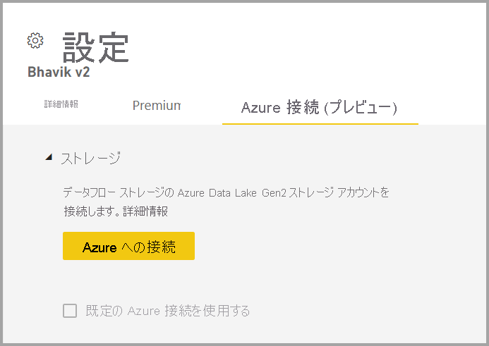
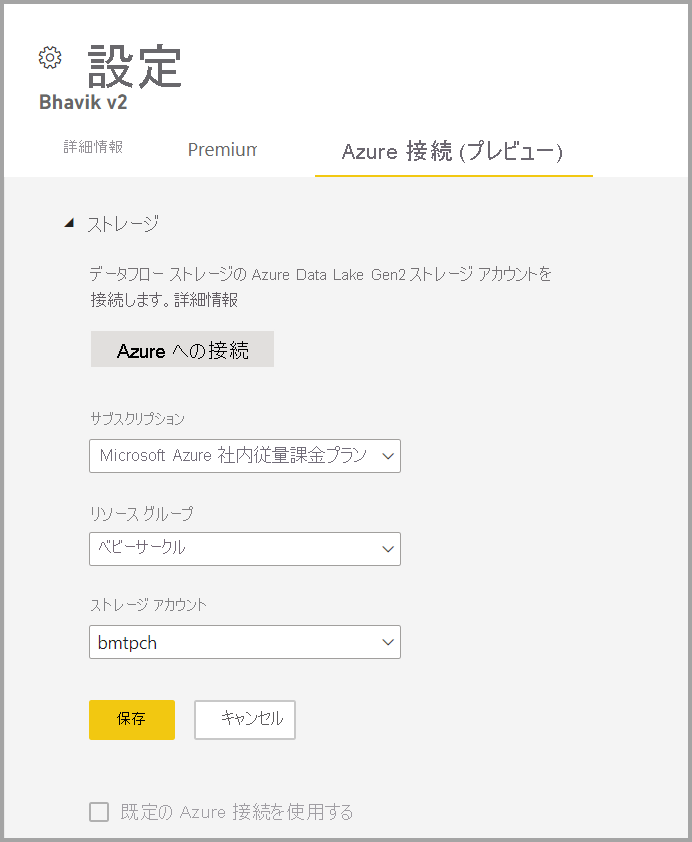

# Azure Data Lake Gen 2 を使用するようにデータフロー ストレージを構成する 

既定では、Power BI で使用されるデータは、Power BI によって提供される内部ストレージに保存されます。 データフローと Azure Data Lake Storage Gen2 (ADLS Gen2) を統合すると、組織の Azure Data Lake Storage Gen2 アカウントにデータフローを保存できます。 これにより、Power BI データフローに "独自のストレージを持ち込む" ことができ、テナントまたはワークスペースのレベルで接続を確立できます。

## ADLS Gen 2 ワークスペースまたはテナント接続を使用する理由

データフローを接続した後、それに対する参照が Power BI に構成されて保存され、独自の ADLS Gen 2 に対してデータの読み取りと書き込みができるようになります。 Power BI にはデータが CDM 形式で格納されます。これにより、データフロー自体によって生成された実際のデータに加えて、データに関するメタデータがキャプチャされます。 これにより、多数の強力な機能がロック解除され、CDM 形式のデータと関連するメタデータが、拡張性、自動化、監視、およびバックアップのシナリオに対応できるようになります。 このデータを独自の環境で使用可能にし、幅広くアクセスできるようにすることで、組織内で作成される分析情報とデータを民主化することができます。 また、CDM 対応 (PowerPlatform、Azure のカスタム アプリケーションやソリューション、パートナーと ISV のエコシステムを介して利用可能なものなど) または単に CSV を読み取るためのソリューションをさらに作成する機能もロック解除されます。 データ エンジニア、データ科学者、アナリストは、ADLS Gen 2 でキュレーションされた共通データ セットの処理、使用、再利用ができるようになります。

使用する ADLS Gen 2 ストアを構成するには、2 つの方法があります。ADLS Gen 2 アカウントが割り当てられたテナントを使用する方法と、ワークスペース レベルで独自の ADLS Gen 2 ストアを使用する方法です。 

## 前提条件

- 独自の ADLS Gen 2 アカウントを使用するには、ストレージ アカウント層での所有者のアクセス許可が必要です。 リソース グループまたはサブスクリプションのレベルでのアクセス許可は機能 "*しません*"。 管理者であっても、自分自身に所有者のアクセス許可を割り当てる必要があります。  **現在、ファイアウォールの内側で ADLS Gen2 ストレージ アカウントをサポートしていません**。 

- ストレージ アカウントは、[階層型名前空間 (HNS)](/azure/storage/blobs/create-data-lake-storage-account) が有効な状態で作成する必要があります。 

- ストレージ アカウントは、Power BI テナントと同じ Azure Active Directory テナントに作成する必要があります。 

- エンドポイントをセキュリティで保護するには、TLS (トランスポート層セキュリティ) バージョン 1.2 (またはそれ以上) が必要です。 TLS 1.2 より前のバージョンの TLS を使用する Web ブラウザーやその他のクライアント アプリケーションでは、接続できません。

- ADLS Gen 2 アカウントは、Power BI テナントと同じリージョンにデプロイされている必要があります。 リソースの場所が同じリージョンにない場合、エラーが発生します。

- 最後に、管理ポータルから任意の ADLS Gen 2 に接続できますが、ワークスペースに直接接続する場合は、接続する前にまず、ワークスペースを確実にデータフローがない状態にする必要があります。

次の表では、ADLS Gen 2 と Power BI で必要とされる ADLS と Power BI のアクセス許可について説明します。

|アクション  |ADLS のアクセス許可  |Power BI の最小限のアクセス許可  |
|---------|---------|---------|
|ADLS Gen 2 を Power BI テナントに接続する     | 所有者        | テナント管理者        |
|ADLS Gen 2 をワークスペースに接続する     | 所有者        | ワークスペース管理者        |
|接続した ADLS アカウントに書き戻す Power BI データフローを作成する     | 適用できません        | ワークスペースの共同作成者         |
|Power BI データフローを使用する     | 適用できません        | ワークスペース ビューアー        |

## ワークスペース レベルで Azure Data Lake Gen 2 に接続する
データフローがないワークスペースに移動します。 **[ワークスペースの設定]** を選択します。 **[Azure Connections]\(Azure 接続\)** タブを選択し、 **[ストレージ]** セクションを選択します。

 
テナントで ADLS Gen 2 が既に構成されている場合、 **[Use default Azure connection]\(既定の Azure 接続を使用する\)** オプションが表示されます。 2 つのオプションがあります。 

- **[Use the default Azure connection]\(既定の Azure 接続を使用する\)** という名前のボックスを選択して、ADLS Gen 2 が構成されているテナントを使用するか、または     
- **[Azure に接続する]** を選択して、新しい Azure ストレージ アカウントを指定します。 

**[Azure に接続する]** を選択すると、Power BI により、アクセスできる Azure サブスクリプションの一覧が取得されます。 ドロップダウンに入力し、階層型名前空間オプションが有効になっている有効な Azure サブスクリプション、リソース グループ、ストレージ アカウントを選択します。これは、ADLS Gen 2 フラグです。

 
選択したら、 **[保存]** を選択します。これで、ワークスペースが独自の ADLS Gen2 アカウントに正常に接続されます。 Power BI により、必要なアクセス許可を使用してストレージ アカウントが自動的に構成され、データが書き込まれる Power BI ファイル システムが設定されます。 この時点で、このワークスペース内のすべてのデータフローのデータはこのファイル システムに直接書き込まれ、他の Azure サービスで使用できるため、すべての組織データまたは部門データの単一ソースが作成されます。

## ADLS Gen 2 ワークスペース接続の構造と形式について  
 
ADLS Gen 2 ストレージ アカウント内では、すべてのデータフローが **powerbi** コンテナーまたはファイルシステムに格納されます。
 
構造はこのようになります。    
`<workspace name>/<dataflow name>/model.json     
<workspace name>/<dataflow name>/model.json.snapshots/<all snapshots>` 
 
更新後:    
`<workspace name>/<dataflow name>/<table name>/<entity snapshots>`
 
Northwind Odata サンプルの Orders テーブルを使用した例を以下に示します。

上記の画像で:    
- model.json は、データフローの最新バージョンです。
- model.json.snapshots は、データフローのすべての旧バージョンです。 これは、以前のバージョンのマッシュアップまたは増分設定が必要な場合に便利です。    
- table.snapshots.csv は、更新から取得したデータです。 これは、増分更新や、データ サイズが原因でユーザーに更新タイムアウトの問題が発生している共有の更新に対しても役立ちます。 最新のスナップショットを参照して、csv ファイルに含まれているデータの量を確認できます。 

このストレージ アカウントには書き込むだけで、現在のところデータの削除は行いません。 つまり、接続解除しても ADLS アカウントからは削除されないため、上記のすべてのファイルはそのまま保存されます。 
 
> [!NOTE]
> model.json ファイルから、同じワークスペース内の別のデータフローであるか、別のワークスペース内のデータフローにある、別の model.json を参照できます。 model.json で table.snapshot.csv を参照するのは、増分更新の場合のみです。 
 
## ADLS Gen 2 ワークスペース接続の拡張性 

ADLS Gen 2 を Power BI に接続する場合は、ワークスペースまたはテナントのレベルでこれを行うことができます。 アクセス制御が適切であることを確認します。 詳細については、「[Azure Data Lake Gen 2 を使用するようにデータフロー ストレージを構成する](https://docs.microsoft.com/power-bi/transform-model/dataflows/dataflows-azure-data-lake-storage-integration)」を参照してください。
 
ストレージ構造は、Common Data Model 形式に準拠しています。 ストレージ構造と CDM の詳細については、「[分析データフロー用のストレージ構造とは](https://docs.microsoft.com/power-query/dataflows/what-is-the-cdm-storage-structure-for-analytical-dataflows)」と「[Common Data Model と Azure Data Lake Storage Gen2](https://docs.microsoft.com/common-data-model/data-lake)」を参照してください。
 
適切に構成すると、コントロールにデータとメタデータが含まれるようになります。 多くのアプリケーションで CDM が認識されます。データは、Azure、PowerApps、PowerAutomate、およびサードパーティのエコシステムを使用して、その形式に準拠することによって、または生データを読み取ることによって拡張できます。

## Azure Data Lake Gen 2 をワークスペースまたはテナントから接続解除する

ワークスペース レベルで接続を削除するには、まず、ワークスペース内のすべてのデータフローを確実に削除する必要があります。 すべてのデータフローが削除されたら、ワークスペースの設定で **[接続解除]** を選択します。 同じことがテナントにも当てはまります。ただし、テナント レベルで接続解除する場合は、その前にまず、すべてのワークスペースをテナント ストレージ アカウントから確実に接続解除する必要があります。

## Azure Data Lake Gen 2 を無効にする

**管理ポータル** の **[データフロー]** で、ユーザーがこの機能を使用するためのアクセスを無効にしたり、ワークスペース管理者が独自の Azure Storage を使用するのを禁止したりすることができます。

## Azure Data Lake Gen 2 を元に戻す
Azure Data Lake Gen 2 を使用するようにデータフロー ストレージを構成すると、自動的に元に戻す方法はありません。 Power BI で管理されたストレージに戻すプロセスは、手動です。 

実施した Gen 2 への移行を元に戻すには、データフローを削除してから同じワークスペースに再作成する必要があります。 ADLS Gen 2 からはデータを削除しないため、次にリソース自体にアクセスしてデータをクリーンアップします。 これには次のような手順が含まれます。

1. Power BI からデータフローのコピーをエクスポートします。 または、model.json ファイルをコピーします。 model.json ファイルは ADLS に格納されています。

2. データフローを削除します。

3. ADLS を接続解除します。 

4. インポートを使用してデータフローを再作成します。 インポートする前に、増分更新データ (該当する場合) を削除する必要があることに注意してください。 これを行うには、model.json ファイル内の関連するパーティションを削除します。

5. 更新または再作成の増分更新ポリシーを構成します。  

## ADLS Gen 2 コネクタを使用してデータに接続する  
 
このドキュメントの範囲では、ADLS Gen 2 データフロー接続について説明し、Power BI ADLS Gen 2 コネクタについては説明しません。 ADLS Gen 2 コネクタの使用は、別の、場合によっては追加のシナリオです。 ADLS コネクタは、ADLS を単純にデータソースとして使用します。 つまり、PQO を使用して実行するそのデータに対するクエリは、CDM 形式である必要はありません。お客様が希望するデータ形式にすることができます。 このシナリオの詳細については、「[Power BI を使用して Azure Data Lake Storage Gen2 のデータを分析する](https://docs.microsoft.com/power-query/connectors/datalakestorage)」を参照してください。

## 次のステップ
データフローと Power BI の詳細については、以下の記事を参照してください。

* [データフローとセルフサービスのデータ準備の概要](dataflows-introduction-self-service.md)
* [データフローの作成](dataflows-create.md)
* [データフローの構成と使用](dataflows-configure-consume.md)
* [データフローの Premium 機能](dataflows-premium-features.md)
* [データフローを使用した AI](dataflows-machine-learning-integration.md)
* [データフローの制限事項と考慮事項](dataflows-features-limitations.md)
* [データフローのベスト プラクティス](dataflows-best-practices.md)
