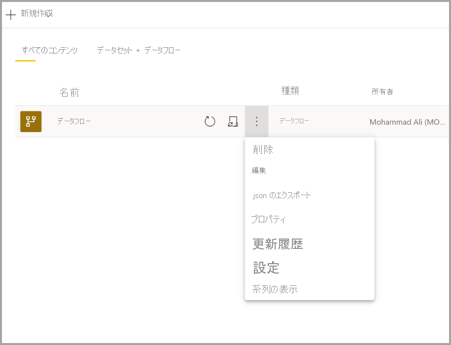
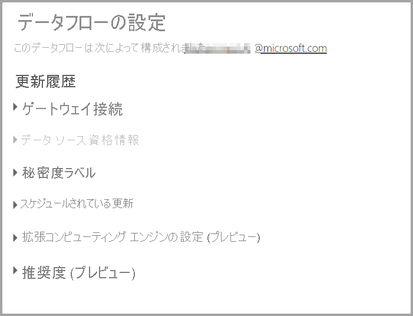
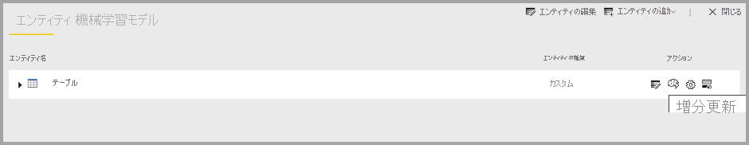
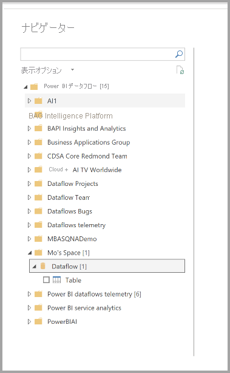

# データフローの構成と使用

データフローを使用すると、複数のソースのデータを統合し、その統合されたデータをモデリング用に準備することができます。 データフローを作成するたびに、データフローのデータを更新するように求められます。 データフローを Power BI Desktop 内のデータセットで使用したり、リンクまたは計算テーブルとして参照したりするには、事前に更新する必要があります。

## データフローの構成

データフローの更新を構成するには、 **[詳細]** メニュー (省略記号) を選択して、 **[設定]** を選択します。

以下のセクションで説明するように、 **[設定]** オプションを使用すると、データフローに対する多くのオプションが提供されます。

* **[所有権の取得]** : データフローの所有者でない場合、これらの設定の多くが無効になります。 データフローの所有権を取得するには、 **[引き継ぎ]** を選択して制御を受け取ります。 必要なアクセス レベルがあることを確認するために、資格情報を入力するように求められます。

* **[ゲートウェイの接続]:** このセクションを使用すると、データフローでゲートウェイを使用するかどうかを選択し、使用するゲートウェイを選択できます。 

* **[データ ソースの資格情報]:** このセクションを使用すると、使用されている資格情報を選択し、データ ソースへの認証方法を変更できます。

* **[秘密度ラベル]:** ここでは、データフロー内のデータの秘密度を定義できます。 秘密度ラベルの詳細については、「[Power BI で秘密度ラベルを適用する方法](../../admin/service-security-apply-data-sensitivity-labels.md)」を参照してください。

* **[スケジュールされている更新]:** ここでは、選択したデータフローを更新する時刻を定義できます。 データフローは、データセットと同じ頻度で更新できます。

* **[コンピューティング エンジンの拡張設定]:** ここでは、データフローをコンピューティング エンジン内に格納するかどうかを定義できます。 コンピューティング エンジンにより、このデータフローを参照する後続のデータフローで、マージ、結合、その他の変換を、それ以外の場合よりはるかに速く実行できます。 また、データフローに対して DirectQuery を実行することもできます。 **[オン]** を選択すると、データフローは常に DirectQuery モードでサポートされ、すべての参照でエンジンを利用できます。 **[最適化]** を選択すると、このデータフローへの参照がある場合にのみエンジンが使用されることを意味します。 **[オフ]** を選択すると、このデータフローに対してコンピューティング エンジンと DirectQuery 機能が無効になります。

* **[Endorsements]\(承認\):** データフローを認定または昇格するかどうかを定義できます。 

## データセットの更新
データフローは、相互に重なる構成要素として機能します。 *Raw Data* という名前のデータフローと、*Raw Data* データフローへのリンク テーブルが含まれる *Transformed Data* という名前のリンク テーブルがあるとします。 データフロー *Raw Data* に対するスケジュールされた更新がトリガーされると、完了時にそれを参照するデータフローがトリガーされます。 この機能により、更新のチェーン効果が作成され、データフローを手動でスケジュールする必要がなくなります。 リンク テーブルの更新を処理する場合は、次の点に注意する必要があります。

* リンク テーブルは、同じワークスペース内に存在する場合にのみ、更新によってトリガーされます

* ソース テーブルが更新されている場合、リンク テーブルは編集に対してロックされます。 参照チェーン内のいずれかのデータフローの更新が失敗した場合、すべてのデータフローが古いデータにロールバックされます (データフローの更新は、ワークスペース内でトランザクションとして処理されます)。

* ソースの更新の完了によってトリガーされた場合、参照テーブルのみが更新されます。 すべてのテーブルをスケジュールするには、リンク テーブルにもスケジュールの更新を設定する必要があります。 二重の更新を回避するため、リンクされたデータフローには更新スケジュールを設定しないでください。

**更新の取り消し** データフローにおいては、データセットとは異なり、更新をキャンセルする機能がサポートされています。 更新の実行時間が長い場合、データフロー オプション (データフローの横にある省略記号) を選択し、 **[更新の取り消し]** を選択します。

**増分更新 (Premium のみ)** 増分更新するようにデータフローを設定することもできます。 これを行うには、増分更新用に設定するデータフローを選択し、増分更新アイコンを選択します。

増分更新を設定すると、日付範囲を指定するパラメーターがデータフローに追加されます。 増分更新の設定方法の詳細については、[Power Query での増分更新](/power-query/dataflows/incremental-refresh)に関する記事を参照してください。

状況によっては、増分更新を設定しないようにする必要があります。

* リンク テーブルでデータフローが参照されている場合は、増分更新を使用しないでください。 データフローでは、クエリの折りたたみはサポートされていません (テーブルで直接クエリが有効にされている場合でも)。 

* データフローを参照するデータセットにおいては、増分更新を使用しないでください。 データフローへの更新は一般にパフォーマンスが優れているため、増分更新は必要ありません。 更新に時間がかかりすぎる場合は、コンピューティング エンジンまたは DirectQuery モードの使用を検討してください。

## データフローの使用

データフローは、次の 3 つの方法で使用できます。

* データフローからリンク テーブルを作成して、別のデータフロー作成者がデータを使用できるようにします

* データフローからデータセットを作成して、ユーザーがデータを利用してレポートを作成できるようにします

* CDM 形式から読み取ることのできる外部ツールから接続を作成します

**Power BI Desktop からの使用** データフローを使用するには、Power BI Desktop を実行し、 **[データを取得]** ダイアログで **[Power BI データフロー]** コネクタを選択します。

> [!NOTE]
> Power BI データフロー コネクタを使用すると、現在ログインしているユーザーとは異なる資格情報のセットが使用されます。 これは、マルチテナント ユーザーをサポートするための仕様です。

接続先のデータフローとテーブルを選択します。 

> [!NOTE]
> 存在しているワークスペースに関係なく、また Premium または非 Premium ワークスペースで定義されているかどうかにかかわらず、任意のデータフローまたはテーブルに接続できます。

DirectQuery が使用可能な場合は、DirectQuery またはインポートを使用してテーブルに接続するかどうかを選択するように求められます。 

DirectQuery モードでは、大規模なデータセットのローカルな問い合わせをすばやく実行できます。 ただし、追加の変換を実行することはできません。 

インポートを使用すると、データが Power BI に取り込まれ、データフローとは無関係にデータセットを更新する必要があります。

## 次のステップ
データフローと Power BI の詳細については、以下の記事を参照してください。

* [データフローとセルフサービスのデータ準備の概要](dataflows-introduction-self-service.md)
* [データフローの作成](dataflows-create.md)
* [Azure Data Lake Gen 2 を使用するようにデータフロー ストレージを構成する](dataflows-azure-data-lake-storage-integration.md)
* [データフローの Premium 機能](dataflows-premium-features.md)
* [データフローを使用した AI](dataflows-machine-learning-integration.md)
* [データフローの制限事項と考慮事項](dataflows-features-limitations.md)
* [データフローのベスト プラクティス](dataflows-best-practices.md)