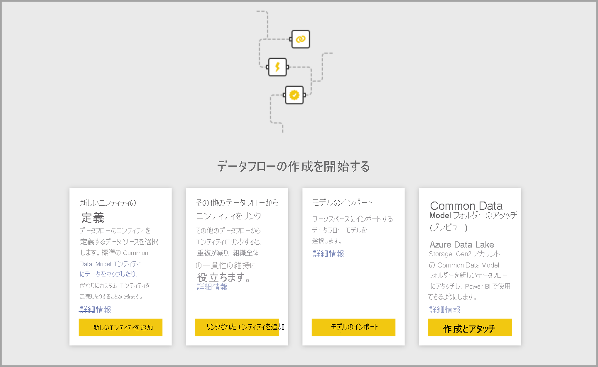
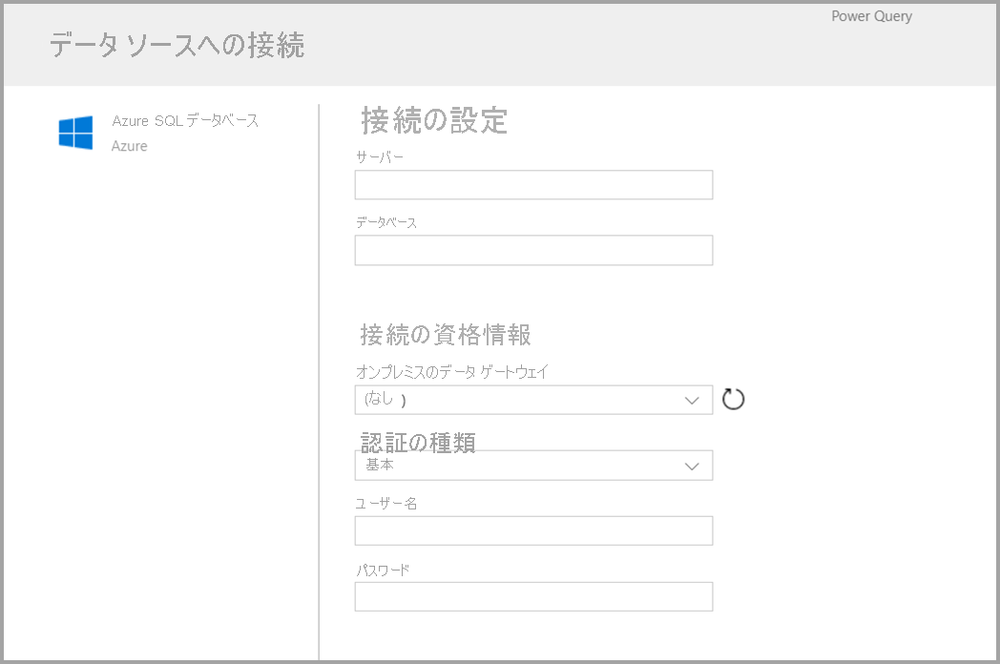
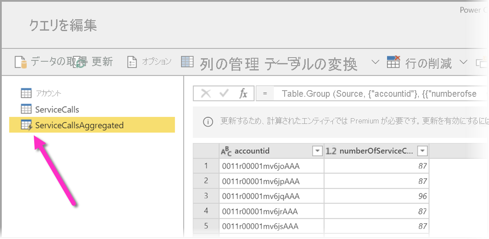
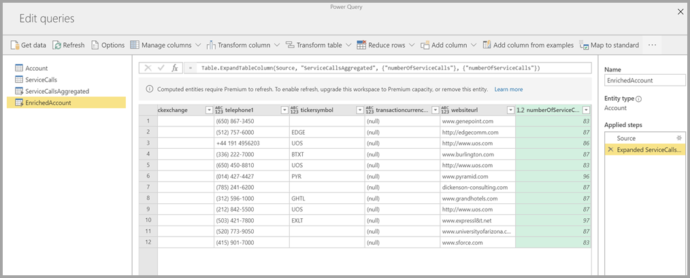
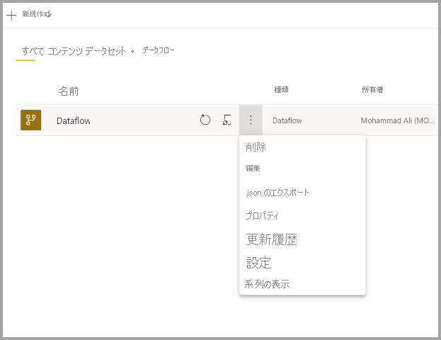

# データフローの作成
**データフロー** とは、Power BI サービスのワークスペースで作成および管理される、テーブルのコレクションです。 **テーブル** とは、データベース内のテーブルと同様に、データの格納に使用される一連の列です。 自分のデータフロー内のテーブルの追加と編集や、データ更新スケジュールの管理は、自分データフローを作成したワークスペースから直接行うことができます。

データフローを作成するには、ブラウザーで Power BI サービスを起動し、次の画面のように、左側のナビ ペインから **ワークスペース** を選択します (データフローは、Power BI サービスの "*マイ ワークスペース*" では使用できません)。 新しいデータフローを作成するワークスペースを新しく作成することもできます。

新しいデータフローを基にして作成または構築する方法は複数あります。

* [定義済みの新しいテーブルを使用してデータフローを作成する](#create-a-dataflow-using-define-new-tables)
* [リンク テーブルを使用してデータフローを作成する](#create-a-dataflow-using-linked-tables)
* [計算テーブルを使用してデータフローを作成する](#create-a-dataflow-using-a-computed-table)
* [インポート/エクスポートを使用してデータフローを作成する](#create-a-dataflow-using-importexport)

以下のセクションでは、これらのデータフロー作成の各方法について詳しく説明します。

## 定義済みの新しいテーブルを使用してデータフローを作成する

[Define new tables]\(新しいテーブルの定義\) オプションを使用すると、新しいテーブルを定義し、新しいデータ ソースに接続できます。

次の図のように、データ ソースを選択すると、データ ソースに接続するときに使用するアカウントなどの接続設定を指定するように求められます。

接続したら、お使いのテーブルに使用するデータを選択できます。 データとソースを選択すると、Power BI により、データフロー内のデータを最新に維持するため、セットアップ プロセスの後半で選択する頻度で、データ ソースへの再接続が行われます。

テーブルで使用するデータを選択した後は、データフロー エディターを使用して、お使いのデータフローでの使用に必要な形式に、データを整形または変換できます。 

## リンク テーブルを使用してデータフローを作成する

リンク テーブルを使用してデータフローを作成すると、別のデータフローで定義されている既存のテーブルを読み取り専用の方法で参照できます。 以下では、この方法を選択するいくつかの理由について説明します。

* 日付テーブルや静的ルックアップ テーブルなどのテーブルを、複数のデータフローで再利用したい場合。この場合は、テーブルを一度作成し、他のデータフロー全体で参照する必要があります。

* データ ソースに対して更新を複数作成したくない場合。この場合は、データをキャッシュとして動作するリンク テーブルに格納します。 このようにすると、後続のすべてのコンシューマーがそのテーブルを利用でき、基になるデータ ソースに対する負荷を軽減できます。

* 2 つのテーブル間でマージを実行する必要がある場合。

> [!NOTE]
> リンク テーブルは、Power BI Premium でのみ使用できます。

## 計算テーブルを使用してデータフローを作成する

計算テーブルを使用してデータフローを作成すると、リンク テーブルを参照し、書き込み専用の方法でそのテーブルに対して操作を実行できます。 その結果としてデータフローの一部になる、新しいテーブルが作成されます。 リンク テーブルを計算テーブルに変換するには、マージ操作から新しいクエリを作成するか、テーブルを編集または変換する場合は、そのテーブルに対する参照または複製を作成します。

### 計算テーブルを作成する方法

一連のテーブルが使用されたでデータフローを作成した後は、それらのテーブルで計算を実行できます。
Power BI サービスのデータフロー作成ツールで **[Edit tables]\(テーブルの編集\)** を選択した後、お使いの計算テーブルの基礎として使用する計算を実行するテーブルを右クリックします。 コンテキスト メニューで **[参照]** を選択します。
計算テーブルの対象になるテーブルでは、次の図のように、 **[読み込みを有効にする]** を選択する必要があります。 テーブルを右クリックし、このコンテキスト メニューを表示します。

**[読み込みを有効にする]** を選択すると、そのソースが参照テーブルである新しいテーブルが作成されます。 次の図のように、アイコンが **計算** アイコンに変化します。

この新規作成したテーブルに実行するすべての変換は、Power BI のデータフロー ストレージに既にあるデータに対して実行されます。 つまり、クエリはデータのインポート元である外部データ ソース (たとえば、データの取得元である SQL データベース) に対しては実行されず、データフローのストレージ内に存在するデータに対して実行されます。

**ユース ケース例** 計算テーブルには、どのような種類の変換を実行できますか。 Power BI または M エディターの変換ユーザー インターフェイスを使用して通常指定するすべての変換が、ストレージ内計算を実行するときにサポートされます。

次のような例を考えます。お使いの Dynamics 365 サブスクリプション内のすべての顧客の生データを含む *Account* というテーブルがあるとします。 また、1 年間の日ごとにさまざまなアカウントから実行されたサポート コールのデータを含む、サービス センターからの *ServiceCalls* という生データもあります。

*Account* テーブルを *ServiceCalls* からのデータでエンリッチしたいとします。
最初に、*ServiceCalls* からのデータを集計して、過去 1 年間に各アカウントで行われたサポート コールの数を計算する必要があります。

次に、*ServiceCallsAggregated* テーブルを *Account* テーブルにマージして、エンリッチされた *Account* テーブルを計算します。

結果として、次の図のような *EnrichedAccount* が表示されます。

これで完了です。ソース データではなく、Power BI Premium サブスクリプションに存在するデータフロー内のデータに対して変換が実行されています。

> [!NOTE]
> 計算テーブルは Premium のみの機能です

## CDM フォルダーを使用してデータフローを作成する

CDM フォルダーからデータフローを作成すると、Common Data Model (CDM) 形式で別のアプリケーションから書き込まれたテーブルを参照できるようになります。 ADLS Gen 2 に格納されている CDM 形式のファイルへの完全なパスを指定するように求められます。

 

次の一覧に示すように、CDM フォルダーからデータフローを作成するための要件がいくつかあります。

* PBI でファイルにアクセスするには、ADLS Gen 2 アカウントに適切なアクセス許可が設定されている必要があります

* データフローを作成しようとしているユーザーが、ADLS Gen 2 アカウントにアクセスできる必要があります

* CDM フォルダーからのデータフローの作成は、新しいワークスペース エクスペリエンス "のみ" で使用できます。

* URL は JSON ファイルへの直接ファイル パスである必要があり、ADLS Gen 2 エンドポイントが使用される必要があります。blob.core はサポートされていません

## インポート/エクスポートを使用してデータフローを作成する

インポート/エクスポートを使用してデータフローを作成すると、ファイルからデータフローをインポートできます。 これは、データフローのコピーをオフライン環境に保存する場合や、データフローをあるワークスペースから別のものに移動する場合に便利です。 

データフローをエクスポートするには、作成したデータフローを選択し、 **[詳細]** メニュー項目 (省略記号) を選択してオプションを展開し、 **[.json のエクスポート]** を選択します。 CDM 形式で表されたデータフローのダウンロードを開始するように求められます。

データフローをインポートするには、インポート ボックスを選択して、ファイルをアップロードします。 Power BI によってデータフローが自動的に作成され、データフローをそのまま保存したり、追加の変換を実行したりできます。

## 次のステップ

データ フローを作成した後は、Power BI Desktop と Power BI サービスを使用して、Power BI データフローに取り込んだデータに基づくデータセット、レポート、ダッシュボード、アプリを作成し、それによってビジネス アクティビティについての分析情報を取得できます。 以下の記事では、データフローの一般的な使用シナリオについてさらに詳しく説明されています。

* [データフローとセルフサービスのデータ準備の概要](dataflows-introduction-self-service.md)
* [データフローの構成と使用](dataflows-configure-consume.md)
* [Azure Data Lake Gen 2 を使用するようにデータフロー ストレージを構成する](dataflows-azure-data-lake-storage-integration.md)
* [データフローの Premium 機能](dataflows-premium-features.md)
* [データフローを使用した AI](dataflows-machine-learning-integration.md)
* [データフローの制限事項と考慮事項](dataflows-features-limitations.md)
* [データフローのベスト プラクティス](dataflows-best-practices.md)