# データフローを使用した AI

この記事では、データフローで人工知能 (AI) を使用する方法について説明します。 この記事で説明する領域は次のとおりです。

* Cognitive Services
* 自動化された機械学習
* Azure Machine Learning 統合

## Power BI の Cognitive Services

Power BI で Cognitive Services を使用すると、[Azure Cognitive Services](https://azure.microsoft.com/services/cognitive-services/) からさまざまなアルゴリズムを適用して、セルフサービスで自分のデータを準備し、データフロー用のデータを強化できます。

現在サポートされているサービスは、[感情分析](/azure/cognitive-services/text-analytics/how-tos/text-analytics-how-to-sentiment-analysis)、[キー フレーズ抽出](/azure/cognitive-services/text-analytics/how-tos/text-analytics-how-to-keyword-extraction)、[言語検出](/azure/cognitive-services/text-analytics/how-tos/text-analytics-how-to-language-detection)、および[イメージのタグ付け](/azure/cognitive-services/computer-vision/concept-tagging-images)です。 変換は Power BI サービス上で実行されます。Azure Cognitive Services サブスクリプションは不要です。 この機能には、Power BI Premium が必要です。

### **AI 機能を有効にする**

Cognitive Services は、Premium 容量ノード EM2、A2、または P1 以降でサポートされます。 Cognitive Services も Premium Per User (PPU) ライセンスで利用できます。 Cognitive Services を実行する際は、容量上の別個の AI ワークロードが使用されます。 Power BI で Cognitive Services を使用する前に、管理ポータルの容量設定で AI ワークロードを有効にする必要があります。 [ワークロード] セクションで AI ワークロードを有効にし、このワークロードで消費する最大メモリ量を定義します。 推奨されるメモリ制限は、20% です。 この制限を超えると、クエリ速度が低下します。

### **Power BI で Cognitive Services の使用を開始する**

Cognitive Services の変換は、[データフロー用のセルフ サービスのデータ準備](https://powerbi.microsoft.com/blog/introducing-power-bi-data-prep-wtih-dataflows/)の一部です。 Cognitive Services を使用してデータを強化するには、最初にデータフローを編集します。

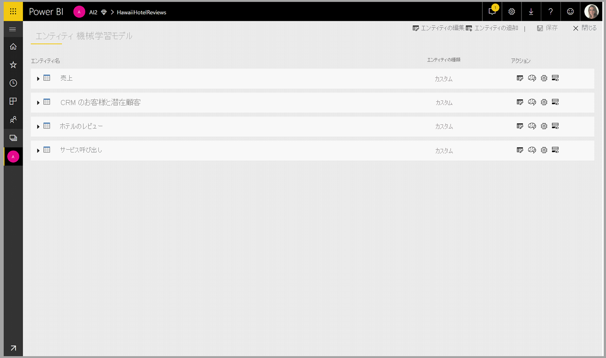

Power Query エディターの上部のリボン内で **[AI Insights]** ボタンを選択します。

ポップアップ ウィンドウで、使用する関数と、変換するデータを選択します。 この例では、レビュー テキストを含む列のセンチメントをスコア付けしています。

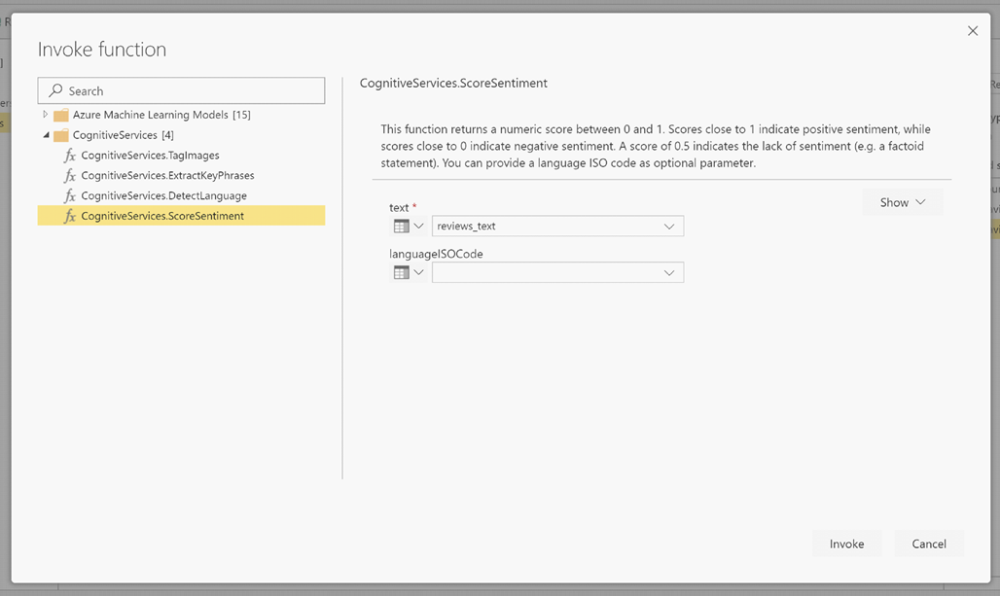

**Cultureinfo** は、テキストの言語を指定する省略可能な入力です。 この列には、ISO コードが想定されています。 Cultureinfo の入力として、列、または静的列を使用できます。 この例では、列全体で言語が英語 (en) として指定されています。 この列を空白のままにすると、Power BI によって自動的に言語が検出された後、関数が適用されます。 次に、**[呼び出し]** を選択します。

![[呼び出し] の選択](media/service-cognitive-services/cognitive-services-05.png)

関数を呼び出すと、結果が新しい列としてテーブルに追加されます。 変換もクエリ内の適用された手順として追加されます。

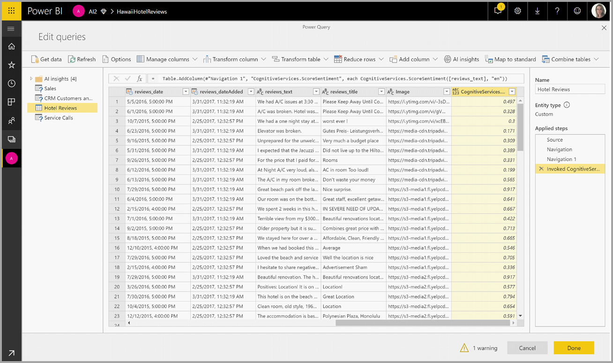

関数から複数の出力列が返される場合、その関数を呼び出すと複数の出力列の行を持つ新しい列が追加されます。

[展開] オプションを使用すると、一方または両方の値を列としてデータに追加できます。

![[列の展開]](media/service-cognitive-services/cognitive-services-07.png)

### **使用できる関数**

このセクションでは、Power BI 内の Cognitive Services で使用可能な関数について説明します。

#### **言語検出**

言語検出関数によって、テキスト入力が評価され、列ごとに言語名と ISO 識別子が返されます。 この関数は、データ列で任意のテキストが収集され、言語が不明な場合に役立ちます。 この関数では、入力データがテキスト形式であることが前提となっています。

Text Analytics では、最大 120 の言語が認識されます。 詳細については、[サポートされる言語](/azure/cognitive-services/text-analytics/text-analytics-supported-languages)に関する記事を参照してください。

#### **キー フレーズ抽出**

**キー フレーズ抽出** 関数によって、非構造化テキストが評価され、テキスト列ごとにキー フレーズの一覧が返されます。 この関数は、入力としてテキスト列を必要とし、 **Cultureinfo** の入力 (省略可能) も受け入れます。 (前述の「**Power BI で Cognitive Services の使用を開始する**」セクションを参照してください)。

キー フレーズ抽出は、指定したテキストのチャンクが大きいほど、効果的に機能します。 これは、テキストのブロックが小さいほどパフォーマンスが向上する感情分析とは反対です。 両方の操作から最良の結果を得るには、入力を適宜再構築することを検討してください。

#### **センチメントのスコア付け**

**センチメントのスコア付け** 関数では、テキスト入力が評価され、0 (否定的) から 1 (肯定的) までのセンチメント スコアがドキュメントごとに返されます。 この関数は、ソーシャル メディア、顧客のレビュー、およびディスカッション フォーラムで肯定的および否定的なセンチメントを検出するのに役立ちます。

Text Analytics では、機械学習分類アルゴリズムを使用して、0 ～ 1 のセンチメント スコアが生成されます。 センチメントは、スコアが 1 に近いほど肯定的、0 に近いほど否定的となります。 モデルは、センチメントが関連付けられている幅広いテキスト本文を使用して、事前にトレーニングされています。 現時点では、独自のトレーニング データを指定することはできません。 テキストの分析時、モデルでは、テキスト処理、品詞分析、語の配置、語の関連付けなど、さまざまな手法が組み合わされて使用されます。 アルゴリズムの詳細については、「[Introducing Text Analytics (テキスト分析の概要)](/archive/blogs/machinelearning/machine-learning-and-text-analytics)」を参照してください。

感情分析は、テキスト内の特定のテーブルのセンチメントを抽出するのではなく、入力列全体に対して実行されます。 実際には、ドキュメントに大きなテキストのブロックではなく、1 つか 2 つの文が含まれているときにスコリング精度が向上する傾向があります。 客観性評価フェーズでは、入力列全体が客観的であるか、センチメントが含まれているのかがモデルによって判断されます。 入力列が概ね客観的な場合は、センチメント検出フェーズに進まず、スコアが .50 となり、処理が終了します。 入力列がパイプライン内を進行した場合は、入力列で検出されたセンチメントの程度に応じて、.50 より上または下のスコアが次のフェーズで生成されます。

現時点では、感情分析では、英語、ドイツ語、スペイン語、およびフランス語がサポートされています。 他の言語はプレビュー段階です。 詳細については、[サポートされている言語](/azure/cognitive-services/text-analytics/text-analytics-supported-languages)に関するページを参照してください。

#### **タグ イメージ**

**タグ イメージ** 関数では、生物、風景、アクションなどの 2,000 を超える認識可能なオブジェクトに基づいてタグが返されます。 タグが不明瞭または一般に理解されないものである場合は、既知の状況のコンテキストでタグの意味を理解しやすくする "ヒント" が表示されます。 タグは分類として編成されず、継承の階層は存在しません。 一連のコンテンツ タグでは、完全な文章で書式設定された人間が判読できる言語として表示されるイメージの "説明" の基礎が形成されます。

イメージをアップロードするか、またはイメージの URL を指定すると、Computer Vision のアルゴリズムにより、そのイメージ内で識別されたオブジェクト、生物、およびアクションに基づいてタグが出力されます。 タグ付けの対象は、前景の人間などの主題だけではありません。セット (室内またはアウトドア)、家具、道具、植物、動物、アクセサリ、小物なども対象となります。

この関数では、イメージの URL または base-64 列が入力として必要です。 現時点でイメージのタグ付けでサポートされるのは、英語、スペイン語、日本語、ポルトガル語、および簡体中国語です。 詳細については、[サポートされている言語](/java/api/com.microsoft.azure.cognitiveservices.vision.computervision.computervision.tagimage#azure-java-stable)に関するページを参照してください。

## Power BI での自動化 された機械学習

ビジネス アナリストはデータフローに自動機械学習 (AutoML) を使用すると、Power BI で Machine Learning (ML) モデルのトレーニング、検証、および呼び出しを直接行うことができます。 新しい ML モデルを作成するためのシンプルなエクスペリエンスが含まれており、アナリストはデータフローを使用して、モデルをトレーニングするための入力データを指定できます。 このサービスでは、最も関連性の高い特徴の抽出、適切なアルゴリズムの選択、ML モデルの調整と検証が自動的に行われます。 モデルのトレーニングが完了すると、Power BI によって、検証結果を含むパフォーマンス レポートが自動的に生成されます。 これで、データフロー内の新しいデータまたは更新されたデータに対してモデルを呼び出すことができるようになります。

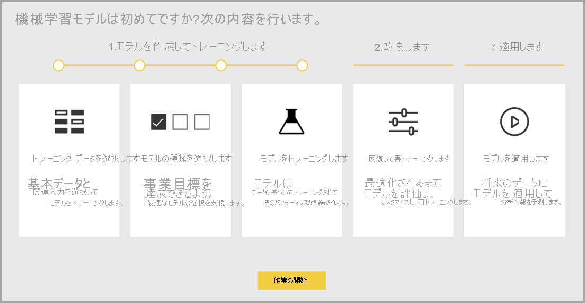

自動機械学習は、Power BI Premium および Embedded 容量でホストされているデータフローにのみ使用できます。

### AutoML の使用

データフローを使用すると、ビッグ データ用にセルフサービスでデータを準備できます。 AutoML はデータフローに統合されており、Power BI 内で機械学習モデルを構築するためのデータ準備作業を活用できます。

データ アナリストは Power BI で AutoML を使用すると、Power BI スキルのみを使用して、シンプルなエクスペリエンスで機械学習モデルを構築できます。 ML モデルの作成の背後にあるほとんどのデータ サイエンスは Power BI で自動化されています。 これには、良好な品質のモデルを確実に作成できるガードレールがあり、ML モデルの作成に使用されたプロセスの可視性が提供されます。

AutoML では、データフローのために **バイナリの予測**、**分類**、**回帰モデル** の作成がサポートされています。 これらは監視対象の機械学習技術の種類です。つまり、過去の観測の既知の結果から学習して、他の観測結果を予測します。 AutoML モデルをトレーニングするための入力データセットは、既知の結果を使用して **ラベル付け** された行のセットです。

Power BI の AutoML では、[Azure Machine Learning](/azure/machine-learning/service/overview-what-is-azure-ml) の[自動 ML](/azure/machine-learning/service/concept-automated-ml) を統合して ML モデルが作成されます。 ただし、Power BI で AutoML を使用するために Azure サブスクリプションは必要ありません。 ML モデルのトレーニングとホストのプロセスは、Power BI サービスによって完全に管理されます。

ML モデルをトレーニングした後、AutoML によって、ML モデルの可能性のパフォーマンスを説明する Power BI レポートが自動的に生成されます。 AutoML では、モデルから返される予測に影響を与える入力の中で主要なインフルエンサーを強調することにより、説明可能性を強調します。 このレポートには、モデルの主要なメトリックも含まれています。

生成されたレポートのその他のページには、モデルの統計の概要とトレーニングの詳細が表示されます。 統計の概要は、モデル パフォーマンスの標準的なデータ サイエンス メジャーを表示したいと考えているユーザーにとって重要です。 トレーニングの詳細には、モデルを作成するために実行されたすべてのイテレーションと、関連するモデリングのパラメーターがまとめられています。 また、ML モデルを作成するために各入力がどのように使用されたかも示されます。

次に ML モデルをデータに適用してスコアリングを行うことができます。 データフローが更新されると、データは ML モデルからの予測によって更新されます。 Power BI には、ML モデルで生成される特定の予測ごとの個別の説明も含まれています。

### 機械学習モデルの作成

このセクションでは、AutoML モデルを作成する方法について説明します。

#### ML モデルを作成するためのデータ準備

Power BI で機械学習モデルを作成するには、まず、履歴結果情報を含むデータのデータフローを作成する必要があります。これは ML モデルのトレーニングに使用されます。 また、予測しようとしている結果に対して強力な予測子である可能性があるビジネス メトリックの計算列も追加する必要があります。 お使いのデータフローの構成の詳細については、[データフローの構成と使用](dataflows-configure-consume.md)に関する記事を参照してください。

AutoML には、機械学習モデルをトレーニングするための特定のデータ要件があります。 これらの要件については、以下のセクションで各モデルの種類に基づいて説明します。

#### ML モデル入力の構成

AutoML モデルを作成するには、データフロー テーブルの **[アクション]** 列にある ML アイコンを選択し、 **[機械学習モデルの追加]** を選択します。

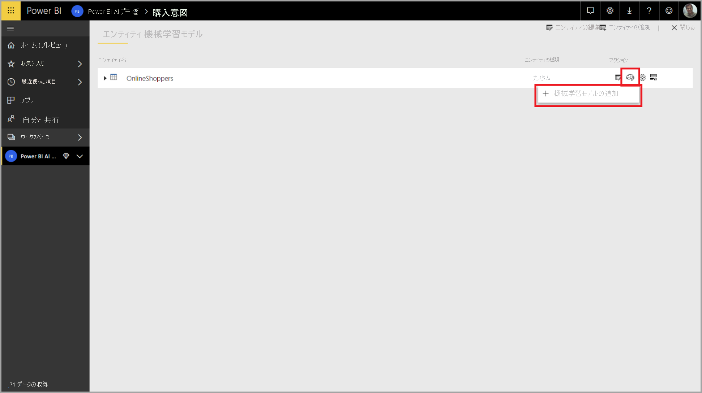

ML モデルを作成するプロセスを案内するウィザードで構成される簡素化されたエクスペリエンスが開始されます。 このウィザードには、次のシンプルな手順が含まれています。

**1.履歴データを含むテーブルと、予測が必要な結果列を選択する**

次の図に示すように、結果列によって ML モデルをトレーニングするためのラベル属性が特定されます。

**2.モデルの種類を選択する**

結果列を指定すると、AutoML によってラベル データが分析され、トレーニング可能な最も可能性の高い ML モデルの種類が推奨されます。 次に示すように、[別のモデルを選択します] をクリックして、別のモデルの種類を選択できます。

> [!NOTE]
> 一部のモデルの種類は、選択したデータに対してサポートされていない可能性があるため、無効になります。 上の例では、テキスト列が結果列として選択されているため、回帰が無効になっています。

**3.モデルで予測シグナルとして使用する入力を選択する**

AutoML により、選択したテーブルのサンプルが分析され、ML モデルのトレーニングに使用できる入力が提案されます。 選択されていない列の横に説明が表示されます。 特定の列に個別の値が多すぎるか 1 つの値しかない場合、または出力列との相関関係が低い、または高い場合は、推奨されません。

結果列 (またはラベル列) に依存する入力は、パフォーマンスに影響があるため、ML モデルのトレーニングには使用しないでください。 このような列には、"出力列との不自然に高い相関関係" としてフラグが設定されます。 これらの列をトレーニング データに導入すると、ラベルの漏えいが発生します。この場合、モデルは検証データまたはテスト データに対して適切に動作しますが、運用環境でスコアリングのために使用したときのパフォーマンスとは一致しません。 トレーニング モデルのパフォーマンスがあまりにも良い場合は、AutoML モデルでラベルの漏えいが懸念される場合があります。

この機能の推奨事項は、データのサンプルに基づいているため、使用した入力を確認する必要があります。 モデルで調査する列だけを含めるように選択を変更することもできます。 また、テーブル名の横にあるチェックボックスをオンにして、すべての列を選択することもできます。

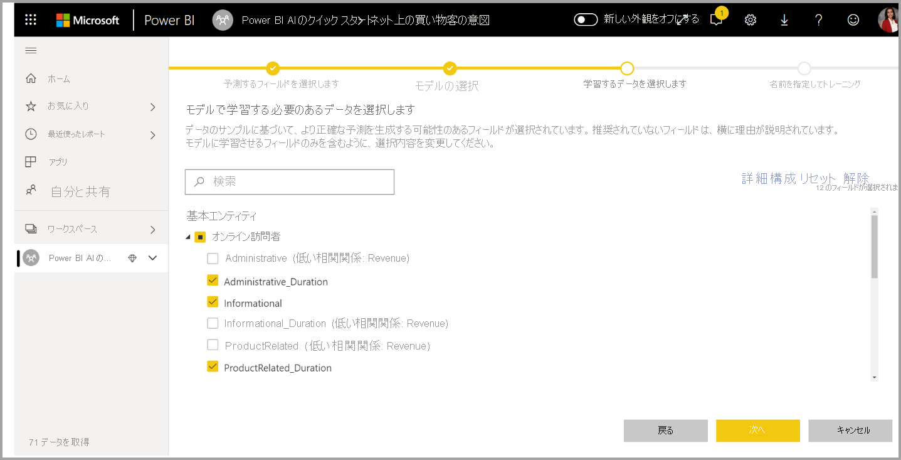

**4.モデルに名前を付けて構成を保存する**

最後の手順では、モデルに名前を付け、[保存] を選択して、ML モデルのトレーニングを開始することができます。 トレーニング時間を短縮して簡単な結果を表示するか、トレーニングにかける時間を増やして最適なモデルを得るかを選択できます。

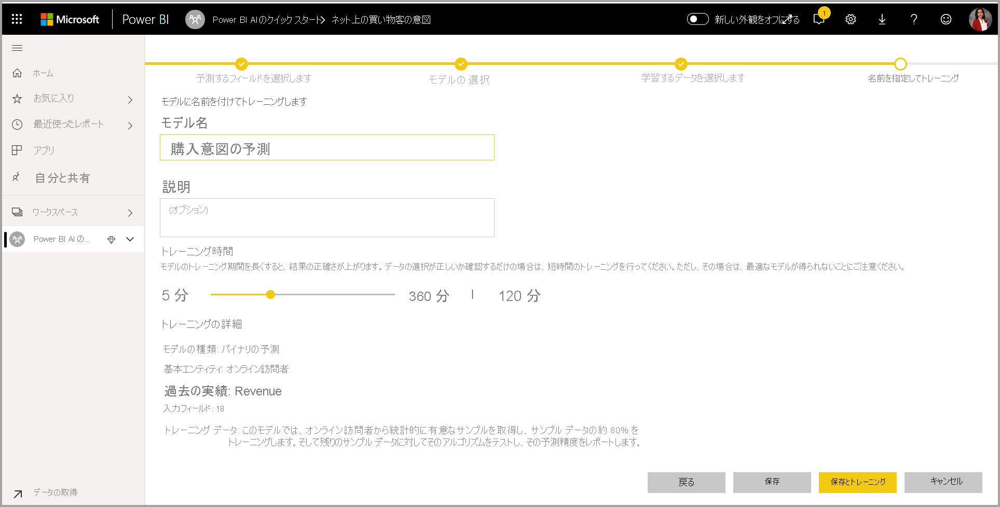

#### ML モデルのトレーニング

AutoML モデルのトレーニングは、データフローの更新の一部です。 AutoML では、最初にトレーニング用のデータが準備されます。
AutoML によって、指定した履歴データがトレーニング データセットとテスト データセットに分割されます。 テスト データセットは、トレーニング後にモデルのパフォーマンスを検証するために使用される予約データ セットです。 これらは、データフローの **トレーニングおよびテスト** テーブルとして実現されます。 AutoML では、モデルの検証にクロス検証が使用されます。

次に、各入力列が分析され、欠損値がある場合は代替値に置き換えるインピュテーションが適用されます。 AutoML では、いくつかの異なるインピュテーション戦略が使用されます。 数値特徴として扱われる入力属性の場合、列の値の平均がインピュテーションに使用されます。 カテゴリ特徴として扱われる入力属性の場合、AutoML で列値のモードがインピュテーションに使用されます。 インピュテーションに使用される値の平均とモードは、サブサンプリングされたトレーニング データセットの AutoML フレームワークによって計算されます。

次に、必要に応じて、サンプリングと正規化がデータに適用されます。 分類モデルの場合、AutoML では層化サンプリングを使用して入力データを実行され、クラスのバランスを取ることで、行カウントが確実にすべて等しくなるようにします。

AutoML によって、データ型とその統計プロパティに基づいて、選択された各入力列にいくつかの変換が適用されます。 AutoML では、これらの変換を使用して、ML モデルのトレーニングに使用する特徴が抽出されます。

AutoML モデルのトレーニング プロセスは、最適なパフォーマンスのモデルを見つけるために、さまざまなモデリング アルゴリズムとハイパーパラメーター設定を使用する最大 50 個のイテレーションで構成されます。 AutoML でパフォーマンスが向上していないことが通知された場合、より少ないイテレーションで早期にトレーニングを終了できます。 これらの各モデルのパフォーマンスは、予約データのテスト データセットを使用した検証によって評価されます。 このトレーニング手順では、これらのイテレーションのトレーニングと検証のために、AutoML によって複数のパイプラインが作成されます。 モデルのパフォーマンスを評価するプロセスには、データセットと使用可能な容量リソースのサイズに応じて、数分からウィザードで構成されているトレーニング時間の上限の数時間までかかることがあります。

場合によっては、複数のモデルを使用して予測パフォーマンスを向上させるアンサンブル学習を最終的に生成されるモデルに使用できます。

#### AutoML モデルの説明可能性

モデルのトレーニングが完了すると、AutoML によって入力機能とモデル出力の間のリレーションシップが分析されます。 これにより、各入力の特徴について、予約データのテスト データセットのモデル出力に対する変更の大きさが評価されます。 これは、"_特徴の重要度_" と呼ばれます。 これは、トレーニングが完了すると、更新の一部として行われます。 そのため、更新には、ウィザードで構成されているトレーニング時間よりも長い時間がかかることがあります。

#### AutoML モデル レポート

AutoML では、グローバルな特徴の重要度と共に、検証中のモデルのパフォーマンスをまとめた Power BI レポートが生成されます。 データフローの更新が正常に完了したら、[Machine Learning モデル] タブからこのレポートにアクセスできます。 このレポートには、予約データのテスト データに ML モデルを適用し、その予測を既知の結果値と比較した結果がまとめられます。

モデルのレポートを確認すると、そのパフォーマンスを把握できます。 また、モデルの主要なインフルエンサーが、既知の結果に関するビジネスの分析情報に沿っているかどうかを検証することもできます。

レポート内でモデルのパフォーマンスを説明するために使用されるグラフとメジャーは、モデルの種類によって異なります。 これらのパフォーマンス グラフとメジャーについては、以下のセクションで説明します。

レポート内の追加ページには、データ サイエンスの観点からモデルに関する統計的なメジャー値が記載される場合があります。 たとえば、**バイナリの予測** レポートには、モデルのゲイン グラフと ROC 曲線が含まれています。

このレポートには、モデルのトレーニング方法についての説明が記載された **[トレーニングの詳細]** ページと、各イテレーションの実行に対するモデルのパフォーマンスを説明するグラフも含まれています。

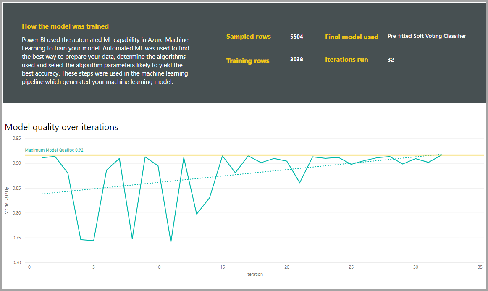

このページのもう 1 つのセクションには、入力列の検出された種類と、欠損値を埋めるために使用されるインピュテーション方法が示されます。 また、最終的なモデルで使用されたパラメーターも含まれます。

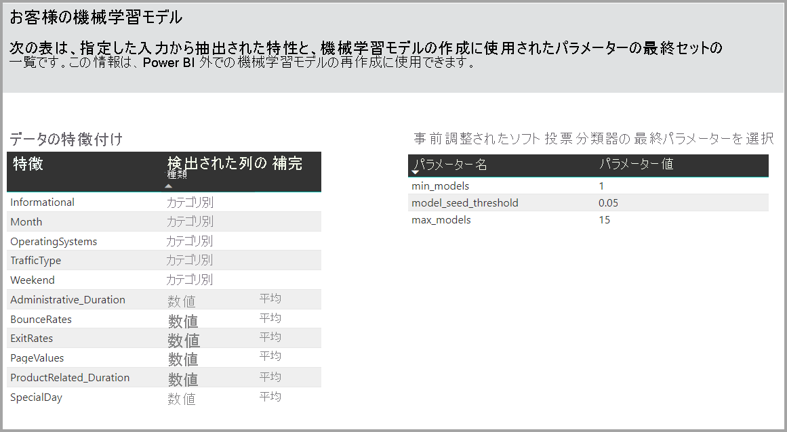

生成されるモデルにアンサンブル学習が使用される場合、 **[トレーニングの詳細]** ページには、そのパラメーターだけでなく、アンサンブルにおける各構成モデルの重みを示すグラフも含まれます。

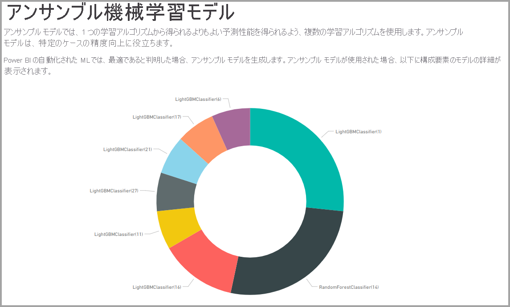

### AutoML モデルの適用

作成された ML モデルのパフォーマンスに問題がなければ、データフローが更新されるときに、新しいデータまたは更新されたデータに適用することができます。 これを行うには、モデル レポートで右上隅の **[適用]** ボタンを選択するか、[Machine Learning モデル] タブの [アクション] の下にある [ML モデルの適用] ボタンを選択します。

ML モデルを適用するには、適用する先のテーブルの名前と、モデル出力用にこのテーブルに追加される列のプレフィックスを指定する必要があります。 列名の既定のプレフィックスはモデル名です。 _Apply_ 関数には、モデルの種類に固有の追加のパラメーターを含めることができます。

ML モデルを適用すると、2 つの新しいデータフロー テーブルが作成されます。これには、出力テーブルでスコアが付けられる各行の予測と個別の説明が含まれています。 たとえば、_OnlineShoppers_ テーブルに _PurchaseIntent_ モデルを適用すると、出力で **OnlineShoppers enriched PurchaseIntent** テーブルと **OnlineShoppers enriched PurchaseIntent explanations** テーブルが生成されます。 エンリッチされたテーブルの各行に対して、**Explanations** が入力の特徴に基づいて、エンリッチされた説明テーブル内の複数の行に分割されます。 **ExplanationIndex** は、エンリッチされた説明テーブルの行を、エンリッチされたテーブルの行にマップするのに役立ちます。

PQO 関数ブラウザーの AI 分析情報を使用し、あらゆる Power BI AutoML モデルを同じワークスペース内の任意のデータフローにあるテーブルに適用することもできます。 この方法では、モデルを所有するデータフローの所有者でなくても、同じワークスペース内で他者によって作成されたモデルを使用できます。 Power Query によって、ワークスペース内のすべての Power BI ML モデルが検出され、動的な Power Query 関数として公開されます。  これらの関数を呼び出すには、Power Query エディター内のリボンからこれらの関数にアクセスするか、M 関数を直接呼び出します。 現在、この機能がサポートされるのは、Power BI データフローと、Power BI サービスの Power Query Online のみです。 これは、AutoML ウィザードを使用し、データフロー内で ML モデルを適用する場合とは非常に異なります。 この方法で説明テーブルが作成されることはありません。データフローの所有者でない限り、モデル トレーニング レポートにアクセスしたり、モデルを再トレーニングしたりできません。 ソース モデルが編集された場合 (入力列の追加または削除)、あるいはモデルまたはソース データフローが削除された場合、この依存データフローが壊れます。

モデルを適用すると、AutoML では、データフローが更新されるとすぐに予測が常に最新の状態に保たれます。

Power BI レポートで ML モデルの分析情報と予測を使用するには、**データフロー** コネクタを使用して Power BI Desktop から出力テーブルに接続します。

### バイナリの予測モデル

バイナリの予測モデル (より正式な呼び方では **二項分類**) は、データセットを 2 つのグループに分類するために使用されます。 これらは、二元の結果を持つ可能性のあるイベントを予測するために使用されます。 たとえば、営業案件が転換されるかどうか、アカウントが解約されるかどうか、請求書が期日どおりに支払われるかどうか、トランザクションが不正かどうかなどです。

バイナリの予測モデルの出力は確率スコアで、ターゲットの結果が達成される可能性が特定されます。

#### バイナリの予測モデルのトレーニング

前提条件:

- 結果のクラスごとに最低 20 行の履歴データが必要

バイナリの予測モデルの作成プロセスは、前述のセクション「**ML モデル入力の構成**」で説明されているように、他の AutoML モデルと同じ手順に従います。 唯一の違いは、"モデルの選択" ステップで最も関心のあるターゲットの結果値を選択できることです。 モデルの検証結果を要約する、自動的に生成されるレポートで使用される結果に対してわかりやすいラベルを指定することもできます。

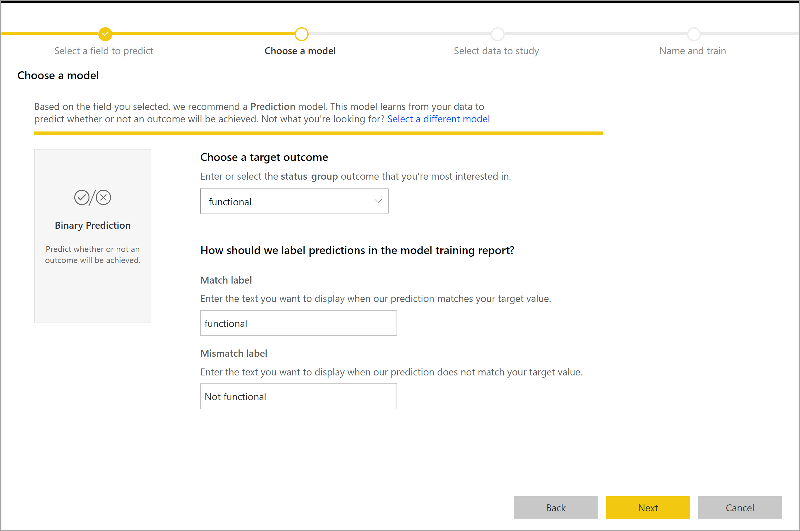

#### バイナリの予測モデル レポート

バイナリの予測モデルにより、行がターゲットの結果を達成する確率が出力として生成されます。 このレポートには確率のしきい値のスライサーが含まれます。これは、確率のしきい値を上回るまたは下回るスコアの解釈方法に影響します。

このレポートでは、モデルのパフォーマンスが _[True Positives]\(真陽性\)、[False Positives]\(偽陽性\)、[True Negatives]\(真陰性\)、[False Negatives]\(偽陰性\)_ で示されます。 [True Positives]\(真陽性の数\) と [True Negatives]\(真陰性の数\) は、結果データの 2 つのクラスに対して正しく予測された結果です。 偽陽性は、ターゲットの結果があると予測されたが、実際にはなかった行です。 逆に、偽陰性は、ターゲットの結果があったが、ないと予測されていた行です。

精度やリコールなどのメジャーは、予測される結果に対する確率のしきい値の影響を示します。 確率しきい値のスライサーを使用すると、精度とリコールのバランスが取れた妥協点を達成するしきい値を選択できます。

このレポートには、最高の利益を得るためにターゲットとする母集団のサブセットを特定するのに役立つ、費用対効果分析ツールも含まれています。 目標設定のための推定単位費用と、目標の結果を達成すると得られる単位便益を考慮して、費用対効果分析では利益の最大化が試行されます。 このツールを使用すると、グラフ内の最大ポイントに基づいて確率のしきい値を選択して、利益を最大化することができます。 また、グラフを使用して、確率のしきい値の選択に伴う利益またはコストを計算することもできます。

モデル レポートの **[Accuracy Report]\(精度レポート\)** ページには、モデルの _[Cumulative Gains]\(累積ゲイン\)_ グラフと ROC 曲線が含まれます。 これらは、モデルのパフォーマンスの統計的なメジャーです。 レポートには、表示されているグラフの説明が含まれます。

![[Accuracy report]\(精度レポート\) 画面](media/service-machine-learning-automated/automated-machine-learning-power-bi-15.png)

#### バイナリの予測モデルの適用

バイナリの予測モデルを適用するには、ML モデルから予測を適用する先のデータを含むテーブルを指定する必要があります。 その他のパラメーターには、出力列名のプレフィックス、予測される結果を分類するための確率しきい値があります。

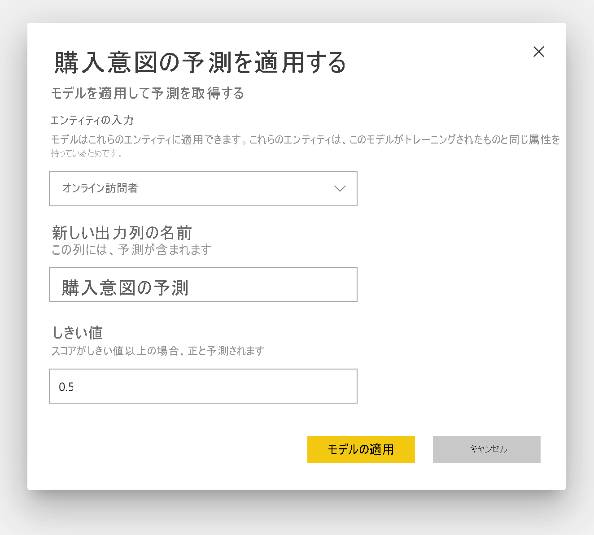

バイナリの予測モデルを適用すると、エンリッチされた出力テーブルに **Outcome**、**PredictionScore**、**PredictionExplanation**、**ExplanationIndex** の 4 つの出力列が追加されます。 テーブル内の列名に、モデルの適用時に指定されたプレフィックスが設定されます。

**PredictionScore** は確率を示すパーセントで、ターゲットの結果が達成される可能性を割り出します。

**Outcome** 列には、予測結果ラベルが含まれています。 確率がしきい値を超えているレコードは、ターゲットの結果を達成できる可能性が高いと予測され、True としてラベル付けされます。 しきい値を下回っているレコードは、結果を達成する可能性が低いと予測され、False としてラベル付けされます。

**PredictionExplanation** 列には、**PredictionScore** に対して入力の特徴が与えた具体的な影響を示す説明が含まれています。

### 分類モデル

分類モデルは、データセットを複数のグループまたはクラスに分類するために使用されます。 これらは、複数の考えられる結果のいずれになるかイベントを予測するために使用されます。 たとえば、顧客の有効期間値が非常に高い、高い、中くらい、または低いのいずれの可能性が高いか、既定のリスクが高い、中くらい、低い、非常に低いのいずれかなどです。

分類モデルの出力は確率スコアであり、これによって、特定のクラスの条件を行が達成する可能性が特定されます。

#### 分類モデルのトレーニング

分類モデルのトレーニング データを含む入力テーブルには、過去の既知の結果を特定する文字列または整数列が結果列として含まれている必要があります。

前提条件:

- 結果のクラスごとに最低 20 行の履歴データが必要

分類モデルの作成プロセスは、前述のセクション「**ML モデル入力の構成**」で説明されているように、他の AutoML モデルと同じ手順に従います。

#### 分類モデル レポート

分類モデル レポートを生成するには、予約データのテスト データに ML モデルを適用し、行の予測クラスを実際の既知のクラスと比較します。

モデル レポートには、既知の各クラスについて正しく分類された行と不正に分類された行の内訳を含むグラフが表示されます。

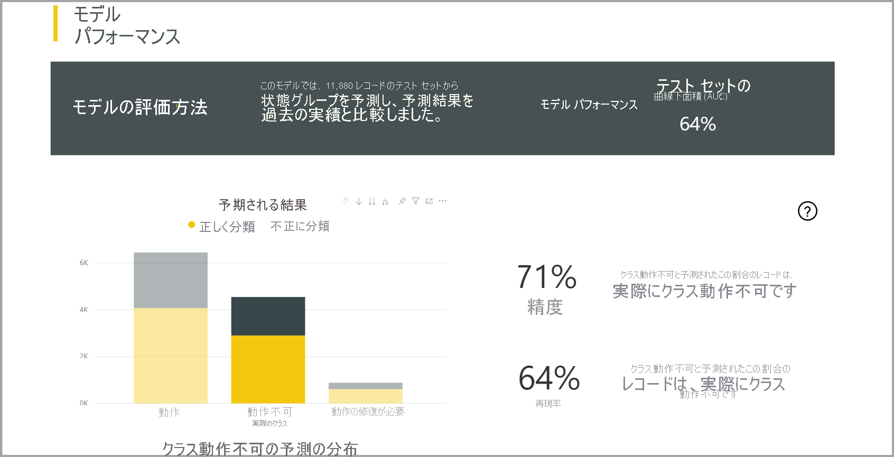

さらにクラス固有のドリルダウンを使用すると、既知のクラスの予測がどのように分散されているかを分析できます。 これには、その既知のクラスの行が誤って分類される可能性のある他のクラスが示されます。

レポート内のモデルの説明には、各クラスの上位の予測子も含まれています。

分類モデル レポートには、この記事のセクション「**AutoML モデル レポート**」で前述したように、他の種類のモデルのページと同様の [トレーニングの詳細] ページも表示されます。

#### 分類モデルの適用

分類 ML モデルを適用するには、入力データと出力列名のプレフィックスを持つテーブルを指定する必要があります。

分類モデルを適用すると、エンリッチされた出力テーブルに **ClassificationScore**、**ClassificationResult**、**ClassificationExplanation**、**ClassProbabilities**、**ExplanationIndex** の 5 つの出力列が追加されます。 テーブル内の列名に、モデルの適用時に指定されたプレフィックスが設定されます。

**ClassProbabilities** 列には、使用可能な各クラスの行の確率スコアの一覧が含まれています。

**ClassificationScore** は確率を示すパーセントであり、これによって、特定のクラスの条件を行が達成する可能性が特定されます。

**ClassificationResult** 列には、行に対して予測される可能性が最も高いクラスが含まれています。

**ClassificationExplanation** 列には、**ClassificationScore** に対して入力の特徴が与えた具体的な影響を示す説明が含まれています。

### 回帰モデル

回帰モデルは、数値を予測するために使用されます。 たとえば、販売取引によって実現する可能性が高い収益、アカウントの有効期間の値、支払われる可能性のある売掛金請求書の金額、請求書が支払われる可能性がある日付などです。

回帰モデルの出力は予測値です。

#### 回帰モデルのトレーニング

回帰モデルのトレーニング データを含む入力テーブルには、既知の結果値を特定する数値列が結果列として含まれている必要があります。

前提条件:

- 回帰モデルには、少なくとも 100 行の履歴データが必要です

回帰モデルの作成プロセスは、前述のセクション「**ML モデル入力の構成**」で説明されているように、他の AutoML モデルと同じ手順に従います。

#### 回帰モデル レポート

他の AutoML モデル レポートと同様に、回帰レポートは、予約データのテスト データにモデルを適用した結果に基づいています。

モデル レポートには、予測値と実際の値を比較するグラフが含まれています。 このグラフでは、斜線からの距離は、予測の誤差を示しています。

残余誤差グラフは、予約データのテスト データセット内のさまざまな値に関する平均誤差の割合の分布を示します。 横軸は、グループの実際の値の平均を表します。バブルのサイズは、その範囲内の値の頻度または数を示しています。 縦軸は、平均残余誤差です。

回帰モデル レポートには、セクション「**AutoML モデル レポート**」で前述したように、他の種類のモデルのレポートと同様の [トレーニングの詳細] ページも表示されます。

#### 回帰モデルの適用

回帰 ML モデルを適用するには、入力データと出力列名のプレフィックスを持つテーブルを指定する必要があります。

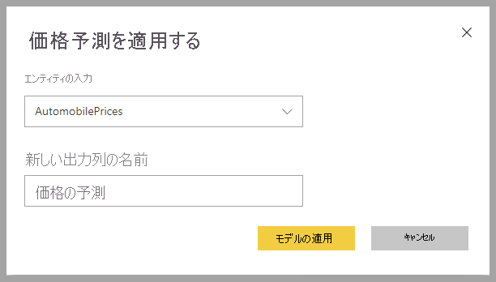

回帰モデルを適用すると、エンリッチされた出力テーブルに **RegressionResult**、**RegressionExplanation**、**ExplanationIndex** の 3 つの出力列が追加されます。 テーブル内の列名に、モデルの適用時に指定されたプレフィックスが設定されます。

**RegressionResult** 列には、入力列に基づいた行の予測値が含まれています。 **RegressionExplanation** 列には、**RegressionResult** に対して入力の特徴が与えた具体的な影響を示す説明が含まれています。

## Azure Machine Learning の Power BI への統合

多くの組織が **Machine Learning** モデルを使用して、ビジネスに関する分析情報の質や予測を向上させています。 これらのモデルからの分析情報は、レポートやダッシュボードなどの分析で視覚化したり、呼び出したりできるので、その情報を最も必要としているビジネス ユーザーに提供することが可能です。  Power BI では、ポイントアンドクリック ジェスチャを使用するだけで、Azure Machine Learning 上でホストされているモデルから、簡単に分析情報を取り込めるようになりました。

この機能を使用するには、最初にデータ サイエンティストが Azure portal を使用して、Azure ML モデルへのアクセス権を BI アナリストに付与します。  次に、Power Query が、セッションが開始されるたびに、ユーザーがアクセス可能なすべての Azure ML モデルを検出して、動的な Power Query 関数として公開します。  ユーザーがこれらの関数を呼び出すには、Power Query エディター内のリボンからこれらの関数にアクセスするか、M 関数を直接呼び出します。 また、一連の行のパフォーマンスを向上させるため、Power BI は、Azure ML モデルを呼び出すときに、アクセス要求を自動的にバッチ処理します。

現在、この機能がサポートされるのは、Power BI データフローと、Power BI サービスの Power Query オンラインのみです。

データフローの詳細については、「[データフローとセルフサービスのデータの準備の概要](dataflows-introduction-self-service.md)」を参照してください。

Azure Machine Learning の詳細については、以下を参照してください。

- 概要:[Azure Machine Learning とは](/azure/machine-learning/service/overview-what-is-azure-ml)
- Azure Machine Learning のクイック スタートおよびチュートリアル:[Azure Machine Learning のドキュメント](/azure/machine-learning/)

> [!NOTE]
> Azure Machine Learning 統合を使用するには、Power BI Premium サブスクリプションが必要です。

### Power BI ユーザーに Azure ML モデルへのアクセス権を付与する

Power BI から Azure ML モデルにアクセスするには、Azure サブスクリプションへの **読み取り** アクセス権が必要です。  さらに:

- Machine Learning Studio (クラシック) モデルの場合は、Machine Learning Studio (クラシック) Web サービスへの **読み取り** アクセス権
- Machine Learning モデルの場合は、Machine Learning ワークスペースへの **読み取り** アクセス権

Azure ML service 上でホストされているモデルへのアクセス権を付与することにより、Power BI ユーザーがこの Power Query 関数としてのモデルにアクセスできるようにする手順を以下に示します。  詳細については、[RBAC および Azure portal を使用したアクセスの管理](/azure/role-based-access-control/role-assignments-portal)に関する記事を参照してください。

1. [Azure portal](https://portal.azure.com) にサインインします。

2. **[Subscriptions]\(サブスクリプション\)** ページに移動します。 Azure portal のナビ ペインのメニューにある **[すべてのサービス]** リストに **[サブスクリプション]** ページがあります。

    [ ![[Azure サブスクリプション] ページ](media/service-machine-learning-integration/machine-learning-integration-01.png) ](media/service-machine-learning-integration/machine-learning-integration-01.png#lightbox)

3. サブスクリプションを選択します。

    [ 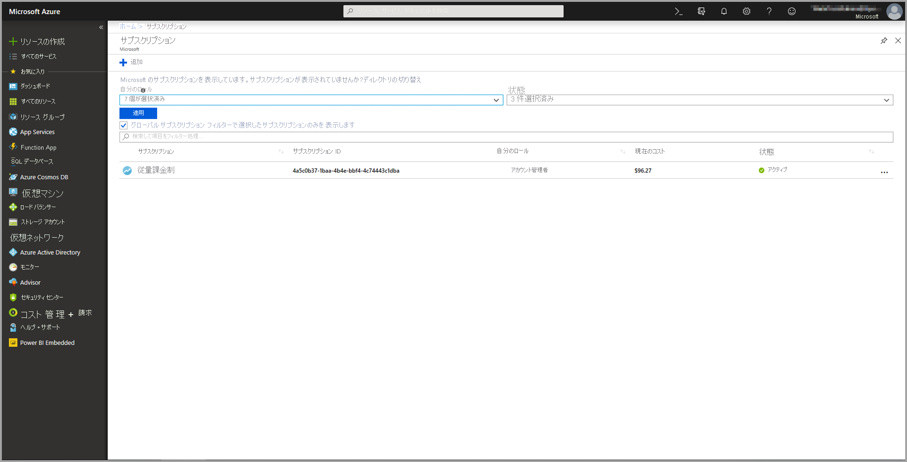 ](media/service-machine-learning-integration/machine-learning-integration-02.png#lightbox)

4. **[アクセス制御 (IAM)]** を選択してから、 **[追加]** ボタンを選択します。

    

5. ロールとして **[閲覧者]** を選択します。 Azure ML モデルへのアクセス権を付与する Power BI ユーザーを選択します。

    [ ![ロールとして [閲覧者] を選択する](media/service-machine-learning-integration/machine-learning-integration-04.png) ](media/service-machine-learning-integration/machine-learning-integration-04.png#lightbox)

6. **[保存]** を選択します。

7. 上記の 3 から 6 の手順を繰り返し、特定の Machine Learning Studio (クラシック) Web サービスのユーザー、*または* モデルをホストしている Machine Learning ワークスペースのユーザーに **[閲覧者]** アクセス権を付与します。

### Machine Learning モデルのスキーマの検出

データ サイエンティストは、Machine Learning の機械学習モデルを開発する際、さらにはデプロイする際にも、主に Python を使用しています。  モデルのスキーマ ファイルの作成タスクを自動化する Machine Learning Studio (クラシック) とは異なり、Machine Learning の場合、データ サイエンティストは、Python を使用して、スキーマ ファイルを明示的に生成する必要があります。

Machine Learning モデルでは、デプロイされた Web サービスにこのスキーマ ファイルを含める必要があります。 Web サービスのスキーマを自動的に生成するには、デプロイされたモデルのエントリ スクリプトで入力/出力のサンプルを指定する必要があります。 記事「[Azure Machine Learning を使用してモデルをデプロイする」のサブセクション「(省略可能) Swagger スキーマの自動生成」](/azure/machine-learning/how-to-deploy-and-where#optional-define-model-web-service-schema)を参照してください。 このリンクには、スキーマ生成のステートメントを含む、エントリ スクリプトの例が含まれます。 

具体的には、エントリ スクリプト内の *\@input_schema* 関数と *\@output_schema* 関数によって、*input_sample* および *output_sample* 変数の入出力のサンプル形式が参照され、デプロイ時にこれらのサンプルを使用して Web サービス用の OpenAPI (Swagger) 仕様が生成されます。

エントリ スクリプトの更新によるこれらのスキーマ生成は、Azure Machine Learning SDK を使用して自動機械学習エクスペリエンスにより作成されたモデルにも適用する必要があります。

> [!NOTE]
> Azure Machine Learning ビジュアル インターフェイスを使用して作成されたモデルでは、現在のところスキーマ生成はサポートされていませんが、今後のリリースではサポートされる予定です。 

### Power BI で Azure ML モデルを呼び出す

アクセス権があれば、どの Azure ML モデルでも、データフロー内の Power Query エディターから直接呼び出すことができます。 下図に示すように、Azure ML モデルにアクセスするには、Azure ML モデルからの分析情報でエンリッチするテーブルの **[編集]** ボタンを選択します。

**[編集]** ボタンを選択すると、データフロー内でテーブルの Power Query エディターが開きます。

リボン内で **[AI 分析情報]** ボタンを選択した後、ナビ ペインのメニューから "_Azure Machine Learning Models_" フォルダーを選択します。 アクセス権があるすべての Azure ML モデルが Power Query 関数としてここに一覧表示されます。 また、Azure ML モデルの入力パラメーターは、対応する Power Query 関数のパラメーターとして自動的にマップされます。

Azure ML モデルを呼び出すには、選択したテーブルのいずれかの列を、ドロップダウンからの入力として指定します。 入力ダイアログの左側にある列アイコンを切り替えることにより、入力として使用する定数値を指定することもできます。

[ 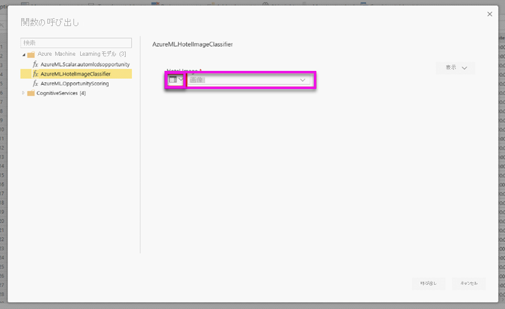 ](media/service-machine-learning-integration/machine-learning-integration-07.png#lightbox)

**[呼び出し]** を選択すると、Azure ML モデルの出力のプレビューが、テーブル テーブルの新しい列として表示されます。 また、モデル呼び出しが、クエリに適用された手順として表示されます。

モデルから複数の出力パラメーターが返された場合、それらのパラメーターは、出力列内で 1 つの行としてグループ化されます。 列を展開すると、個々の出力パラメーターを別々の列内に生成できます。

データフローを保存すると、データフローの更新時に (テーブル テーブルの行の新規作成や更新に対して) モデルが自動的に呼び出されます。

## 次の手順

この記事では、Power BI サービスのデータフローの自動機械学習の概要について説明しました。 次の記事も推奨されます。

- [チュートリアル: Power BI で機械学習モデルを構築する](../../connect-data/service-tutorial-build-machine-learning-model.md)
- [チュートリアル: Power BI での Cognitive Services の使用](../../connect-data/service-tutorial-use-cognitive-services.md)
- [チュートリアル: Power BI で Azure Machine Learning モデルを使用する](../../connect-data/service-aml-integrate.md)

データフローと Power BI の詳細については、以下の記事を参照してください。

* [データフローとセルフサービスのデータ準備の概要](dataflows-introduction-self-service.md)
* [データフローの作成](dataflows-create.md)
* [データフローの構成と使用](dataflows-configure-consume.md)
* [Azure Data Lake Gen 2 を使用するようにデータフロー ストレージを構成する](dataflows-azure-data-lake-storage-integration.md)
* [データフローの Premium 機能](dataflows-premium-features.md)
* [データフローの制限事項と考慮事項](dataflows-features-limitations.md)
* [データフローのベスト プラクティス](dataflows-best-practices.md)
