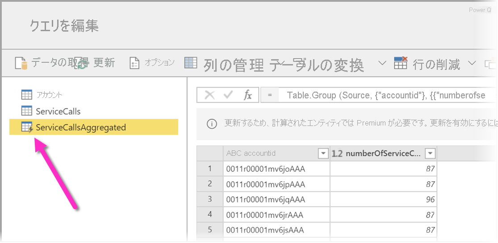

# データフローの Premium 機能

データフローは、Power BI Pro および Power BI Premium のユーザーに対してサポートされています。 一部の機能は、Power BI Premium サブスクリプションでのみ使用できます。 この記事では、Premium のみの機能とその使用の詳細について説明します。 

次の機能は、Power BI Premium でのみ使用できます。

* 拡張コンピューティング エンジン
* 直接クエリ
* 計算対象エンティティ
* リンクされたエンティティ
* 増分更新

以下のセクションでは、これらの各機能について詳しく説明します。

## 拡張コンピューティング エンジン

Power BI の拡張コンピューティング エンジンにより、Power BI Premium サブスクライバーは自身の容量を使用してデータフローの使用を最適化できます。 拡張コンピューティング エンジンを使用すると、次のような利点があります。

* 計算対象エンティティに対する、実行時間の長い ETL ステップ (*joins*、*distinct*、*filters*、*group by* の実行など) に必要な更新時間の大幅な短縮
* エンティティに対して DirectQuery クエリを実行する

既定では、拡張コンピューティング エンジンは **[オン]** になっています。 拡張コンピューティング エンジンがオンになっていない場合、拡張コンピューティング エンジンを有効にする方法については、一般的な質問に対する回答と共に、次のセクションで説明します。

### 拡張コンピューティング エンジンの使用

拡張コンピューティング エンジンは、Power BI サービスの **[容量の設定]** ページの **[データフロー]** セクションで有効にします。 既定では、拡張コンピューティング エンジンは **[オフ]** になっています。 拡張コンピューティング エンジンを有効にするには、次の図に示すようにトグルを **[オン]** に切り替えて、設定を保存します。 

> [!IMPORTANT]
> 拡張コンピューティング エンジンは、A3 以上の Power BI 容量に対してのみ機能します。

拡張コンピューティング エンジンをオンにしたら、**データフロー** に戻ります。複雑な演算 (同じ容量の既存のリンクされたエンティティから作成されたデータフローに対する *joins* や *group by* 演算など) を実行する計算テーブルのパフォーマンスが向上しているはずです。 

コンピューティング エンジンを最大限に活用するには、次のように ETL ステージを 2 つの異なるデータフローに分割します。

* **データフロー 1**: このデータフローでは、データ ソースから必要なすべてを取り込み、それをデータフロー 2 に配置するだけです。
* **データフロー 2**: この 2 つ目のデータフローですべての ETL 操作が実行されますが、データフロー 1 が同じ容量にあり、それを参照していることを確認します。 また、コンピューティング エンジンが確実に使用されるように、他の演算を実行する前に、フォールドできる演算 (filter、group by、distinct、join) を確実に実行します。

### 一般的な質問と回答

**質問:** 拡張コンピューティング エンジンを有効にしましたが、更新に時間がかかります。 なぜでしょうか。

**回答:** 拡張コンピューティング エンジンを有効にすると更新時間が遅くなる原因には、2 つの理由が考えられます。

 * 拡張コンピューティング エンジンを有効にすると、エンジンが適切に機能するためにある程度のメモリが必要になります。 そのため、更新の実行に使用できるメモリが減り、更新がキューに格納される可能性が高くなります。これにより、同時に更新できるデータフローの数が減少します。 これに対処するには、拡張コンピューティングを有効にするときに、データフローに割り当てられているメモリを増やして、同時実行のデータフロー更新に使用できるメモリが変わらないようにします。

 * 更新が遅くなる可能性があるもう 1 つの理由は、コンピューティング エンジンは既存のエンティティ上に対してのみ動作することです。 データフローではないデータ ソースがデータフローで参照されている場合、改善は見られません。 一部のビッグ データ シナリオでは、データを拡張コンピューティング エンジンに渡す必要があるため、データ ソースからの最初の読み取りが遅くなり、パフォーマンスが向上しません。  

**質問:** 拡張コンピューティング エンジンのトグルが表示されません。 なぜでしょうか。

**回答:** 拡張コンピューティング エンジンは、世界中のリージョンに段階的にリリースされています。 2020 年末までに、すべてのリージョンがサポートされる予定です。

**質問:** コンピューティング エンジンでサポートされているデータ型は何ですか?

**回答:** 拡張コンピューティング エンジンとデータフローでは、現在、次のデータ型がサポートされています。 データフローで次のデータ型のいずれかが使用されていない場合は、更新時にエラーが発生します。

* 日付/時刻
* 10 進数
* テキスト
* 整数
* 日付/時刻/タイムゾーン
* True/False
* Date
* 時刻

## Power BI で DirectQuery とデータフローを使用する (プレビュー)

DirectQuery を使用してデータフローに直接接続し、それによってデータをインポートせずにデータフローに直接接続することができます。 

データフローに DirectQuery を使用すると、Power BI とデータフローのプロセスに対して次の改善が可能になります。

* **個別の更新スケジュールを回避する** - DirectQuery では、データフローに直接接続するため、インポートされたデータセットを作成する必要がなくなります。 そのため、データフローに DirectQuery を使用すると、データフローとデータセット用の個別の更新スケジュールが不要になり、データの同期が保証されます。

* **データのフィルター処理** - DirectQuery は、データフロー内のデータのフィルター処理されたビューを操作する場合に便利です。 データをフィルター処理することでデータフロー内のデータの小さなサブセットを処理したい場合は、DirectQuery (およびコンピューティング エンジン) を使用してデータフローのデータをフィルター処理し、目的のフィルター処理されたサブセットを操作できます。

### データフローに対して DirectQuery を使用する

データフローに対する DirectQuery の使用は、Power BI Desktop の 2020 年 5 月バージョンから使用できるようになったプレビュー機能です。 

データフローに DirectQuery を使用するための前提条件もあります。

* データフローが Power BI Premium が有効なワークスペース内に存在する必要があります
* **コンピューティング エンジン** を有効にする必要があります

### データフローに対して DirectQuery を有効にする

データフローを DirectQuery からアクセスできるようにするには、拡張コンピューティング エンジンが最適化された状態になっている必要があります。 データフローに対して DirectQuery を有効にするには、新しい **[コンピューティング エンジンの拡張設定]** オプションを **[オン]** に設定します。 次の画像は、適切に選択された設定を示しています。

この設定を適用したら、最適化を有効にするためにデータフローを更新してください。

### DirectQuery に関する考慮事項と制限事項

DirectQuery とデータフローには、いくつかの既知の制限事項があります。

* この機能のプレビュー期間中は、データフローに DirectQuery を使用すると一部のお客様にタイムアウトやパフォーマンス上の問題が発生する場合があります。 このような問題は、このプレビュー期間中にアクティブに対処されています。

* インポートおよび DirectQuery データ ソースがある複合または混合モデルは、現在、サポートされていません。

* 大規模なデータフローでは、視覚エフェクトを表示するときに、タイムアウトの問題が発生する可能性があります。 タイムアウトの問題が発生する大規模なデータフローの場合は、インポート モードを使用する必要があります。

* DirectQuery を使用している場合は、データ ソースの設定で、データフロー コネクタに無効な資格情報が表示されます。 これが動作に影響することはなく、データセットは正常に機能します。 

## 計算対象エンティティ

Power BI Premium サブスクリプションで **データフロー** を使用するときに、**ストレージ内計算** を実行できます。 これにより、既存のデータフローで計算を実行して、レポートの作成と分析に集中できる結果を返すことができます。

ストレージ内計算を実行するには、まず、データフローを作成して、その Power BI データフロー ストレージにデータを取り込む必要があります。 データを含むデータフローを作成した後は、ストレージ内計算を実行するエンティティである計算されたエンティティを作成できます。

### 計算対象エンティティに関する考慮事項と制限事項

* 組織の Azure Data Lake Storage Gen2 アカウントで作成されたデータフローを使用しているとき、リンクされたエンティティと計算対象エンティティは、そのエンティティが同じストレージ アカウントに存在するときにのみ機能します。 

ベスト プラクティスとして、オンプレミスとクラウドのデータによって結合されたデータに対して計算を行う場合は、ソースごとに新しいデータフローを作成し (オンプレミス用に 1 つ、クラウド用に 1 つ)、3 番目のデータフローを作成して、これらの 2 つのデータソースのマージと計算を行います。

## リンクされたエンティティ

Power BI Premium サブスクリプションで使用する場合は、既存のデータフローを参照できます。これにより、計算対象エンティティを使用してこれらのエンティティの計算を実行したり、複数のデータフロー内で再利用できる "単一の正しい情報源" テーブルを作成したりできます。

## 増分更新

更新のたびにすべてのデータを取得する必要がないよう、増分更新されるようにデータフローを設定できます。 そのためには、データフローを選択してから、増分更新アイコンを選択します。

増分更新を設定すると、日付範囲を指定するパラメーターがデータフローに追加されます。 増分更新の設定方法の詳細については、[増分更新](/power-query/dataflows/incremental-refresh)に関する記事を参照してください。

### 増分更新を設定しない場合に関する考慮事項

次の状況では、データフローの増分更新を設定しないでください。

* リンクされたエンティティでデータフローが参照されている場合、それらでは増分更新を使用しないでください。 データフローを使用すると、クエリの折りたたみはサポートされません (テーブルで DirectQuery が有効にされている場合でも)。 
* データフローを参照するデータセットにおいては、増分更新を使用しないでください。 通常、データフローに対する更新は問題なく行われるはずです。 更新に予想より長い時間がかかる場合は、コンピューティング エンジンと DirectQuery モードの使用を検討してください。

## 次のステップ
データフローと Power BI の詳細については、以下の記事を参照してください。

* [データフローのベスト プラクティス](dataflows-best-practices.md)
* [Power BI Premium データフロー ワークロードを構成する](dataflows-premium-workload-configuration.md)
* [データフローとセルフサービスのデータ準備の概要](dataflows-introduction-self-service.md)
* [データフローの作成](dataflows-create.md)
* [データフローの構成と使用](dataflows-configure-consume.md)
* [Azure Data Lake Gen 2 を使用するようにデータフロー ストレージを構成する](dataflows-azure-data-lake-storage-integration.md)
* [データフローを使用した AI](dataflows-machine-learning-integration.md)
* [データフローの制限事項と考慮事項](dataflows-features-limitations.md)