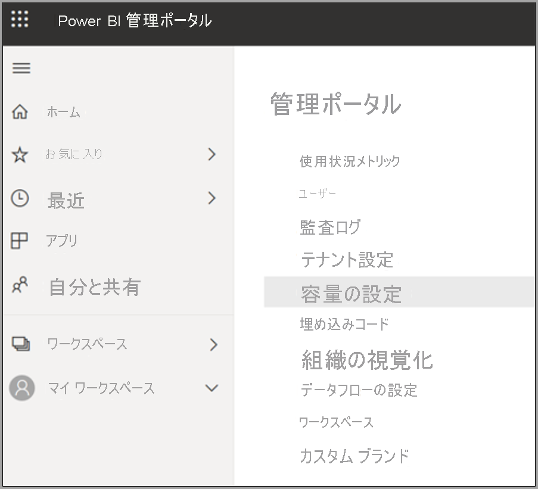
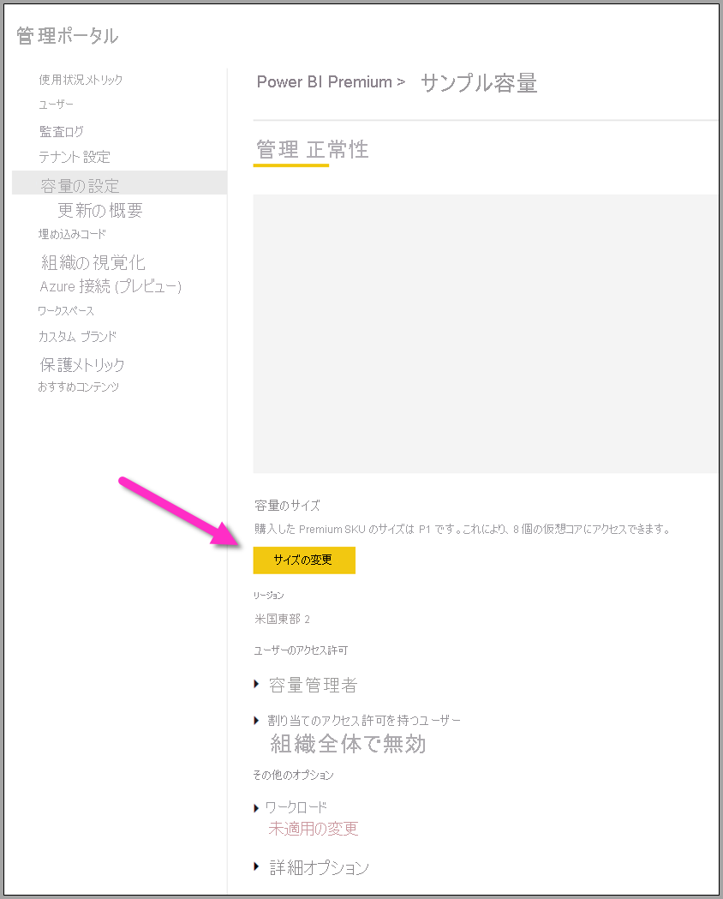

# Power BI Premium データフロー ワークロードを構成する

Power BI Premium サブスクリプションにデータフロー ワークロードを作成することができます。 Power BI では "*ワークロード*" の概念を使用して、Premium コンテンツを記述します。 ワークロードには、データセット、ページ分割されたレポート、データフロー、AI が含まれます。 "*データフロー*" ワークロードを使用すると、データフローのセルフサービスのデータ準備を使用して、データの取り込み、変換、統合、および強化を行うことができます。 Power BI Premium データフローは、 **[管理ポータル]** で管理されています。

以下のセクションでは、組織でデータフローを有効にする方法、Premium 容量の設定を調整する方法、および一般的な使用法のガイダンスについて説明します。

## Power BI Premium でのデータフローの有効化

Power BI Premium サブスクリプションでデータフローを使用するための最初の要件は、組織のデータフローを作成して使用できるようにすることです。 次の画像に示すように、 **[管理ポータル]** で、 **[テナント設定]** を選択し、 **[データフローの設定]** の下にあるスライダーを **[有効]** に切り替えます。

データフロー ワークロードを有効にした後、既定の設定で構成されます。 必要に応じて、これらの設定を調整することもできます。 次に、これらの設定が有効な場所について説明し、それぞれについて説明し、データフローのパフォーマンスを最適化するために値を変更する必要があるタイミングを把握できるようにします。

## データフロー設定の調整

データフローが有効になったら、 **[管理ポータル]** を使用して、データフローの作成方法と Power BI Premium サブスクリプションでのリソースの使用方法を変更または調整できます。 次の手順は、データフローの設定を調整する方法を示しています。

1. **[管理ポータル]** で、 **[テナント設定]** を選択し、作成されたすべての容量を一覧表示します。 設定を管理する容量を選択します。

    

2. Power BI Premium 容量には、データフローで使用可能なリソースが反映されます。 次の画像に示すように、 **[サイズの変更]** ボタンを選択することで容量のサイズを変更できます。

    

3. [容量の設定] で、 **[ワークロード]** を展開することにより、データフローの設定を構成できます。

    ![[ワークロード] セクションを展開する](media/dataflows-premium-workload-configuration/dataflows-premium-workloads-04.png)

4. **[ワークロード]** セクションで、**データフロー** 領域までスクロールします。 次の画像は、容量のデータフロー ワークロードの動作を制御または調整するために使用できる設定を示しています。

    

次の表に、データフロー設定の基本的な説明を示します。

| **管理セクション** | **設定名** | **説明** |
|---------|---------|---------|
| **容量のサイズ** | **サイズの変更** | 現在選択されている容量が一覧表示され、容量を変更するためのオプションが示されます。 この設定を変更すると、容量をスケールアップまたはスケールダウンできます。 |
| **[ワークロード]** | **最大メモリ (%)** | 容量のうち、データフローが使用できるメモリの最大割合。 |
| **[ワークロード]** | **拡張データフロー コンピューティング エンジン** | このオプションを有効にすると、大規模なデータ ボリュームを操作するときに、計算されたエンティティの計算を最大 20 倍高速化できます。  **新しいエンジンをアクティブ化するには、容量を再起動する必要があります。**  詳細については、「[拡張データフロー コンピューティング エンジン](../../admin/service-admin-premium-workloads.md#enhanced-dataflows-compute-engine)」を参照してください。 |
| **[ワークロード]** | **コンテナー サイズ** | データフロー内の各テーブルに対してデータフローが使用するコンテナーの最大サイズ。 既定値は 700 MB です。 詳細については、「[コンテナー サイズ](../../admin/service-admin-premium-workloads.md#container-size)」を参照してください。 |
| **[ワークロード]** | **Compute engine memory (%) (コンピューティング エンジンのメモリ (%))** | コンピューティング エンジンに割り当てられたメモリの最大率。 既定値は 30% です。 |

以下のセクションでは、各設定およびそれらがデータフロー ワークロードにどのように影響するかについて詳しく説明します。

### データフロー ワークロードのオプションについて

データフロー ワークロードのオプションについて考える簡単な方法は、例えを使用することです。 "*容量のサイズ*"、または所有している Power BI Premium インスタンスの種類は、"*レストラン*" と考えることができます。 レストラン内には、"*ワークロード メモリ*" があり、これが "*厨房*" ということになります。 "*コンピューティング エンジン*" は "*オーブン*" です。 最後に、"*コンテナー*" は "*シェフ*" の質です。 データフロー ワークロードのオプションを評価するために、大規模な、または非常に重要なディナー用の食事を準備するとします。 大切なお客様がやって来るため、彼らが到着するまでにディナーを出せるように準備する必要があります。

各設定について説明し、ガイダンスを提供するために、このレストランの例えを使用します。 最上位レベル (Premium 容量) から始めます。これが Power BI Premium を使用するときの最初の選択肢であるためです。

#### Premium 容量 SKU - ハードウェアをスケールアップする

Power BI Premium ワークロードではフロントエンドおよびバックエンド コアの組み合わせを使用して、さまざまなワークロードの種類にわたって高速なクエリを提供します。 「[容量ノード](../../admin/service-premium-what-is.md#capacity-nodes)」の記事には、使用可能な各ワークロード オファリングにおける現在の仕様を示すグラフが含まれています。 A3 以上の容量ではコンピューティング エンジンを利用できます。したがって、拡張コンピューティング エンジンを使用する必要がある場合は、そこ (「[容量ノード](../../admin/service-premium-what-is.md#capacity-nodes)」) から始めます。 

このレストランの例えでは、容量の選択は質の高いレストランの選択のようなものです。 コストは高くなりますが、フロントエンド コア、バックエンド コア、およびメモリの増加により、高いレベルのパフォーマンスを期待できます。 レストランが大きいほど、厨房が大きくなり、シェフの質が上がります。これは、Power BI Premium でより上位の SKU にアップグレードすると、CPU 速度が増し、操作ごとのメモリが増え、並列処理がさらに増えるという利点が得られることに似ています。

#### 最大メモリ - 容量をデータフロー専用にする 

**[最大メモリ (%)]** 設定は、データフロー ワークロード用に提供される、Premium 容量で使用可能な物理メモリに対するメモリの割合です。 データフロー ワークロードの全容量まで効率よく専用にすることができ、容量は必要に応じて、設定した割り当てに達するまで動的にスケール アップされます。 この例えでは、厨房を大きくすると、より多くの食事を作ることができます。同様に、データフローの容量のワークロード サイズを小さくし、より多くのデータフローを許可することができます。 動的なリソース管理が実施されていますが、 *[最大メモリ (%)]* 構成オプションを使用すると、100% のメモリをデータフロー ワークロード専用にすることができます。 これは、リソース管理に依存するのではなく、データフロー ワークロード用に確実に容量のメモリを使用できるようにするときのまれな状況の場合です。 例えを使用すると、これは厨房では確実にお客様の特定の食事を準備することに集中し、厨房全体でその作業に専念するようなものです。 もちろん、次のセクションで説明するように、より専念できても、よりおいしい食事をより迅速にテーブルに出せるとは限りません。

#### コンテナーのサイズ - 更新またはメモリ不足の問題

次は、 **[コンテナーのサイズ (MB)]** 設定について説明します。 内部的には、データフローで "*マッシュアップ コンテナー*" と呼ばれるプロセスを使用して、ETL プロセスを評価します。 エンジンによってクエリ ロジックがこれらのコンテナーに分割され、並列に処理することができます。 コンテナーの数に応じて、同時処理が効率的に行われ、パフォーマンスが向上します。 これらのコンテナーは、まず、 **[容量]** によって、次に **[最大メモリ (%)]** 設定によって、その後、特にコンテナー設定で割り当てられたメモリの量 (既定では 700 Mb) によって制約されます。 そのため、ハードウェア メモリの量を増やし、コンテナーのサイズを大きくすることができます。しかし、そのようにすると、コンテナー内の特定の ETL プロセス専用のメモリが増える一方で、並列操作が減ることになります。 コンテナーの数は、バックエンド コアの数の 3 倍に制限されます。これは、そのポイントを超えてコンテナーを非常に小さくして、多くの並列コンテナーを使用することはできないため、重要です。 設定できるコンテナーの最小サイズは 200 Mb です。 コンテナーのサイズはクエリ レベルにもスコープ設定されます。これは、クエリが他のクエリを参照している場合を除き、各クエリが独自のコンテナーで実行されることを意味します。この場合、それらは同じコンテナーの一部として更新されます。

例えに戻り、厨房で数は少ないものの調理により集中することで、受けた注文の種類や食事の複雑さに応じて、食事をより迅速に作ることができます。 ここでのトレードオフは、シェフは少なくなりますが、準備のための時間により重点を置けることです。 同様に、コンテナー サイズの測定単位を 1200 MB - 1500 MB に増やすことが、より少ない数のより複雑な ETL ジョブ (集計、結合、ピボット、行または列の操作などのアクティビティ) でパフォーマンスが向上する可能性があることを意味する場合があります。各コンテナーに対してより多くのメモリが提供されますが、そうすると、コンテナーの数が減ることになります。 この例えで示すとおり、注文数が多すぎると、実際には厨房での作業が遅くなることがあります。コンテナーのサイズについてもこのように考えることができます。複雑なテーブル操作を完了する必要がある場合、そのリソースを増やすと割り当てられたメモリがより少数のコンテナーに分割されるため、並列処理は可能になりますが、パフォーマンスは低下することになります。

つまり、使用されるクエリに基づいて、コンテナーのサイズを最適化する必要があることになります。 たとえば、単にソースからテーブルにデータを読み込むのであれば、データを取得して操作を実行する必要はなく、データをストレージに読み込むだけとなります。 読み込みおよび更新操作の速度を上げる必要があるため、この状況ではできるだけ多くの並列処理を行う必要があります。 逆に、変換操作 (複雑なフィルター、結合、集計) をさらに追加する場合、メモリ内でこれらの変換操作の一部を処理する必要がある可能性があるため、メモリが大幅に増えることがあります。 容量に対して他のデータフロー操作が実行されている場合は、これらの操作の速度が低下し、実行スロットを持つようにキューに強制的に入れられる可能性があることに注意してください。 この目的で、データフロー、更新のパフォーマンス、および容量全体の監視と管理が、**Power BI Premium Capacity Metrics** アプリによって支援されます。 [Power BI Premium 容量メトリック](../../admin/service-premium-capacity-optimize.md#what-content-is-using-up-my-capacity) アプリを使用して、容量単位でフィルター処理したり、ワークスペースのコンテンツのパフォーマンス メトリックを確認したりできます。 Premium 容量内に格納されているすべてのコンテンツについて、過去 7 日間のパフォーマンス メトリックとリソース使用量を時間単位で確認できます。したがって、データフローのパフォーマンスを調査する場合は、アプリから始めることをお勧めします。

#### 拡張コンピューティング エンジン - パフォーマンスを向上させる機会

この例えでは、[拡張コンピューティング エンジン](dataflows-premium-features.md#the-enhanced-compute-engine)はオーブンのようなものです。 Power BI ではコンピューティング エンジンを使用して、クエリおよび更新操作を処理します。 拡張コンピューティング エンジンは、標準的なエンジンを強化したものであり、SQL キャッシュにデータを読み込むことで動作し、SQL を使用してテーブルの変換、更新操作を高速化し、DirectQuery 接続を有効にします。 エンジンをオーブンと比較した場合、拡張オーブンを利用すると、食事をより迅速かつ効率的に作れる可能性があります。 計算対象エンティティについて、 **[オン]** または **[最適化]** に構成した状態で、ビジネス ロジックでそれが許可されている場合、パフォーマンスを向上させるために Power BI で SQL が使用されます。 エンジンを **[オン]** にすると、DirectQuery 接続も提供されます。 この例えで示すように、特定の食事ではオーブンを必要とせず、オーブンを利用する必要もない場合があります。 拡張コンピューティング エンジンも同じように考えることができます。データフローを使用するときに、拡張コンピューティング エンジンが適切に活用されていることを確認してください。 ユーザーは拡張コンピューティング エンジンを、データフローごとにオン、最適化、またはオフに構成することができます。

> [!NOTE]
> 拡張コンピューティング エンジンは一部のリージョンではまだご利用いただけません。

## 一般的なシナリオに関するガイダンス

このセクションでは、Power BI Premium でデータフロー ワークロードを使用する場合の一般的なシナリオに関するガイダンスを提供します。

### 長い更新時間

長い更新時間は通常、並列処理の問題です。 次のオプションをこの順番で確認する必要があります。

1. 長い更新時間の重要な概念は、データ準備の性質です。 この記事の前半で説明したレストランの例えでは、食品は既に準備しており、使用されるのを待っているとします。 このシナリオでは、準備時間が最小限になるため、食品をはるかに迅速に調理できます。 同様に、データ ソースを利用し、実際に準備を行い、事前クエリ ロジックを実行することで、長い更新時間を最適化できる場合は常にそのようにする必要があります。 特に、ソースとして SQL などのリレーショナル データベースを使用する場合は、最初のクエリをソースで実行できるかどうかを確認し、そのソース クエリをデータ ソースの初期抽出データフローに使用します。 ソース システムでネイティブ クエリを使用できない場合は、データフローの[エンジンでデータ ソースにフォールドできる](/power-query/power-query-folding)操作を実行します。

2. 同じ容量での更新時間の分散を評価します。 更新操作は、大量のコンピューティングを必要とするプロセスです。 レストランの例えを使用すると、更新時間の分散は、レストランの客数を制限することに似ています。 レストランで客をスケジューリングし、容量を計画するのと同じように、使用量がフル ピークに達していない場合でも更新操作を検討する必要があります。 これが容量の負担の緩和に役立つ場合があります。

3. ワークロードに与えられる全体的なメモリの量を増やします。 これを厨房のサイズと考えます。 このリソースを調整することは、厨房に合わせてシェフの数を調整することに似ています。 これを行うには、 **[最大メモリ (%)]** 設定を調整し、100% まで増やします。

4. コンテナーに対するメモリの量を減らします。これにより、コンテナーを増やすことができます。 これは次のように考えることができます。Gordon Ramsey のような有名な腕のいいシェフを雇うのではなく、有能でも賃金が安いシェフを多く雇います。 したがって、厨房での調理数は増えますが、各シェフの作業は簡単なもののみになる場合があります。 つまり、コンテナーは増えても、メモリは少なくなります。

5. 前の手順の両方を行うと、並列処理の次数をさらに高くすることができます。これは調理数が増え、厨房が大きくなるためです。
    
6. このセクションの手順で必要な並列処理の次数が得られない場合は、容量を上位の SKU にアップグレードすることを検討してください。 その後、このセクションの前の手順にもう一度従います。

### メモリ不足の例外

**メモリ不足の例外** が発生した場合は、コンテナーとメモリのパフォーマンスを向上させる必要があります。 次の手順を実行します。

1. コンテナーのメモリを増やします。 これは、前のセクションで説明したように、1 人の花形シェフと多数のシェフの場合と似ています。

2. ワークロードに対するメモリを増やし、コンテナーに対するメモリをさらに増やします。 この例えでは、厨房をより大きくし、シェフの質を上げます。

3. これらの変更によって必要な並列処理の次数が得られない場合は、より高い Power BI Premium SKU を検討してください。

### コンピューティング エンジンを使用したパフォーマンスの向上

次の手順を行い、ワークロードによって確実にコンピューティング エンジンがトリガーされ、常にパフォーマンスが向上するようにします。

**同じワークスペース内の計算およびリンクされたエンティティの場合:**

1. "*取り込み*" の場合は、データセット全体のサイズを小さくする場合にのみフィルターを使用して、可能な限り迅速にストレージにデータを取り込むことに集中します。 変換ロジックをこの手順から切り離し、エンジンが材料の初期収集に集中できるようにすることをお勧めします。 次に、リンクまたは計算されたエンティティを使用して、変換とビジネス ロジックを同じワークスペース内の別個のデータフローに分割します。これにより、エンジンがアクティブ化し、計算を高速化することができます。 この例えでは、厨房での食品の準備のようなものです。通常、食品の準備は素材を集めることとは異なる別の手順であり、食品をオーブンに入れるための前提条件となります。 同様に、コンピューティング エンジンを利用するには、ロジックを別個に準備する必要があります。

2. フォールドする操作 (結合、結合、変換、および[その他](/power-query/power-query-folding#transformations-that-can-achieve-folding)の操作など) を確実に実行してください。

3. [公開されているガイドラインと制限事項内](dataflows-features-limitations.md#dataflows-in-premium)でのデータフローの構築。

DirectQuery を使用することもできます。

### コンピューティング エンジンはオンになっているがパフォーマンスが低下している

コンピューティング エンジンがオンになっていても、パフォーマンスの低下が見られるシナリオについて調べる場合は、次の手順を行います。

1. ワークスペース全体に存在する計算およびリンクされたエンティティを制限します。

2. コンピューティング エンジンをオンにして最初の更新を実行すると、データはレイクとキャッシュに書き込まれます。 この二重書き込みは、これらの更新が遅くなることを意味します。

3. 複数のデータフローにリンクされているデータフローがある場合は、すべての更新が同時に行われないように、必ずソース データフローの更新をスケジューリングしてください。

## 次のステップ
データフローと Power BI の詳細については、以下の記事を参照してください。

* [データフローとセルフサービスのデータ準備の概要](dataflows-introduction-self-service.md)
* [データフローの作成](dataflows-create.md)
* [データフローの構成と使用](dataflows-configure-consume.md)
* [Azure Data Lake Gen 2 を使用するようにデータフロー ストレージを構成する](dataflows-azure-data-lake-storage-integration.md)
* [データフローを使用した AI](dataflows-machine-learning-integration.md)
* [データフローの制限事項と考慮事項](dataflows-features-limitations.md)