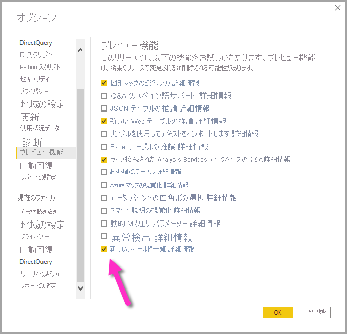
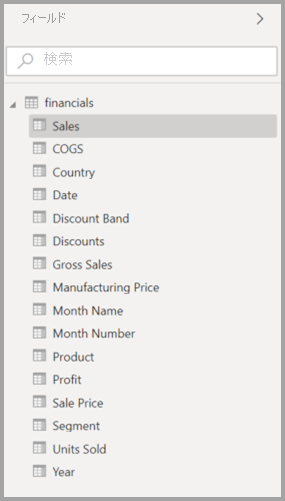
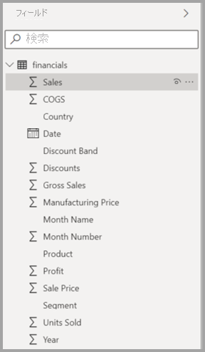
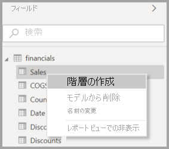
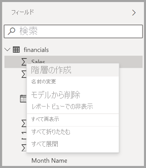
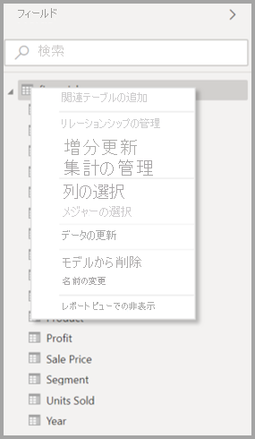
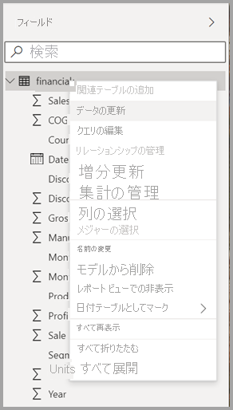
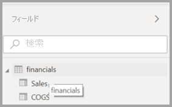
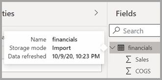

# Power BI Desktop のフィールド一覧の使用 (プレビュー)

2020 年 11 月の更新プログラム以降、Power BI Desktop のモデル ビュー、データ ビュー、レポート ビューのすべてで **フィールド** 一覧を統一する作業が行われています。 これらのビューを統一することで、ビュー全体の機能とユーザー インターフェイス (UI) が一貫したものになり、お客様からのフィードバックに対処されます。

ビューに関する変更点は次のとおりです。

* 図像
* 検索機能
* コンテキスト メニュー項目
* 類似したドラッグ アンド ドロップ動作
* ヒント
* アクセシビリティの機能強化

目的は Power BI Desktop をいっそう使いやすくすることです。 通常のデータ ワークフローへの変更の影響は、最小限にする必要があります。

## 新しいフィールド一覧の有効化 (プレビュー)

統合フィールド一覧は **[モデル]** ビューで開始し、その後、他のビューで有効になります。 統合フィールド ビューを有効にするには、Power BI Desktop で **[ファイル] > [オプションと設定] > [オプション]** に移動し、左側のペインで **[プレビュー機能]** を選択します。 [プレビュー機能] セクションで、 **[New field list]\(新しいフィールド一覧\)** の横にあるチェック ボックスをオンにします。

選択を有効にするため Power BI Desktop を再起動するよう求められます。

## フィールド一覧の変更

次の表では、フィールド一覧に関する更新を示します。 

|**元のフィールド一覧 (モデル ビュー)**  | **新しいフィールド一覧 (モデル ビュー)**  |
|:---------:|:---------:|
|**Original** |**[新規作成]** |
|**アイコンと UI**       ||
|     |    |
|**コンテキスト メニュー - フィールド**       ||
|     |    |
|**コンテキスト メニュー - テーブル**       ||
|     |    |
|**ヒント**       ||
|     |    |

## フィールド一覧アイコン

新しいフィールド一覧アイコンもあります。 次の表では、元のアイコンとそれに相当する新しいアイコン、およびそれぞれの簡単な説明を示します。 

|元のアイコン  |新規アイコン  |説明  |
|:---------:|:---------:|:---------|
|     |           |[フィールド] リストのフォルダー         |
|     |         |数値フィールド: 数値フィールドは、合計や平均などが可能な集計です。 集計は、データと一緒にインポートされ、レポートの基となるデータ モデルで定義されます。 詳細については、「[Power BI レポートの集計](../create-reports/service-aggregates.md)」を参照してください。         |
|     |         |数値以外のデータ型を含む計算列: 列の値を定義する Data Analysis Expressions (DAX) 式を使用して作成する新しい数値以外の列です。 [計算列](desktop-calculated-columns.md)に関する詳細情報を表示します。        |
|     |          |数値の計算列: 列の値を定義する Data Analysis Expressions (DAX) 式を使用して作成する新しい列です。 [計算列](desktop-calculated-columns.md)に関する詳細情報を表示します。         |
|     |          |メジャー: メジャーには、独自のハードコーディングされた式があります。 レポート閲覧者は、計算を変更することはできません、たとえば、合計であれば、合計のままにしかできません。 値は列に格納されません。 これらは、ビジュアル内の場所のみに応じて、すぐに計算されます。 詳細については、「[メジャーについて](desktop-measures.md)」を参照してください。         |
|     |         |メジャー グループ。         |
|     |         |KPI: 測定可能な目標に対する進捗状況を視覚的に伝える方法の 1 つです。 [主要業績評価指標 (KPI)](../visuals/power-bi-visualization-kpi.md) ビジュアルに関する詳細について参照してください。         |
|     |           |フィールドの階層: 矢印を選択し、階層を構成するフィールドを表示します。 詳細については、YouTube で[階層の作成と使用](https://www.youtube.com/watch?v=q8WDUAiTGeU)についてのこの Power BI ビデオをご覧ください。         |
|     |         |Geo データ: これらの場所フィールドは、地図の視覚化を作成するために使用できます。         |
|     |          |ID フィールド: このアイコンのフィールドは、一意のフィールドであり、重複するものがあっても、すべての値が表示されるように設定されています。 たとえば、データに 'Robin Smith' という名前のユーザーのためのレコードが 2 つあったとしても、それぞれが一意として扱われます。 これらは合算されることはありません。         |
|     |          |パラメーター: 1 つまたは複数のパラメーター値に応じて、レポートおよびデータ モデルの一部 (クエリ フィルター、データ ソース参照、メジャー定義など) にするパラメーターを設定します。 詳細については、この Power BI の[クエリ パラメーター](https://powerbi.microsoft.com/blog/deep-dive-into-query-parameters-and-power-bi-templates/)に関するブログ投稿を参照してください。         |
|     |         |組み込みの日付テーブルを含むカレンダー日付フィールド。         |
|     |          |計算テーブル:モデルに既に読み込まれているデータに基づいて、Data Analysis Expressions (DAX) 式で作成されたテーブル。 これらは中間計算に最適であり、モデルの一部として格納できます。         |
|     |         |警告:エラーがある計算フィールド。 たとえば、DAX 式の構文が正しくない場合があります。         |
|     |         |グループ:この列の値は、グループとビンの機能を使用する、別の列からの値のグループ化に基づいています。 [グループ化とビン分割を使用する](../create-reports/desktop-grouping-and-binning.md)方法を参照してください。         |
| 元のアイコンなし    |          |変更検出メジャー:ページが自動的に更新されるようにページを構成するときに、ページのビジュアルの残りの部分を更新する必要があるかどうかを判断するためにクエリが実行される[変更検出メジャー](../create-reports/desktop-grouping-and-binning.md)を構成できます。         |

## 次のステップ

次の記事にも興味をもたれるかもしれません。

* [Power BI Desktop での計算列の作成](desktop-calculated-columns.md)
* [Power BI Desktop でグループ化とビン分割を使用する](../create-reports/desktop-grouping-and-binning.md)
* [Power BI Desktop レポートでグリッド線と "グリッドにスナップ" を使用する](../create-reports/desktop-gridlines-snap-to-grid.md)

