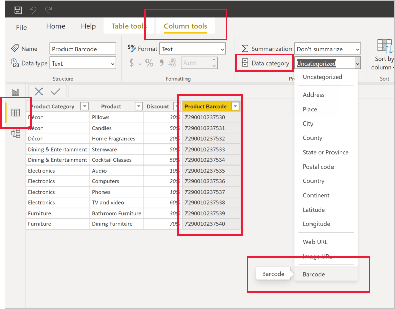

# Power BI Desktop でバーコード フィールドにタグを付け、モバイル アプリでバーコードスキャンのフィルター処理を有効にする

Power BI Desktop で列の[データを分類](desktop-data-categorization.md)し、Power BI Desktop がレポートの表示での値の処理方法を認識できるようにすることができます。 列を **バーコード** として分類することもできます。 その後、会社または組織内の誰かが、iOS または Android スマートフォンあるいはタブレットの Power BI モバイル アプリを使用して製品の[バーコードをスキャンする](../consumer/mobile/mobile-apps-scan-barcode-iphone.md)と、そのバーコードを含むレポートが表示されます。 レポートを開くと、そのバーコードに関連するデータに自動的にフィルターが適用されます。

## バーコード データを分類する

バーコードを含むレポートがあるとします。 

1. Power BI Desktop で、データ ビューに切り替えます。
2. バーコード データを含む列を選択します。 後の「[サポートされるバーコード形式](#supported-barcode-formats)」の一覧を参照してください。
3. **[列ツール]** タブで、 **[データ カテゴリ]**  >  **[バーコード]** の順に選択します。
   
    

    >[!WARNING]
    >レポート内のすべてのデータ テーブルにわたる複数の列を **バーコード** として分類しないでください。 モバイル アプリでは、すべてのレポート データ テーブルにわたるバーコード列が 1 つしかないレポートに対してのみ、バーコード フィルター処理がサポートされます。 レポートに複数のバーコード列がある場合、フィルター処理は行われません。

4. レポート ビューで、バーコードによってフィルター処理するビジュアルにバーコード フィールドを追加します。
5. レポートを保存して、Power BI サービスに発行します。

これで iOS と Android スマートフォンおよびタブレット用の Power BI アプリでスキャナーを開き、バーコードをスキャンすると、バーコードがあるレポートの一覧にこのレポートが表示されるようになります。 レポートを開くと、スキャンした製品バーコードでそのビジュアルがフィルター処理されます。

## サポートされるバーコード形式
Power BI レポートでタグを付けることができる場合は、Power BI で次のバーコード形式が認識されます。 

* UPCECode 
* Code39Code  
* A39Mod43Code 
* EAN13Code 
* EAN8Code  
* 93Code  
* 128Code 
* PDF417Code 
* Interleaved2of5Code 
* ITF14Code 

## 次のステップ
* [iOS または Android スマートフォンあるいはタブレットの Power BI アプリからバーコードをスキャンする](../consumer/mobile/mobile-apps-scan-barcode-iphone.md)
* [バーコードのスキャンに関する問題](../consumer/mobile/mobile-apps-scan-barcode-iphone.md#issues-with-scanning-a-barcode)
* [Power BI Desktop でのデータ分類](desktop-data-categorization.md)  
* わからないことがある場合は、 [Power BI コミュニティで質問してみてください](https://community.powerbi.com/)。
