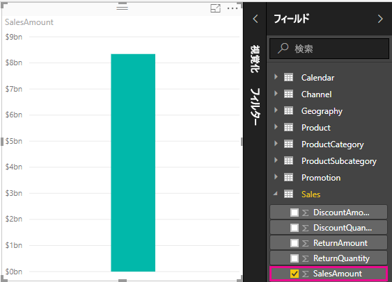
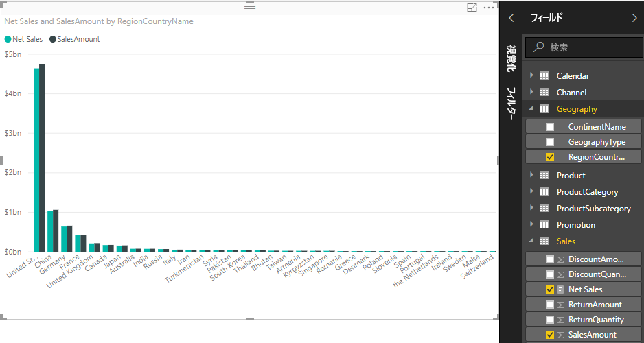
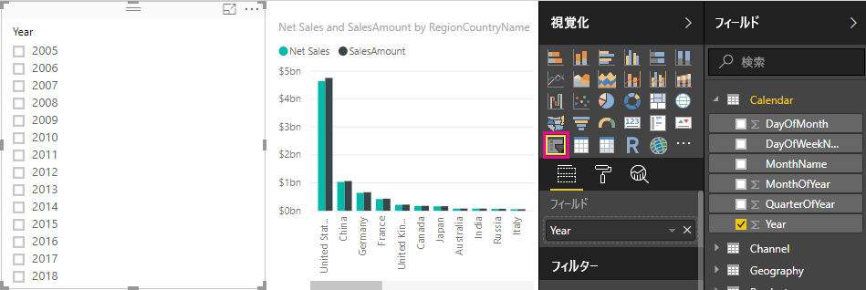
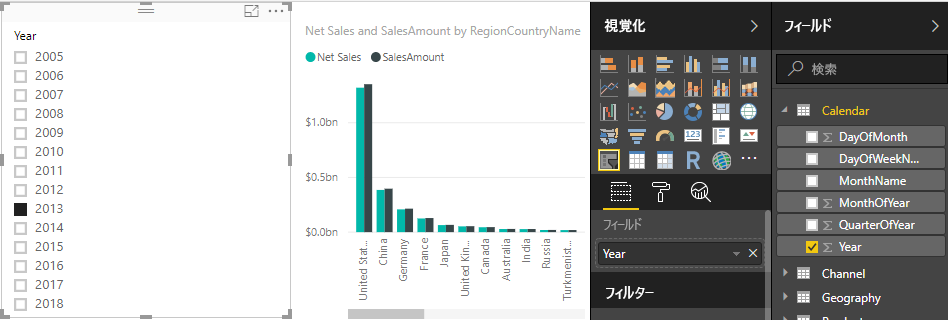
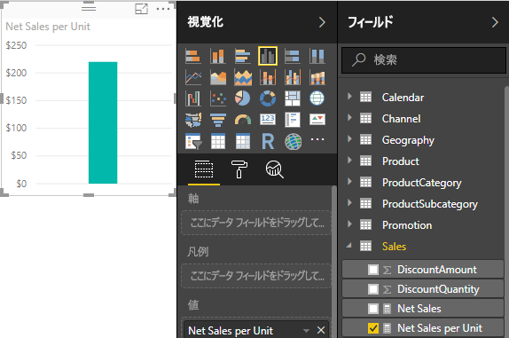
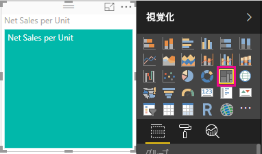
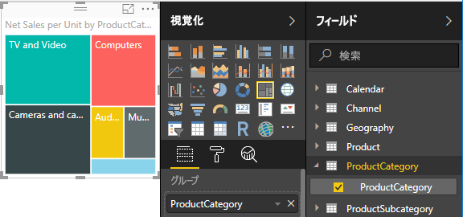
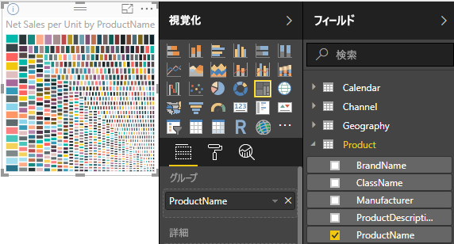

# チュートリアル:Power BI Desktop での独自のメジャーの作成
メジャーを使用すると、Power BI Desktop で最も強力なデータ分析ソリューションをいくつか作成できます。 メジャーは、ユーザーがレポートで操作するデータに対して計算を実行するために役立ちます。 このチュートリアルでは、メジャーの基本について説明し、独自のメジャーを Power BI Desktop で作成する手順を紹介します。

## 前提条件

- このチュートリアルは、Power BI Desktop を使用して高度なモデルを作成することに既に慣れている Power BI ユーザー向けに書かれています。 [データの取得] とクエリ エディターを使用してデータをインポートする操作、複数の関連したテーブルを取り扱う操作、およびレポート キャンバスにフィールドを追加する操作に既に習熟している必要があります。 Power BI Desktop を新しく使い始めたユーザーの場合は、まず「[Power BI Desktop の概要](../fundamentals/desktop-getting-started.md)」をお読みください。
  
- このチュートリアルでは、[Contoso Sales Sample for Power BI Desktop](https://download.microsoft.com/download/4/6/A/46AB5E74-50F6-4761-8EDB-5AE077FD603C/Contoso%20Sales%20Sample%20for%20Power%20BI%20Desktop.zip) ファイルを使用します。このファイルには、Contoso という架空の会社のオンライン売上データが既に含まれています。 このデータはデータベースからインポートされるため、データソースに接続したり、クエリ エディターで表示したりすることはできません。 ご使用のコンピューターにファイルをダウンロードして展開します。

## 自動メジャー

Power BI Desktop でメジャーが作成されるときは、ほとんどの場合、自動的に作成されます。 Power BI Desktop でメジャーがどのように作成されるかを確認するため、次の手順を行います。

1. Power BI Desktop で、 **[ファイル]**  >  **[開く]** の順に選択し、*Contoso Sales Sample for Power BI Desktop.pbix* ファイルを参照し、 **[開く]** を選択します。

2. **[フィールド]** ウィンドウで、**Sales** テーブルを展開します。 次に、 **[SalesAmount]** フィールドの横にあるチェックボックスをオンにするか、**SalesAmount** をレポート キャンバスにドラッグします。

    新しい縦棒グラフの視覚化が表示され、**Sales** テーブルの **SalesAmount** 列のすべての値を合計した値が表示されます。

    

**[フィールド]** ウィンドウ内のシグマ アイコン  付きのすべてのフィールド (列) は数値で、その値は集計することができます。 Power BI Desktop では、多数の値 (**SalesAmount** に 200 万行) を含むテーブルを表示するのではなく、数値データ型を検出すると、メジャーを自動的に作成して計算し、データを集計します。 合計は数値データ型の既定の集計ですが、平均やカウントなど、異なる集計を簡単に適用できます。 メジャーはすべて何らかの種類の集計を実行するので、集計について理解することは、メジャーについて理解することの土台になります。 

グラフの集計を変更するには、次の手順を行います。

1. レポート キャンバスで **SalesAmount** 視覚化を選択します。  

1. **[視覚化]** ウィンドウの **[値]** 領域で、 **[SalesAmount]** の右側にある下矢印を選択します。 

1. 表示されたメニューから、 **[平均]** を選択します。 

    視覚化グラフは、**SalesAmount** フィールド内のすべての売上値の平均に変わります。

    

必要な結果に応じて、集計の種類を変更できます。 ただし、すべての種類の集計がすべての数値データ型に適用されるわけではありません。 たとえば、**SalesAmount** フィールドの場合、合計と平均は有用で、最小値と最大値にも役割があります。 ただし、カウントは **SalesAmount** フィールドではあまり意味をなしません。このフィールドの値は数値ですが、実際には金額だからです。

メジャーから計算される値は、ユーザーのレポート操作に合わせて変化します。 たとえば、**RegionCountryName** フィールドを **Geography** テーブルから既存の **SalesAmount** グラフにドラッグすると、各国の平均売上金額が表示されるように変更されます。

ユーザーがレポートを操作した結果としてメジャーが変化した場合は、ユーザーがそのメジャーの *コンテキスト* に影響を与えたことになります。 ユーザーがレポートの視覚化を操作するたびにコンテキストが変更され、メジャーは結果を計算して表示します。

## 独自のメジャーの作成と使用

ほとんどの場合、Power BI Desktop によって自動的に計算され、選択したフィールドと集計の種類に応じて値が返されます。 ただし、場合によっては、さらに複雑な固有の計算を実行するために独自のメジャーを作成した方がよい場合があります。 Power BI Desktop では、Data Analysis Expressions (DAX) 数式言語を使用して独自のメジャーを作成できます。 

DAX の数式では、Excel の数式と同じ関数、演算子、および構文を多数使用しています。 ただし、DAX の関数は、リレーショナル データを処理し、ユーザーがレポートを操作するのに合わせて動的に計算を実行するように設計されています。 200 種類を超える DAX 関数は、Sum や Average などの簡単な集計から、さらに複雑な統計関数やフィルター処理関数まで、あらゆる処理を実行できます。 DAX の理解を深めるために役立つリソースは多数あります。 このチュートリアルを終えたら、「[Power BI Desktop における DAX の基本事項](desktop-quickstart-learn-dax-basics.md)」をお読みください。

独自のメジャーを作成すると、それは *モデル* メジャーと呼ばれ、選択したテーブルの **[フィールド]** リストに追加されます。 メジャー モデルの利点として、任意の必要なものに名前を付けて識別しやすくすることができる、他の DAX 式の引数として使用できる、複雑な計算を高速に実行できるなどがあります。

### クイック メジャー

Power BI Desktop の 2018 年 2 月のリリースから、ウィンドウでの入力に基づいて DAX 式が自動的に入力される *クイック メジャー* で、利用できる一般的な計算が多数増えました。 迅速で強力な計算なので、DAX の学習や、独自のカスタマイズしたメジャーのシード処理にも役立ちます。 

次のいずれかの方法を使用して、クイック メジャーを作成します。 
 - **[フィールド]** ウィンドウ内のテーブルで、**その他のオプション** **[...]** を右クリックするか選択し、一覧から **[新しいクイック メジャー]** を選択します。

 - Power BI Desktop リボンの **[ホーム]** タブにある **[計算]** の下で、 **[新しいクイック メジャー]** を選択します。

クイック メジャーの作成と使用の詳細については、[クイック メジャーの使用](desktop-quick-measures.md)に関するページを参照してください。

### メジャーを作成する

総売上金額から割引と返品を差し引いて純売上高を分析したいとします。 視覚化に存在するコンテキストには、SalesAmount の合計から DiscountAmount と ReturnAmount の合計を差し引くメジャーが必要です。 **[フィールド]** リストに純売上高のフィールドはありませんが、純売上高を計算する独自のメジャーを作成するための構成要素はあります。 

メジャーを作成するには、次の手順に従います。

1. **[フィールド]** ウウィンドウで、**Sales** テーブルを右クリックするか、テーブルにマウス カーソルを移動し、**その他のオプション** **[...]** を選択します。 

1. 表示されたメニューから、 **[新しいメジャー]** を選択します。 

    このアクションにより、新しいメジャーが **Sales** テーブルに保存され、簡単に検索できるようになります。
    
    ![一覧の [新しいメジャー]](media/desktop-tutorial-create-measures/meastut_netsales_newmeasure.png)
    
    Power BI Desktop リボンの **[ホーム]** タブにある **[計算]** グループの **[新しいメジャー]** を選択して、新しいメジャーを作成することもできます。
    
    ![リボンの [新しいメジャー]](media/desktop-tutorial-create-measures/meastut_netsales_newmeasureribbon.png)
    
    >[!TIP]
    >メジャーをリボンから作成すると、どのテーブルでもメジャーを作成できますが、使用する予定の場所にメジャーを作成すると見つけやすくなります。 この場合、まず **Sales** テーブルを選択してアクティブにしてから、 **[新しいメジャー]** を選択します。 
    
    レポート キャンバスの上部に数式バーが表示されます。数式バーでは、メジャーの名前を変更し、DAX 式を入力できます。
    
    
    
1. 既定では、新しいメジャーにはそれぞれ *Measure* という名前が付けられます。 名前を変更しない場合、新しいメジャーを追加すると *Measure 2*、*Measure 3* などの名前になります。 メジャーを識別しやすくしたいので、数式バーで *Measure* を強調表示してから、*Net Sales* に変更します。
    
1. 数式の入力を開始します。 等号に続けて「*Sum*」と入力します。 入力すると、ドロップダウン候補リストに、入力した文字で始まるすべての DAX 関数が表示されます。 必要に応じて下にスクロールしてリストから **[SUM]** を選択し、**Enter** キーを押します。
    
    
    
    始めかっこが表示され、ドロップダウン候補リストに、SUM 関数に渡すことのできる使用可能な列が表示されます。
    
    
    
1. 式は、常に、始めかっこと終わりかっこの間に入ります。 この例では、式には SUM 関数に渡す 1 つの引数 (**SalesAmount** 列) が含まれます。 **Sales (SalesAmount)** がリストに残されている唯一の値になるまで、「*SalesAmount*」と入力します。 

    テーブル名の前にある列名は、列の完全修飾名と呼ばれます。 列の完全修飾名を使用すると、式が読みやすくなります。
    
    
    
1. 一覧から **Sales[SalesAmount]** を選択し、終わりかっこを入力します。
    
    > [!TIP]
    > 構文エラーが最も発生しやすいケースは、終わりかっこの入力漏れか、入力位置の間違いです。
    
    
    
1. 数式内の他の 2 つの列を減算します。

    a. 最初の式の終わりかっこの後に、スペース、マイナス演算子 (-)、もう 1 つスペースの順に入力します。 

    b. もう 1 つの SUM 関数を入力し、**Sales[DiscountAmount]** 列が引数として選択できるようになるまで「*DiscountAmount*」と入力します。 閉じかっこを追加します。 

    c. スペース、マイナス演算子、スペース、**Sales[ReturnAmount]** を引数とするもう 1 つの SUM 関数、終わりかっこの順に入力します。
    
    
    
1. **Enter** キーを押すか、数式バーにある **コミット** (チェックマーク アイコン) を選択して入力を完了し、数式を検証します。 

    検証された **Net Sales** メジャーは、 **[フィールド]** ウィンドウの **Sales** テーブルで使用できるようになります。
    
    
    
1. 数式を入力する領域が足りなくなった場合や、複数行に分けたい場合は、数式バーの右側にある下矢印を選択して、領域を広げます。 

    下矢印が上矢印に変わり、大きなボックスが表示されます。

    

1. **Alt** + **Enter** キーを押しながら別の行の数式の一部を分割したり、**Tab** キーを押してタブの間隔を広げたりします。

   

### レポートでメジャーを使用する
新しい **Net Sales** メジャーをレポート キャンバスに追加し、レポートに他の任意のフィールドを追加して純売上高を計算します。 

国別の純売上高を表示するには:

1. **Net Sales** メジャーを **Sales** テーブルから選択するか、レポート キャンバスにドラッグします。
    
1. **RegionCountryName** フィールドを **Geography** テーブルから選択するか、**Net Sales** グラフにドラッグします。
    
    
    
1. 純売上高と売上高の差異を国別に表示するには、**SalesAmount** フィールドを選択するか、グラフにドラッグします。 

    

    グラフでは、次の 2 つのメジャーが使用されるようになりました:Power BI で自動的に合計される **SalesAmount** と、手動で作成した **Net Sales** メジャー。 各メジャーは別フィールド **RegionCountryName** のコンテキストで計算されました。
    
### スライサーでメジャーを使用する

スライサーを追加して、純売上高と売上高を、カレンダー年でさらにフィルター処理します。
    
1. グラフの横にある空白の領域を選択します。 **[視覚化]** ウィンドウで、 **[テーブル]** 視覚化を選びます。 

    このアクションにより、空白のテーブルの視覚化がレポート キャンバスに作成されます。
    
    
    
1. **Year** フィールドを **Calendar** テーブルから新しい空白のテーブルの視覚化にドラッグします。 
    
    **Year** は数値フィールドであるため、Power BI Desktop によってその値が合計されます。 この合計は、集計としては正しく機能しません。これについては、次の手順で説明します。

    
    
3. **[視覚化]** ウィンドウの **[値]** ボックスで、**Year** の横にある下矢印を選択し、一覧から **[集計しない]** を選択します。 テーブルに個々の年が表示されるようになります。
    
    ![[集計しない] を選択](media/desktop-tutorial-create-measures/meastut_netsales_year_donotsummarize.png)
    
4.  **[視覚化]** ウィンドウで **[スライサー]** アイコンを選択して、テーブルをスライサーに変換します。 視覚化に一覧ではなくスライダーが表示される場合は、スライダーの下矢印から **[一覧]** を選択します。

    
    
5.  **Year** スライサーで任意の値を選択すると、それに従って **RegionCountryName 別の売上高と純売上高** グラフがフィルター処理されます。 選択した **Year** フィールドのコンテキストで **Net Sales** メジャーと **SalesAmount** メジャーが再計算され、結果が表示されます。 
    
    

### 作成したメジャーを別のメジャーで使用する

販売されたユニットあたりの純売上高が最も高い製品を特定したいとします。 純売上高を販売されたユニット数で除算するメジャーが必要になります。 この場合、**Net Sales** メジャーの結果を **Sales[SalesQuantity]** の合計で除算する新しいメジャーを作成します。

1.  **[フィールド]** ウィンドウで、**Net Sales per Unit** という名前の新しいメジャーを、**Sales** テーブルに作成します。
    
1. 数式バーに「*Net Sales*」と入力します。 追加できる項目が候補リストに表示されます。 **[Net Sales]** を選択します。
    
    
    
1. また、始め角かっこ ( **[** ) を入力するだけで、メジャーを参照することもできます。 候補リストには、数式に追加できるメジャーのみが表示されます。
    
    
    
1. スペース、除算演算子 (/)、もう 1 つのスペース、SUM 関数の順に入力し、「*Quantity*」と入力します。 候補リストに、名前に「*Quantity*」が含まれるすべての列が表示されます。 **Sales[SalesQuantity]** を選択し、終わりかっこを入力し、**Enter** キーを押すか、**コミット** (チェックマーク アイコン) を選択して数式を検証します。 

    結果として得られる式は次のようになります。
    
    `Net Sales per Unit = [Net Sales] / SUM(Sales[SalesQuantity])`
    
1. **Net Sales per Unit** メジャーを **Sales** テーブルから選択するか、レポート キャンバスの空白の領域にドラッグします。 

    グラフには、販売されたすべての製品のユニットあたりの純売上高が表示されます。 このグラフはあまり有益ではありません。これについては、次の手順で説明します。
    
    
    
1. 表示方法を変えるために、グラフの視覚化タイプを **[ツリーマップ]** に変更します。
    
    
    
1. **ProductCategory** フィールドを選択するか、ツリーマップまたは **[視覚化]** ウィンドウの **[グループ]** フィールドにドラッグします。 ここでお勧めの情報を紹介します。
    
    
    
7. **ProductCategory** フィールドを削除し、代わりに **ProductName** フィールドをグラフにドラッグしてみてください。 
    
    
    
   これは単なるお遊びですが、すばらしい機能ではありませんか。 他の視覚化のフィルター処理と書式設定も試してみてください。

## 学習した内容
メジャーには、データから必要な洞察を得るための機能があります。 ここでは、数式バーを使用してメジャーを作成し、わかりやすい名前を付け、DAX の候補リストを使用して適切な数式の要素を見つけて選択する方法を学びました。 また、コンテキストについても学習しました。コンテキストとは、メジャーの計算結果が他のフィールドに従って変化すること、または数式にある他の式によって変化することを指します。

## 次の手順
- 多数の一般的なメジャーの計算を利用できる Power BI Desktop のクイック メジャーの詳細については、「[クイック メジャーを使用して一般的で強力な計算を簡単に実行する](desktop-quick-measures.md)」を参照してください。
  
- DAX の数式についてさらに詳しく知りたい場合や、さらに高度なメジャーを作成する場合は、「[Power BI Desktop での DAX の基本事項](desktop-quickstart-learn-dax-basics.md)」を参照してください。 この記事では、構文、関数、およびコンテキストの詳しい理解など、DAX の基本的な概念について説明します。
  
- また、「[Data Analysis Expressions (DAX) リファレンス](/dax/index)」を、ぜひお気に入りに追加してください。 このリファレンスでは、DAX の構文、演算子、および 200 種類を超える DAX 関数について詳細を調べることができます。