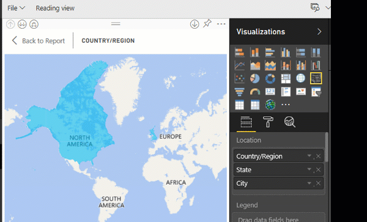

# Power BI マップの視覚エフェクトに関するヒントとテクニック

[!INCLUDE[consumer-appliesto-nyyn](../includes/consumer-appliesto-nyyn.md)]    

Power BI は Bing マップと統合されており、既定のマップ座標 (ジオコーディングと呼ばれるプロセス) が提供されているため、マップを作成できます。 正しい位置を特定するアルゴリズムも使用されますが、それが最適な推測の場合もあります。 Power BI を使用してもマップの視覚化が自動的に作成されない場合は、Bing マップの機能を利用してください。 

ユーザーまたは管理者は、Bing がジオコーディングに使う URL へのアクセスを許可するように、ファイアウォールを更新することが必要な場合があります。  以下の URL です。
* https://dev.virtualearth.net/REST/V1/Locations
* https://platform.bing.com/geo/spatial/v1/public/Geodata
* https://www.bing.com/api/maps/mapcontrol

ジオコーディングの正確性を高めるために、次のヒントを使用してください。 最初の一連のヒントは、データセット自体へのアクセス権がある場合に使うものです。 次の一連のヒントは、データセットにアクセスできない場合に Power BI で実行できることです。 

## Bing マップへの送信内容
Power BI サービスと Power BI Desktop は、マップのビジュアルを作成するために必要な地理データを Bing に送信します。 これには、ビジュアルのフィールド ウェルの **[場所]** 、 **[緯度]** 、および **[経度]** バケットのデータが含まれる場合があります。 厳密な送信内容はマップの種類によって異なります。 詳細については、「[Microsoft のプライバシーに関する声明](https://go.microsoft.com/fwlink/?LinkID=248686)」を参照してください。

* マップ (バブル、散布、およびドット プロット マップ) で、緯度と経度が指定される場合、何のデータも Bing に送信されません。 指定されない場合、 **[場所]** バケットのデータが Bing に送信されます。     

* 塗り分け地図を作成するには、緯度と経度が指定されている場合でも、 **[場所]** バケットにフィールドが必要です。 **[場所]** バケット、 **[緯度]** バケット、 **[経度]** バケットにどのようなデータがある場合でも、Bing に送信されます。
  
    下の例では、 **[Vendor]\(ベンダー\)** フィールドがジオコーディングに使用されているので、[Vendor]\(ベンダー\) 列の値が Bing に送信されます。 **[サイズ]** バケットと **[色の彩度]** バケットのデータは Bing に送信されません。
  
    
  
    この 2 つ目の例では、フィールド **[担当地域]** がジオコーディングに使用されるので、[担当地域] 列の値が Bing に送信されます。 **[凡例]** バケットと **[色の彩度]** バケットのデータは Bing に送信されません。
  
    

## データセットで: 基になるデータセットを向上させるためのヒント
マップ視覚エフェクトの作成に使われるデータセットにアクセスできる場合、正しいジオコーディングの可能性を高めるためにできることがいくつかあります。

**1.Power BI Desktop で地理的なフィールドを分類する**

Power BI Desktop では、データ フィールドに *データ カテゴリ* を設定しておくと、フィールドを正確にジオコーディングできます。 データ ビューで、目的の列を選択します。 リボンで **[モデリング]** タブを選択し、 **[データ カテゴリ]** を **[住所]** 、 **[市区町村]** 、 **[大陸]** 、 **[国/地域]** 、 **[市区郡]** 、 **[郵便番号]** 、 **[州]** 、または **[都道府県]** に設定します。 これらのデータのカテゴリは、Bing で日付を正しくエンコードするために役立ちます。 詳細については、「[Power BI Desktop でのデータ分類](../transform-model/desktop-data-categorization.md)」を参照してください。 SQL Server Analysis Services に接続中の場合、[SQL Server Data Tools (SSDT)](/sql/ssdt/download-sql-server-data-tools-ssdt) を使用して Power BI 以外のデータ分類を設定する必要があります。

**2.複数の場所列を使用します。**     
 マッピングのデータ カテゴリを設定するだけでは、Bing がユーザーの意図を正しく推測するためには不十分な場合もあります。 複数の国や地域に同じ名前の場所が存在するため、指定があいまいになることがあります。 たとえば、*_Southampton_* は、England、Pennsylvania、New York に存在します。

Power BI は Bing の[非構造化 URL テンプレート サービス](/bingmaps/rest-services/locations/find-a-location-by-address)を利用し、国の住所値セットに基づいて緯度と経度の座標を取得します。 データに十分な場所データが含まれない場合、列を追加し、適切に分類します。

 たとえば、[市区町村] 列しかない場合は、Bing のジオコーディングが困難になる可能性があります。 追加の地理列を追加して、場所が明確になるようにします。  場合によっては、場所列をもう 1 つデータセットに追加するだけで済みます。この例では都道府県です。 また、前述の 1. のように、適切に分類してください。

各フィールドには 1 つの場所カテゴリのみがあることを確認してください。 たとえば、[市区町村] 場所フィールドには、**Southampton、New York** ではなく、Southampton が入力されている必要があります。  また、[住所] 場所フィールドには、**1 Microsoft Way, Redmond, WA** ではなく **1 Microsoft Way** が入力されている必要があります。

**3.特定の緯度と経度の使用**

緯度と経度の値をデータセットに追加します。 これにより、あいまいさが排除され、結果の戻りが早くなります。 緯度と経度のフィールドは、 *10 進数* 形式にする必要があります。これは、データ モデルで設定できます。

<iframe width="560" height="315" src="https://www.youtube.com/embed/ajTPGNpthcg" frameborder="0" allowfullscreen></iframe>

**4.完全な場所情報が含まれる列の [場所] カテゴリの使用**

実際の地図の地理階層を使用することが推奨されますが、完全な地理情報が含まれた 1 つの場所列を使用する必要がある場合は、データ分類を **[場所]** に設定することができます。 たとえば、"1 Microsoft Way, Redmond Washington 98052" のように列のデータが完全な住所の場合、Bing ではこの汎用的なデータ カテゴリが最適です。 

## Power BI で: マップ視覚エフェクトを使うときの結果改善のためのヒント
**1.緯度フィールドと経度フィールドを使う (存在する場合)**

Power BI では、使っているデータセットに経度と緯度のフィールドがある場合は、それを使用します。  Power BI には、マップ データを明確にするための特別なバケットがあります。 緯度データを格納しているフィールドを **[視覚化] > [緯度]** 領域にドラッグします。  経度データについても、同じ操作を実行します。 これを行う場合、視覚エフェクトの作成時には *[地域]* フィールドにも入力する必要があります。 それ以外の場合、データは既定で集約されます。そのため、たとえば緯度と経度は、州レベル (市区町村レベルではなく) で組み合わされます。

 

## 地理階層を使用し、場所のさまざまな "レベル" をドリルダウンする
データセットに複数レベルの場所データが既にある場合、自分と同僚は Power BI を使用して *地理階層* を作成できます。 地理階層を作成するには、複数のフィールドを **[場所]** バケットにドラッグします。 このような操作で、フィールドは地理階層になります。 下の例では、次の地理フィールドが追加されています:国/地域、都道府県、市区町村。 Power BI では、自分と同僚がこの地理階層を使用してドリルアップ/ダウンすることができます。

  ![[場所] フィールド](./media/power-bi-map-tips-and-tricks/power-bi-hierarchy.png)

   

地理階層を使用してドリルを行う場合、各ドリル ボタンの機能と、Bing マップに送信される内容を把握することが重要です。 

* 右端のドリル ボタン (ドリル モード)  を使用すると、マップの場所を選択し、特定の場所を 1 レベルずつドリル ダウンすることができます。 たとえば、ドリル ダウンを有効にして北米をクリックすると、1 つ下位の階層、つまり北米の州に移動します。 ジオコーディングでは、Power BI から Bing マップに北米のみの国と州のデータが送信されます。  
* 左側には、他にも 2 つのドリル オプションがあります。 1 つ目のオプション  は、一度にすべての場所で階層を次のレベルにドリルします。 たとえば、国を見ている状態でこのオプションを使用して次のレベル (州) に移動すると、Power BI には、すべての国の州データが表示されます。 ジオコーディングでは、Power BI から Bing マップにすべての場所の州データ (国データはなし) が送信されます。 このオプションは、階層の各レベルがその上のレベルと関係がない場合に便利です。 
* 2 つ目のオプションである  は、マップをクリックする必要がある点を除き、ドリルダウンと似ています。  現在のレベルのコンテキストを記憶して、階層の次のレベルに展開されます。 たとえば、国を見ている状態でこのアイコンを選択すると、階層の次のレベル (州) にドリルダウンされます。 ジオコーディングでは、Power BI から各州とそれに関連する国のデータが送信されるので、Bing マップのジオコーディングがより正確になります。 多くのマップでは、このオプションまたは右端のドリルダウン オプションを使用して、できるだけ多くの情報を Bing に送信して、正確な場所情報を取得します。 

## 次の手順
[Power BI での視覚化のドリルダウン](../consumer/end-user-drill.md)

[Power BI のビジュアル](power-bi-report-visualizations.md)

他にわからないことがある場合は、 [Power BI コミュニティを利用してください](https://community.powerbi.com/)。