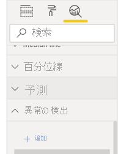
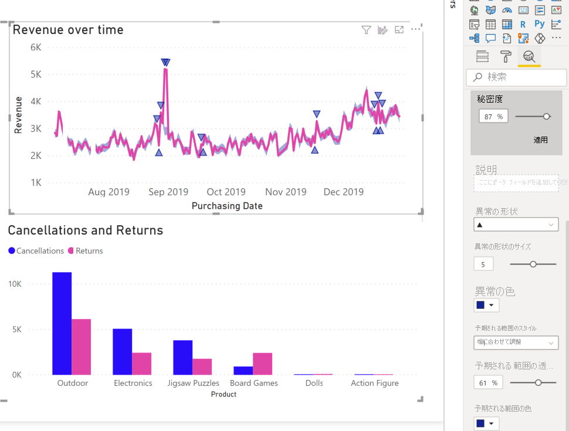

# 異常検出 (プレビュー)

[!INCLUDE[consumer-appliesto-nyyn](../includes/consumer-appliesto-nyyn.md)]    

異常検出は、時系列データに含まれる異常を自動的に検出することによって、折れ線グラフを強化するのに役立ちます。 また、根本原因の分析に役立つ異常についての説明も提供されます。  数回クリックするだけで、データをスライスしたり、表示したりすることなく、分析情報を簡単に見つけることができます。 異常の作成と表示は、Power BI Desktop と Power BI サービスの両方で行うことができます。 この記事の手順と図は Power BI Desktop のものです。

この機能はプレビュー段階であるため、まず機能スイッチをオンにする必要があります。 **[ファイル]**  >  **[オプションと設定]**  >  **[オプション]**  >  **[プレビュー機能]** に移動し、 **[異常検出]** が有効になっていることを確認します。

:::image type="content" source="media/power-bi-visualization-anomaly-detection//preview-feature-switch.png" alt-text="[異常検出] プレビュー機能スイッチをオンにする方法を示すスクリーンショット。":::
 
## はじめに
このチュートリアルでは、さまざまな製品のオンライン販売データを使用します。このチュートリアルを続けるには、オンライン販売シナリオの[サンプル ファイル](https://github.com/microsoft/powerbi-desktop-samples/blob/master/Monthly%20Desktop%20Blog%20Samples/2020/2020SU09%20Blog%20Demo%20-%20September.pbix)をダウンロードしてください。

異常検出を有効にするには、グラフを選択し、分析ペインで [Find Anomalies]\(異常の検出\) オプションを追加します。 

 

 たとえば、このグラフには時間経過に伴う収益が示されています。 異常検出を追加すると、グラフが値の異常と予想される範囲によって自動的に強化されます。 値がこの予想される境界の外に出ると、異常とマークされます。 Anomaly Detector のアルゴリズムの詳細については、こちらの[テクニカル ブログ](https://techcommunity.microsoft.com/t5/ai-customer-engineering-team/overview-of-sr-cnn-algorithm-in-azure-anomaly-detector/ba-p/982798)を参照してください。

 
 
## 異常の書式を設定する

このエクスペリエンスは、高度なカスタマイズが可能です。 異常の形状、サイズ、色、および予想される範囲の色、スタイル、透明度の書式を設定できます。 また、アルゴリズムのパラメーターを構成することもできます。  感度を上げると、アルゴリズムはデータの変化にいっそう敏感に反応するようになります。 その場合、わずかなずれでも異常とマークされます。 感度を下げると、アルゴリズムによって異常と判断されるものの選択がいっそう厳しくなります。

 
 
## 説明
異常を検出するだけでなく、データの異常を自動的に説明することもできます。 異常を選択すると、Power BI によってデータ モデル内のフィールド間の分析が実行され、可能性のある説明が明らかにされます。 異常に関する自然言語での説明と、その異常に関連する要因が、説明の強さによって並べ替えられて表示されます。 ここでは、8 月 30 日の収益が $5187 で、これは $2447 から $3423 の予想範囲を超えています。 このウィンドウのカードを開くと、説明の詳細が表示されます。

 
### 説明を構成する
分析に使用されるフィールドを制御することもできます。 たとえば、Seller と City を **[説明]** フィールド ウェルにドラッグすると、Power BI による分析はそれらのフィールドだけに制限されます。 この場合、8 月 31 日の異常は、特定の販売者と特定の都市に関連付けられているように見えます。 販売者 "Fabrikam" の強度が 99% になっています。 Power BI での "*強度*" は、ディメンションによって合計値でのずれにフィルター処理された場合の、予測値からのずれの割合として計算されます。 たとえば、異常ポイントに対するコンポーネント時系列 *Fabrikam* と集計時系列 *overall Revenue* の間での、実際の値から予想される値を差し引いた比率です。 このカードを開くと、この販売者の収益が 8 月 31 日に急増しているビジュアルが表示されます。 **[Add to report]\(レポートに追加\)** オプションを使用して、このビジュアルをページに追加します。

## 制限事項
- 異常検出は、[軸] フィールドに時系列データが含まれている折れ線グラフ ビジュアルでのみサポートされます。
- 折れ線グラフ ビジュアルの凡例、複数値、またはセカンダリ値では、異常検出はサポートされていません。
- 異常検出には、少なくとも 12 個のデータ ポイントが必要です。
- 予測、最小、最大、平均、中央、パーセンタイルの線は、異常検出では動作しません。
- SAP データ ソースに対する直接クエリ、Power BI Report Server、Azure Analysis Services と SQL Server Analysis Services へのライブ接続は、サポートされていません。
- 異常説明は、[値の表示方法] オプションでは機能しません。
- 階層内の次のレベルへのドリルダウンは、サポートされていません。
