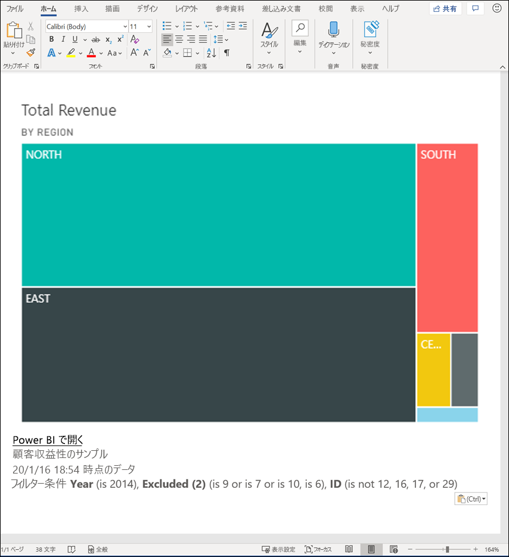
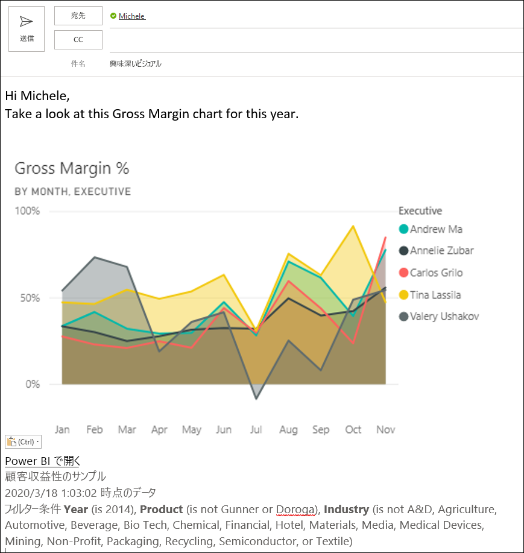
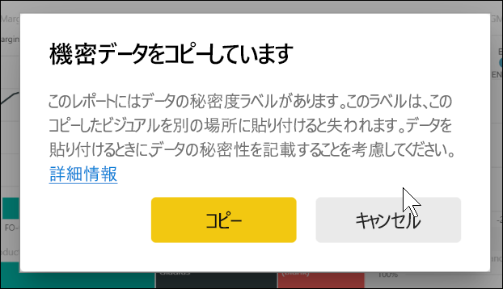
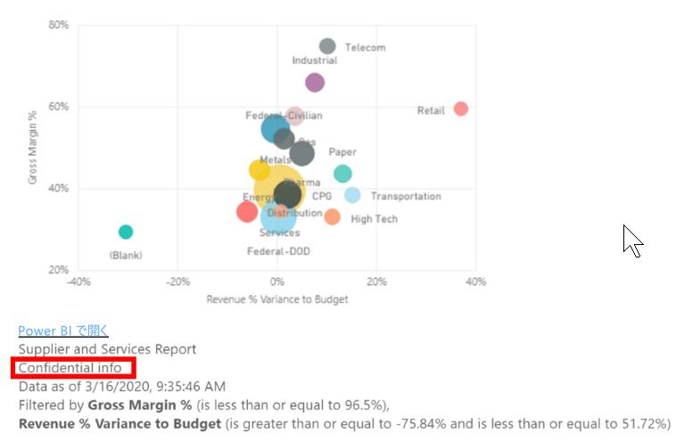
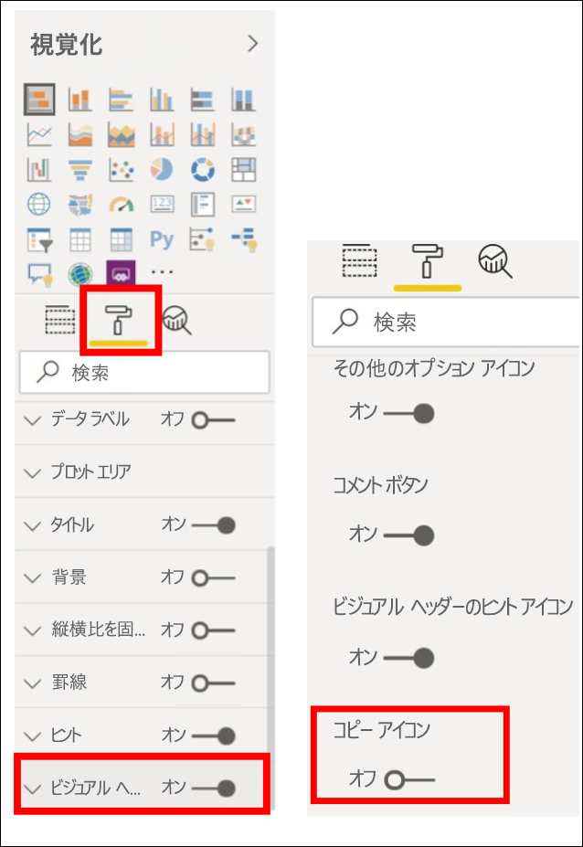
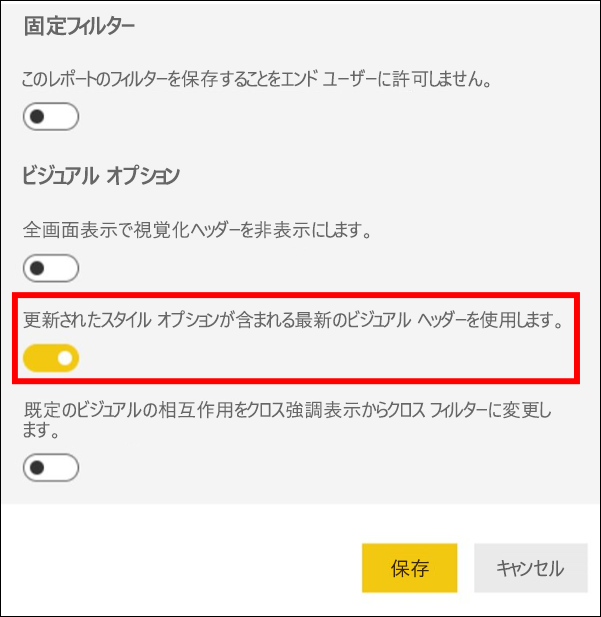
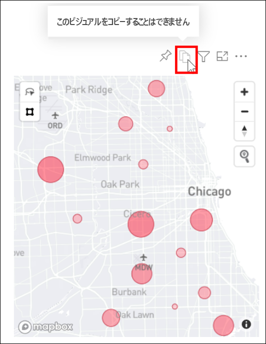

# レポートの視覚エフェクトをコピーして貼り付ける

[!INCLUDE[consumer-appliesto-yyyn](../includes/consumer-appliesto-yyyn.md)]

この記事では、ビジュアルをコピーして貼り付けるための 2 つの方法について説明します。 
* レポート内のビジュアルをコピーし、別のレポート ページに貼り付ける (レポートの編集権限が必要)

* 視覚エフェクトの画像を Power BI からクリップボードにコピーし、他のアプリケーションに貼り付けます (Power BI サービスとモバイルでは使用可能であり、Power BI Desktop では使用できません)

## 同じレポート内でコピーして貼り付ける
Power BI レポートのビジュアルをレポート内のあるページから同じレポート内の同じページまたは別のページにコピーできます。 

視覚エフェクトをコピーして貼り付けるには、レポートの編集アクセス許可が必要です。 Power BI サービスでは、これはレポートを[編集ビュー](../consumer/end-user-reading-view.md)で開くことを意味します。 

" *ダッシュボード* " の視覚エフェクトを、Power BI レポートやその他のダッシュボードにコピーして貼り付けることはできません。

1. 少なくとも 1 つの視覚エフェクトが含まれるレポートを開きます。  

2. 視覚化を選び、 **Ctrl キーを押しながら C** を押してコピーし、 **Ctrl キーを押しながら V** を押して貼り付けます。      

   

## ビジュアルをイメージとしてクリップボードにコピーする

Power BI レポートまたはダッシュボードからイメージを共有したいと思ったことはありませんか。 これで、Power BI サービスまたはモバイルから視覚エフェクトをコピーし、貼り付けをサポートする他のアプリケーションに貼り付けることができます。 

ビジュアルの静的なイメージをコピーするときに、メタデータと共にビジュアルのコピーを取得します。 これには、以下のことが含まれます。
* Power BI レポートまたはダッシュボードに戻るリンク
* レポートまたはダッシュボードのタイトル
* イメージに機密情報が含まれているかどうかの通知
* 最終更新タイム スタンプ
* ビジュアルに適用されるフィルター

### ダッシュボード タイルからコピーする

1. Power BI サービスを開き、コピー元のダッシュボードに移動します。

2. ビジュアルの右上隅にある **[その他のオプション] (...)** を選択し、 **[視覚エフェクトをイメージとしてコピー]** を選びます。 

    ![表示されている [視覚エフェクトをイメージとしてコピー] アイコン](media/power-bi-visualization-copy-paste/power-bi-copy-dashboard.png)

3. **[Your visual is ready to copy]\(ビジュアルをコピーする準備ができました\)** ダイアログが表示されたら、 **[クリップボードにコピー]** を選択します。

    ![[クリップボードにコピー] オプションを含むダイアログ](media/power-bi-visualization-copy-paste/power-bi-copied.png)

4. ビジュアルの準備ができたら、 **Ctrl + V** キーを使用して別のアプリケーションに貼り付けるか、右クリックして [貼り付け] を選択します。 以下のスクリーンショットでは、ビジュアルが Microsoft Word に貼り付けられています。 

    

### レポートのビジュアルからコピーする 

1. Power BI サービスを開き、コピー元のレポートに移動します。

2. ビジュアルの右上隅にある **[視覚エフェクトをイメージとしてコピー]** のアイコンを選択します。 

    ![[視覚エフェクトをイメージとしてコピー] アイコンを示すスクリーンショット](media/power-bi-visualization-copy-paste/power-bi-copy-icon.png)

3. **[Your visual is ready to copy]\(ビジュアルをコピーする準備ができました\)** ダイアログが表示されたら、 **[クリップボードにコピー]** を選択します。

    ![[クリップボードにコピー] オプションを含むダイアログ](media/power-bi-visualization-copy-paste/power-bi-copied.png)

4. ビジュアルの準備ができたら、 **Ctrl + V** キーを使用して別のアプリケーションに貼り付けるか、右クリックして [貼り付け] を選択します。 次のスクリーンショットでは、ビジュアルがメールに貼り付けられています。

    

5. レポートにデータの機密ラベルが適用されている場合、コピー アイコンを選択すると警告が表示されます。  

    

    また、貼り付けられたビジュアルの下のメタデータには、機密ラベルが追加されます。 

    

### ビジュアルのイメージとしてのコピーの使用を管理する
コンテンツを所有しているか、テナントの管理者である場合、レポートまたはダッシュボードからビジュアルをイメージとしてコピーできるようにするかどうかを制御できます。

#### 特定のビジュアルのイメージとしてのコピーを無効にする
ユーザーが特定の視覚エフェクトをコピーできないようにする場合、Power BI サービスでその視覚エフェクトからコピー アイコンを削除できます。    
1. ペイント ローラー アイコンを選び、[書式設定] ウィンドウを開きます。 

1. **[Visual formatting]\(ビジュアルの書式設定\)** カードを開きます。
1. **[ビジュアル ヘッダー]** まで下にスクロールし、カードを展開し、 **[コピー アイコン]** をオフにします。

    

1. **[ビジュアル ヘッダー]** 設定が見つからない場合は、 **[レポート設定]** の下にある最新のビジュアル ヘッダー オプションをオンにします。 

    

1. 変更を保存します。 必要に応じて、再共有と再発行を行います。

#### ユーザーのグループのイメージとしてのコピーを無効にする

コンテンツを所有しているか、テナントの管理者である場合は、ビジュアルをコピーできるユーザーを制御できます。 この設定では、Power BI テナント内の、ユーザーがアクセスするすべてのコンテンツに対して、" *ビジュアルのイメージとしてのコピー* " を無効にします。
  
1. 管理ポータルに移動します。

1. **[テナント設定]** で、 **[エクスポートと共有の設定]** を選択します。 

    ![[Copy and paste visuals]\(ビジュアルのコピーと貼り付け\) の有効化](media/power-bi-visualization-copy-paste/power-bi-enable.png)

1. 選択したユーザー グループに対して、 **[Copy and paste visuals]\(ビジュアルのコピーと貼り付け\)** を無効にします。 

1. 変更を保存します。指定されたグループは、Power BI 全体で **[視覚エフェクトをイメージとしてコピー]** を使用できなくなります。 
  

## 考慮事項とトラブルシューティング

   

Q:[イメージとしてコピー] オプションが表示されません    
A:Power BI Desktop を使用している場合、この機能はまだ使用できません    
Q:ビジュアルでコピー アイコンが無効になっているのはなぜですか?    
A:現在、ネイティブ Power BI ビジュアルと認定済みビジュアルがサポートされています。 次のような特定のビジュアルのサポートは制限されています。 
- ESRI とその他のマップ ビジュアル 
- Python のビジュアル 
- R ビジュアル 
- PowerApps 
- 認定されていないカスタム ビジュアル。カスタム ビジュアルがサポートされるようにする場合は、[カスタム ビジュアルの認定方法](../developer/visuals/power-bi-custom-visuals-certified.md)に関するページを参照してください。 

Q:ビジュアルが正しく貼り付けられないのはなぜですか?    
A:次のような、イメージとしてのビジュアルのコピーに関する制限があります。 
- カスタム ビジュアルの場合 
    - テーマと色が適用されたビジュアル 
    - 貼り付け時のタイルのスケーリング 
    - アニメーションを使用したカスタム ビジュアル 
- コピーの制約 
    - 新しくピン留めされたダッシュボード タイルはコピーできません 
    - 個人用ブックマークなど、Odata フィルターが適用され、固定状態のコンテンツにはユーザーをリダイレクトすることはできません 
- クリップボードから HTML 形式のコンテンツを貼り付けるサポートが制限されているアプリケーションでは、ビジュアルからコピーされたすべてのものがレンダリングされない場合があります 

## 次の手順
[Power BI レポートでの視覚化](power-bi-report-visualizations.md)についての詳細を参照する

他にわからないことがある場合は、 [Power BI コミュニティを利用してください](https://community.powerbi.com/)。

