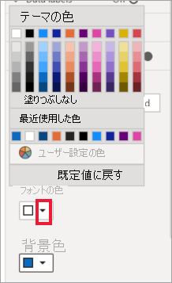
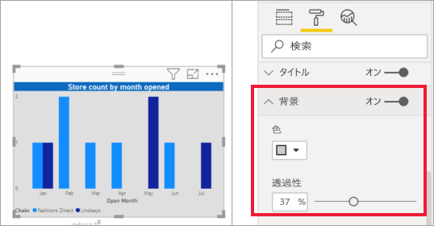
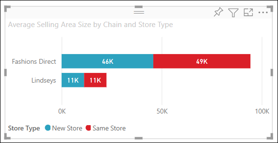
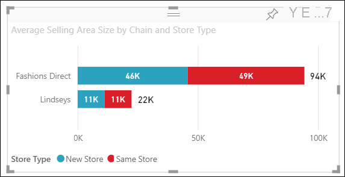
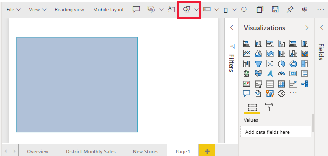

# 視覚エフェクトのタイトル、背景、ラベル、凡例をカスタマイズする

[!INCLUDE[consumer-appliesto-nyyn](../includes/consumer-appliesto-nyyn.md)]    

このチュートリアルでは、視覚化をカスタマイズする、さまざまな方法について説明します。 視覚化をカスタマイズするオプションは多数あります。 そのすべてを学習するには、 **[形式]** ウィンドウ (ペイント ローラー アイコンを選択) を調べることをお勧めします。 はじめに、この記事では視覚エフェクトのタイトル、凡例、背景、ラベル、レイヤーをカスタマイズする方法とテーマを追加する方法を説明します。

一部の視覚化についてはカスタマイズできません。 詳細については、[完全なリスト](#visualization-types-that-you-can-customize)をご覧ください。

## 前提条件

- Power BI サービスまたは Power BI Desktop

- 小売りの分析のサンプル レポート

> [!NOTE]
> Power BI を使用する同僚とレポートを共有するには、それぞれのユーザーが個別の Power BI Pro ライセンスを持っているか、レポートが Premium 容量に保存されている必要があります。 [レポートの共有](../collaborate-share/service-share-reports.md)に関するページをご覧ください。

## レポートの視覚エフェクトのタイトルをカスタマイズする

まず、Power BI Desktop にサインインし、[小売りの分析のサンプル](../create-reports/sample-datasets.md) レポートを開きます。

> [!NOTE]
> 視覚エフェクトをダッシュボードにピン留めすると、その視覚エフェクトはダッシュボード タイルになります。 タイル自体も、[新しいタイトルとサブタイトル、ハイパーリンク、サイズ変更](../create-reports/service-dashboard-edit-tile.md)でカスタマイズできます。

1. **小売りの分析のサンプル** レポートの **[新しいストア]** ページに移動します。

1. "**開店月別、チェーン別の開店店舗数**" 集合縦棒グラフを選択します。

1. **[視覚化]** ウィンドウで、ペイントローラー アイコンを選択して、形式オプションを表示します。

1. **[タイトル]** を選択してセクションを展開します。

   ![[形式] ウィンドウ、ペイント ローラー アイコン、および [タイトル] ドロップダウンを指している矢印のスクリーンショット。](media/power-bi-visualization-customize-title-background-and-legend/power-bi-format-menu.png)

1. **[タイトル]** スライダーを **[オン]** にします。

1. タイトルを変更するには、 **[タイトル テキスト]** フィールドに「*月別の開店した店舗数*」と入力します。

    ![タイトル テキストが入力された [形式] ウィンドウのスクリーンショット。](media/power-bi-visualization-customize-title-background-and-legend/power-bi-title.png)

1. **[フォント色]** を白に、 **[背景色]** を青に変更します。    

    a. ドロップダウンを選択し、 **[テーマの色]** 、 **[最近使用した色]** 、または **[ユーザー設定の色]** から色を選択します。
    
    

    b. ドロップダウンを選択して、色ウィンドウを閉じます。

1. テキスト サイズを **16 ポイント** に増やします。

1. 最後のカスタマイズとして、グラフのタイトルを視覚化の中央に配置します。

    ![[中央揃え] オプションが選択されている [配置] コントロールのスクリーンショット。](media/power-bi-visualization-customize-title-background-and-legend/power-bi-align.png)

    チュートリアルのこの時点で、集合縦棒グラフのタイトルは次のように表示されます。

    

変更を保存して、次のセクションに移動します。

すべての変更を既定値に戻す必要がある場合は、 **[タイトル]** カスタマイズ ウィンドウの下部にある **[既定値に戻す]** を選択します。

![[既定値に戻す] オプションのスクリーンショット。](media/power-bi-visualization-customize-title-background-and-legend/power-bi-revert.png)

## 視覚エフェクトの背景をカスタマイズする

同じ集合縦棒グラフを選択して、 **[背景]** オプションを展開します。

1. **[背景]** スライダーを **[オン]** にします。

1. ドロップダウン リストを選択し、灰色を選択します。

1. **[透明度]** を **[74%]** に変更します。

チュートリアルのこの時点で、集合縦棒グラフの背景は次のように表示されます。

行った変更を保存して、次のセクションに移動します。

すべての変更を既定値に戻す必要がある場合は、 **[背景]** カスタマイズ ウィンドウの下部にある **[既定値に戻す]** を選択します。

## 視覚エフェクトの凡例をカスタマイズする

1. **[概要]** レポート ページを開き、"**年度別および地域マネージャー別の総売上差異**" グラフを選択します。

1. **[視覚化]** タブで、ペイント ローラー アイコンを選択して、[形式] ウィンドウを開きます。

1. **[凡例]** オプションを展開します。

    ![[凡例] カードのスクリーンショット。](media/power-bi-visualization-customize-title-background-and-legend/power-bi-legends.png)

1. **[凡例]** スライダーを **[オン]** にします。

1. 凡例を視覚エフェクトの左側に移動します。

1. **[タイトル]** を **[オン]** に切り替えて、凡例にタイトルを追加します。

1. *[凡例名]* フィールドに「**マネージャー**」と入力します。

1. **[色]** を黒に変更します。

行った変更を保存して、次のセクションに移動します。

すべての変更を既定値に戻す必要がある場合は、 **[凡例]** カスタマイズ ウィンドウの下部にある **[既定値に戻す]** を選択します。

## 積み上げ視覚エフェクトの合計ラベル数をカスタマイズする
積み上げ視覚エフェクトには、データ ラベルと合計ラベルを表示できます。 積み上げ縦棒グラフでは、データ ラベルによって列の各部分の値が示されます。 合計ラベルには、集計された列全体の合計値が表示されます。 

Rien が積み上げグラフに合計ラベルを追加するのを見てから、以下の手順に従って自分で試してみてください。

> [!VIDEO https://www.youtube.com/embed/OgjX-pFGgfM]

1. **[Overview]** レポート ページを開き、 **[Chain および Store Type による Average Selling Area Size]** 横棒グラフを選択します。

1. **[視覚化]** タブで、 を選択して、この横棒グラフを積み上げ横棒グラフに変換します。 視覚エフェクトのデータ ラベルが保持されていることに注意してください。 

    

1. **[視覚化]** タブで、ペイント ローラー アイコンを選択して、[形式] ウィンドウを開きます。

1. **[合計ラベル]** スライダーを **[オン]** に移動します。 

    ![[オン] に設定された [合計ラベル] スライダーを示すスクリーンショット。](media/power-bi-visualization-customize-title-background-and-legend/power-bi-totals.png)

1. 必要に応じて、合計ラベルの書式を設定します。 この例では、色を黒に変更し、フォント サイズを大きくし、 **[千]** 単位で値を表示するように選択しました。

    

## レイヤーの順序をカスタマイズする
レポート内のビジュアルおよび図形のレイヤー化の順序を変更します。 レイヤーの順序によって、選択したときに前面に表示されるオブジェクトが決まります。 レポート キャンバス上でオブジェクトを選択すると、常にアクティブになり、最上位レイヤーに移動されます。 ビジュアルの場合は、これにより、選択したビジュアルの操作が容易になります。 しかし、図形と背景については、誤って選択してレポートのビジュアルを覆ったり隠したりすることがないように、それらを最下部のレイヤーに固定することをお勧めします。 

レイヤー化コントロールは、Power BI サービス、Power BI Desktop、モバイル、レポート サーバーで使用できます。 この記事では、Power BI サービスでレイヤーの順序の動作を変更する方法について説明します。

"Rien によるレイヤーの順序の動作の変更" をご覧になってから、以下の手順に従って自分で試してみてください。

> [!VIDEO https://www.microsoft.com/videoplayer/embed/RE4IY3L]

1. 黄色の正符号を選択して、新しいレポート ページを追加します。 

1. キャンバスに図形を追加します。 ここでは、青色の四角形を追加しました。 

    

1. レポート内の別のページから、ビジュアルをコピーして貼り付けます。 

    

    2 つのレイヤーを用意できたので、円グラフを選択してから、背景を選択してみてください。 円グラフを選択すると、Power BI によってそのオブジェクトがアクティブにされ、ヘッダー メニューが表示されます。 四角形を選択すると、Power BI によってそのオブジェクトがアクティブにされ、前面に移動されます。ここで、円グラフが覆い隠されます。 この既定の動作を変更することができます。

1. 四角形を選択し、[書式設定] ウィンドウを開きます。 **[全般]** を展開し、 **[レイヤーの順序の維持]** トグルを見つけます。 レポートの変更を保存し、[読み取り] ビューに切り替えます。

    ![新しいレポート ページと、オンに設定されている [レイヤーの順序の維持] のスクリーンショット。](media/power-bi-visualization-customize-title-background-and-legend/power-bi-maintain-layer.png)

1. [読み取り] ビューでは、青色の四角形は選択された場合もバック レイヤーに残ります。

## テーマを使用して色をカスタマイズする

レポートのテーマでは、コーポレート カラーを使用したり、アイコン セットを変更したり、ビジュアルの新しい既定の形式を適用したりなど、デザインの変更をお使いのレポート全体に適用できます。 レポートのテーマを適用すると、お使いのレポートのすべてのビジュアルで、ご自身が選択したテーマの色と書式設定が使用されます。

お使いのレポートにテーマを適用するには、メニュー バーから **[テーマの切り替え]** を選択します。 テーマを選択します。  次のレポートでは、 **[太陽]** のテーマが使用されています。

 
![黄色、オレンジ、赤の [太陽] のテーマを使用したレポート](media/power-bi-visualization-customize-title-background-and-legend/power-bi-theme.png)

## カスタマイズ可能な視覚化の種類

視覚化と、各視覚化で使用できるカスタマイズ オプションの一覧を次に示します。

| 視覚化 | タイトル | 背景 | 凡例 | 合計ラベル
|:--- |:--- |:--- |:--- |:--- |
| 領域 | はい | はい |はい | はい  |
| 横棒 | はい | はい |はい | はい |
| カード | はい | はい |該当なし | 該当なし |
| 複数行カード | はい | はい | 該当なし | 該当なし |
| 列 | はい | はい | はい |  はい |
| 複合 | はい | はい | はい | はい |
| ドーナツ | はい | はい | はい | 該当なし |
| 塗り分け地図 | はい | はい | はい |該当なし |
| じょうごグラフ | はい | はい | 該当なし |該当なし |
| ゲージ | はい | はい | 該当なし |該当なし |
| Key Influencer\(主要なインフルエンサー\) | はい | はい | 該当なし |該当なし |
| KPI | はい | はい | 該当なし |該当なし |
| 折れ線 | はい | はい | はい |該当なし |
| マップ | はい | はい | はい |該当なし |
| Matrix | はい | はい | 該当なし |はい |
| 円 | はい | はい | はい |該当なし |
| Q&A | はい | はい | 該当なし |該当なし |
| 散布 | はい | はい | はい |該当なし |
| 図形 | はい | はい | はい |該当なし |
| スライサー | はい | はい | 該当なし |該当なし |
| テーブル | はい | はい | 該当なし |はい |
| テキストボックス | いいえ | はい | 該当なし |該当なし |
| ツリーマップ | はい | はい | はい |該当なし |
| ウォーターフォール | はい | はい | はい |該当なし |

## 次のステップ

- [X 軸と Y 軸のプロパティのカスタマイズ](power-bi-visualization-customize-x-axis-and-y-axis.md)

- [色の書式設定と軸のプロパティの概要](service-getting-started-with-color-formatting-and-axis-properties.md)

他にわからないことがある場合は、 [Power BI コミュニティを利用してください](https://community.powerbi.com/)。

