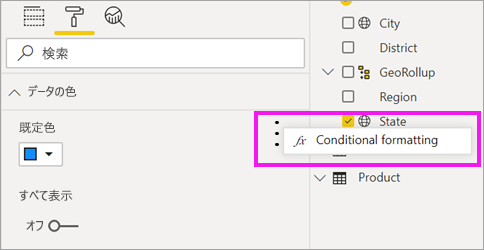
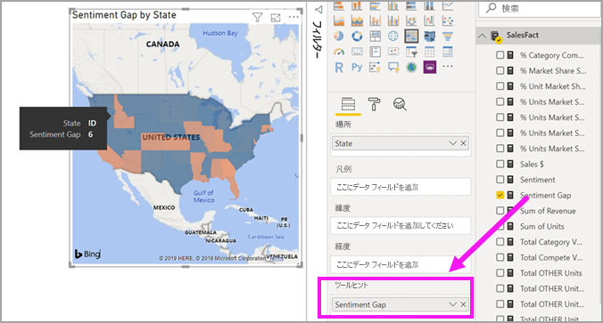

# Power BI で塗り分け地図 (コロプレス地図) を作成して使用する

[!INCLUDE[consumer-appliesto-nyyn](../includes/consumer-appliesto-nyyn.md)]

[!INCLUDE [power-bi-visuals-desktop-banner](../includes/power-bi-visuals-desktop-banner.md)]

塗り分け地図では、網掛け、着色またはパターンを使用して、値の違いを割合に応じて、地理的または地域的に表示します。  こうした相対的な違いは、薄い色の網掛け (頻度が低い/量が少ない) から、濃い色の網掛け (頻度が高い/量が多い) を使用して、すぐにわかるように表示されます。    

## Bing への送信内容
Power BI は Bing と統合されており、既定のマップ座標 (ジオコーディングと呼ばれるプロセス) を提供します。 Power BI サービスまたは Power BI Desktop でマップの視覚エフェクトを作成すると、(その視覚エフェクトの作成に使用された) **場所**、**緯度**、および**経度**バケットのデータが Bing に送信されます。

ユーザーまたは管理者は、Bing がジオコーディングに使う URL へのアクセスを許可するように、ファイアウォールを更新することが必要な場合があります。  以下の URL です。
- https://dev.virtualearth.net/REST/V1/Locations    
- https://platform.bing.com/geo/spatial/v1/public/Geodata    
- https://www.bing.com/api/maps/mapcontrol

Bing に送信されているデータの詳細、およびジオコーディングをより成功させるためのヒントについては、「[マップの視覚エフェクトに関するヒントとテクニック](power-bi-map-tips-and-tricks.md)」をご覧ください。

## 塗り分け地図を使用すべきケース
塗り分け地図は、次の場合に最適な選択になります。

* 量的な情報を地図に表示する。
* 空間的なパターンと関係を示す。
* データが標準化されている。
* 社会経済的なデータを扱っている。
* 特定の地域に関心がある。
* 異なる地理的位置への分散状況を全体的に理解する。

### 前提条件
このチュートリアルでは、[売上およびマーケティングのサンプル PBIX ファイル](https://download.microsoft.com/download/9/7/6/9767913A-29DB-40CF-8944-9AC2BC940C53/Sales%20and%20Marketing%20Sample%20PBIX.pbix)を使います。
1. メニューバーの左上にある **[ファイル]**  >  **[開く]** を選択します。
   
2. **売上およびマーケティングのサンプル PBIX ファイル**を見つけます

1. **売上およびマーケティングのサンプル PBIX ファイル**をレポート ビュー  で開きます。

1. 選択  を選択して、新しいページを追加します。

> [!NOTE]
> Power BI を使用する同僚とレポートを共有するには、それぞれのユーザーが個別の Power BI Pro ライセンスを持っているか、レポートが Premium 容量に保存されている必要があります。    

### 塗り分け地図を作成する
1. [フィールド] ペインから、 **[Geo]** \> **[State]** フィールドを選択します。    

   ![[State] の横にある黄色のチェック マーク](media/power-bi-visualization-filled-maps-choropleths/power-bi-state.png)
2. [グラフを変換](power-bi-report-change-visualization-type.md)して、塗り分け地図にします。 **[State]** も、 **[場所]** に含まれるようになったことに注目してください。 Bing 地図は、マップの作成に **[場所]** のフィールドも使用します。  場所には、正しい各種の場所 (国、都道府県、市区町村、郵便番号など) を指定できます。Bing 地図には、世界中の場所に対応する塗り分け地図の輪郭が用意されています。 正しいエントリが [場所] に指定されていないと、Power BI では塗り分け地図を作成できなくなります。  

   
3. 地図にフィルターを適用して、米国本土のみが表示されるようにします。

   a.  [視覚化] ウィンドウの左側にある **[フィルター]** ウィンドウを確認します。 最小化されている場合は展開します

   b.  **[状態]** をポイントし、展開シェブロンを選択します。  
   ![[State (All)] を示すビジュアル レベル フィルター](media/power-bi-visualization-filled-maps-choropleths/img004.png)

   c.  **[すべて]** の横にチェックマークを付けて、 **[AK]** の横のチェックマークを外します。

   ![[All] と [AK] が選択されていない [State] のドロップダウン](media/power-bi-visualization-filled-maps-choropleths/img005.png)
4. ペイント ローラー アイコンを選択して [書式設定] ウィンドウを開きます。 **[データの色]** を選択します。

    ![[データの色] オプションを表示している [書式設定] ウィンドウ](media/power-bi-visualization-filled-maps-choropleths/power-bi-colors-data.png)

5. 3 つの縦向きドットを選択して、 **[条件付き書式設定]** を選択します。

    

6. **[既定色 - データの色]** 画面を使用して、ご自分の塗り分け地図をどのように網掛け表示するかを決定します。 利用可能なオプションには、網掛けの基礎となるフィールド、および網掛けを適用する方法などがあります。 この例では、 **[SalesFact]**  >  **[センチメント]** の順に使用して、センチメントの最小値をオレンジ色、最大値を青色に設定します。 最大値と最小値の間にある値は、濃淡の異なるオレンジ色と青色になります。 画面の下部にある図は、使用する色の範囲を示しています。 

    ![センチメントが選択されている [既定色] ウィンドウ](media/power-bi-visualization-filled-maps-choropleths/power-bi-sentiment-field.png)

7. 塗り分け地図は緑色と赤色で網掛け表示されます。赤色はセンチメント数が低いことを表し、緑色はより多くの肯定的なセンチメントを表します。  追加の詳細を表示するには、フィールドをツールヒントにドラッグします。  ここに **[SalesFact]**  >  **[Sentiment gap]** を追加しました。 アイダホ州 (ID) を強調表示すると、センチメント ギャップが低く、6 であることがわかります。
   

10. [レポートを保存](../create-reports/service-report-save.md)します。

Power BI では、塗り分け地図の外観に対する数多くのコントロールが提供されます。 希望する外観になるまで、これらのデータ カラー コントロールでいろいろ試してみます。 

## 強調表示とクロス フィルター処理
[フィルター] ウィンドウの使用方法については、「[Power BI でのレポートへのフィルターの追加](../create-reports/power-bi-report-add-filter.md)」をご覧ください。

塗り分け地図で 1 つの場所を強調表示にすると、レポート ページにある他の視覚エフェクトがクロスフィルター処理されます。逆の場合も同様です。

1. 先に進むには、まず、 **[ファイル] > [保存]** の順に選択して、このレポートを保存します。 

2. Ctrl + C キーを使用して、塗り分け地図をコピーします。

3. レポート キャンバスの下部にある、 **[センチメント]** タブを選択して、センチメント レポート ページを開きます。

    ![選択された [センチメント] タブ](media/power-bi-visualization-filled-maps-choropleths/power-bi-sentiment-tab.png)

4. ページの視覚エフェクトを移動し、サイズを変更してスペースを確保し、Ctrl + V キーを使用して、前のレポートから塗り分け地図を貼り付けます。 (以下の画像が表示されます)

   

5. 塗り分け地図で、1 つの州を選択します。  これで、ページ上の他の視覚化がクロス強調表示され、クロスフィルター処理されます。 たとえば**テキサス**を選択すると、カードがクロスフィルター処理され、横棒グラフがクロス強調表示されます。 ここから、センチメントが 75 であることがわかり、テキサスは中央地区 #23 内にあることがわかります。   
   
2. [VanArsdel - 月別の感情] 折れ線グラフでデータ ポイントを選択します。 これにより、塗り分けマップがフィルター処理され、競合他社ではなく、VanArsdel のセンチメント データが表示されます。  
   

## 考慮事項とトラブルシューティング
地図データは、あいまいになることがあります。  たとえば、パリ (Paris) はフランスにありますが、テキサス州にもパリ (Paris) があります。 地理データは、個別の列 (市区町村名の列、都道府県名の列など) に保存されていると考えられるため、Bing では、どちらがどちらのパリなのかを特定できないことがあります。 データセットに緯度と経度のデータが含まれている場合、Power BI には地図データのあいまいさをなくすために役立つ特別なフィールドが用意されています。 緯度データを格納しているフィールドを [視覚化] \> [緯度] 領域にドラッグします。  経度データについても、同じ操作を実行します。    

![[視覚化] と [フィールド] のウィンドウ](media/power-bi-visualization-filled-maps-choropleths/pbi-latitude.png)

Power BI Desktop でデータセットを編集するアクセス許可がある場合は、このビデオでマップのあいまいさに対処する方法をご覧ください。

> [動画 https://www.youtube.com/embed/Co2z9b-s_yM ]

緯度と経度のデータにはアクセスできないけれども、データセットへの編集アクセス権はある場合は、[この手順に従ってデータセットを更新](https://support.office.com/article/Maps-in-Power-View-8A9B2AF3-A055-4131-A327-85CC835271F7)してください。

マップの視覚エフェクトについて詳しくは、「[マップの視覚エフェクトに関するヒントとテクニック](../power-bi-map-tips-and-tricks.md)」をご覧ください。

## 次の手順

[図形マップ](desktop-shape-map.md)

[Power BI での視覚化の種類](power-bi-visualization-types-for-reports-and-q-and-a.md)

