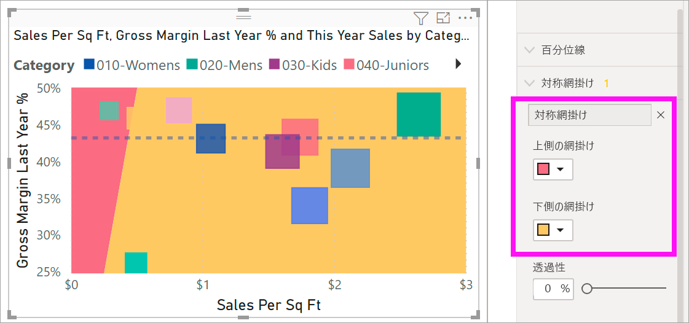

# Power BI での散布図、バブル チャート、およびドット プロット グラフ

[!INCLUDE[consumer-appliesto-nyyn](../includes/consumer-appliesto-nyyn.md)]

[!INCLUDE [power-bi-visuals-desktop-banner](../includes/power-bi-visuals-desktop-banner.md)]

散布図には、必ず 2 つの値軸があり、横軸に沿って数値データの 1 つのセットが表示され、縦軸に沿って数値データのもう 1 つのセットが表示されます。 このグラフには x と y の数値が交差する位置に点が表示され、この 2 つの値が 1 つのデータ ポイントに結合されます。 Power BI では、これらのデータ ポイントが横軸に沿って均等または不均等に分布されます。 これはグラフで表されるデータによって異なります。

データ ポイント数を最大 10,000 まで設定することができます。  

## 散布図、バブル チャート、ドット プロット グラフの使い分けについて

### 散布図およびバブル チャート

散布図は、2 つの数値の間の関係を表します。 バブル チャートでは、データ ポイントがバブルに置き換えられます。バブルの "*サイズ*" は、3 つ目の追加データ ディメンションを表します。

散布図は、次のような場合に最適な選択肢になります。

* 2 つの数値の間の関係を示す。

* 2 つのグループの数値を x 座標と y 座標の 1 つの系列としてプロットする。

* 水平軸のスケールを変更する場合に、折れ線グラフの代わりに使用する。

* 水平軸を対数スケールに変更する。

* ペアまたはグループになった値のセットを含むワークシート データを表示する。

    > [!TIP]
    > 散布図では、2 つの軸のスケールを独立して調整し、グループ化された値についてより多くの情報を引き出すことができます。

* 大きなデータ セットからパターンを表示する。たとえば、線形の傾向や非線形の傾向、クラスター、外れ値を見つけることができます。

* 時間に関係なく、大量のデータ ポイントを比較する。  散布図に含めるデータが多いほど、正確に比較を行うことができます。

散布図では上記のことが可能ですが、バブル チャートは、次のような場合に最適な選択肢になります。

* それぞれ値のセットを含む 3 つのデータ系列で構成されたデータがある。

* 財務データを表示する。  バブル サイズを変更すると、特定の値を視覚的に強調できます。

* 象限 (四分円) を使用する。

### ドット プロット グラフ

ドット プロット グラフは、バブル チャートや散布図と似ていますが、カテゴリ データを X 軸にプロットするのに使用されます。

ドット プロット グラフは、カテゴリ データを X 軸に含める場合に最適な選択肢になります。

## 前提条件

このチュートリアルでは、[小売の分析のサンプル PBIX ファイル](https://download.microsoft.com/download/9/6/D/96DDC2FF-2568-491D-AAFA-AFDD6F763AE3/Retail%20Analysis%20Sample%20PBIX.pbix)を使用します。

1. メニューバーの左上にある **[ファイル]**  >  **[開く]** を選択します。
   
2. **小売の分析のサンプル PBIX ファイル**を探します。

1. **小売の分析のサンプル PBIX ファイル**をレポート ビュー  で開きます。

1. 選択  を選択して、新しいページを追加します。

> [!NOTE]
> Power BI を使用する同僚とレポートを共有するには、それぞれのユーザーが個別の Power BI Pro ライセンスを持っているか、レポートが Premium 容量に保存されている必要があります。    

## 散布図を作成する

1. 空のレポート ページから開始し、 **[フィールド]** ウィンドウで次のフィールドを選択します。

    * **[Sales]**  >  **[Sales Per Sq Ft]**

    * **[Sales]**  >  **[Total Sales Variance %]**

    * **[District]**  >  **[District]**

    ![集合縦棒グラフ、[視覚化] ウィンドウ、[フィールド] ウィンドウ、および選択したフィールドのスクリーンショット](media/power-bi-visualization-scatter/power-bi-bar-chart.png)

1. **[視覚化]** ウィンドウで、 を選択して、 集合縦棒グラフを散布図に変換します。

   

1. **[District] \(地域)** を **[詳細]** から **[凡例]** にドラッグします。

    Power BI によって表示された散布図では、Y 軸に**総売上差異 %** 、X 軸に**平方フィートあたりの売上高**がプロットされています。 データ ポイントの色は地区を表しています。

    

次に、3 番目のディメンションを追加してみましょう。

## バブル チャートを作成する

1. **[フィールド]** ウィンドウから、 **[Sales]\(売上\)**  >  **[This Year Sales]\(今年の売上\)**  >  **[値]** を **[サイズ]** ウェルにドラッグします。 データ ポイントは、売り上げ高の値に比例してボリュームに展開します。

   ![売上高の値を [サイズ] ウェルに追加することでバブル チャートに変換された散布図のスクリーンショット。](media/power-bi-visualization-scatter/power-bi-scatter-chart-size.png)

1. バブルの上にマウスを置きます。 バブルのサイズは、 **[This Year Sales]** の値を反映しています。

    

1. バブル チャートに表示するデータ ポイントの数を設定するには、 **[視覚化]** ウィンドウの **[形式]** セクションで、 **[全般]** を展開し、 **[データ ボリューム]** を調整します。

    ![[視覚化] ウィンドウと、形式アイコン、[全般] ドロップダウン、および [データ ボリューム] オプションのスクリーンショット。](media/power-bi-visualization-scatter/pbi-scatter-data-volume.png)

    10,000 までの任意の値に最大データ量を設定できます。 数字が大きくなったら、最初にテストをして、良いパフォーマンスが得られることを確認することをお勧めします。

    > [!NOTE]
    > データ ポイントが多いほど読み込み時間が長くなります。 スケールの上限に制限のあるレポートを発行する場合は、Web とモバイルでレポートをテストし、 グラフでユーザーが望むパフォーマンスが得られることを確認する必要があります。

1. 視覚化の色、ラベル、タイトル、背景などの書式設定を続行します。 [アクセシビリティを向上させる](../create-reports/desktop-accessibility-overview.md)には、行ごとにマーカー図形を追加することを検討します。 マーカーの形状を選択するには、 **[図形]** を展開し、 **[マーカーの図形]** を選択して図形を選択します。

    ![[図形] ドロップダウンと [マーカーの図形] オプションのスクリーンショット。](media/power-bi-visualization-scatter/pbi-scatter-marker.png)

    マーカーの図形をひし形、三角形、または正方形に変更します。 各線に別のマーカーの図形を使用すると、レポートの使用者は個々の線 (または領域) を区別するのが容易になります。

1. [分析] ウィンドウ ![[分析] ウィンドウのアイコンのスクリーンショット。](media/power-bi-visualization-scatter/power-bi-analytics.png) を開き、視覚化に追加の情報を追加します。  
    - 中央値線を追加します。 **[中央値線]**  >  **[追加]** の順に選択します。 既定では、Power BI によって*平方フィート単位の売上*の中央値線が追加されます。10 個のデータ ポイントがあり、両側に 5 つずつデータ ポイントがある中央値が作成されることがわかっているため、これはあまり役に立ちません。 代わりに、**メジャー**を*総売上差異 %* に切り替えます。  

        

    - 対称網掛けを追加して、y 軸のメジャーと比較して x 軸のメジャーの値が高いポイントを示します。逆の場合も同様です。 [分析] ウィンドウで対称網掛けをオンにすると、Power BI によって、現在の軸の上限と下限に基づいて、散布図の背景が対称的に表示されます。 これは、特に x 軸と y 軸で異なる軸の範囲がある場合に、データ ポイントで優先する軸メジャーを識別するための非常に簡単な方法です。

        a. **総売上差異 %** フィールドを**前年の粗利 (%)** に変更します

        

        b. [分析] ウィンドウから、 **[対称網掛け]** を追加します。 網掛けから、Hosiery (靴下・下着類) (ピンク色の網掛け領域内の緑のバブル) が店舗の面積あたりの売上よりも粗利を優先する唯一のカテゴリであることがわかります。 

        

    - [分析] ウィンドウの調査を続けて、データ内の興味深い洞察を見つけます。 

        

## ドット プロット グラフを作成する

ドット プロット グラフを作成するには、 **[X 軸]** 数値フィールドをカテゴリ フィールドに置き換えます。

**[X 軸]** ウィンドウで、 **[平方フィート単位の売上]** を削除し、 **[地区]**  >  **[District Manager]\(地区マネージャー\)** に置き換えます。

## 考慮事項とトラブルシューティング

### 散布図グラフにデータ ポイントが 1 つだけ表示される

散布図に、X 軸上と Y 軸上のすべての値を集計した 1 つのデータ ポイントのみが表示されていますか?  あるいは、1 本の横線または縦線に沿ってすべての値が集計されていますか?

**[詳細]** ウェルにフィールドを追加して、値をグループ化する方法を Power BI に指示してください。 フィールドは、プロットするポイントごとに一意である必要があります。 シンプルな行番号や ID フィールドの場合はこれで十分です。

![RowNum が [詳細] ウェルに追加されている散布図のスクリーンショット。](media/power-bi-visualization-scatter/pbi-scatter-tshoot.png)

そのようなデータがない場合は、X と Y の値を連結してポイントごとに一意の値を持つフィールドを作成します。

![TempTime が [詳細] ウェルに追加されている散布図のスクリーンショット。](media/power-bi-visualization-scatter/pbi-scatter-tshoot2.png)

新しいフィールドを作成するには、[Power BI Desktop クエリ エディターを使ってデータセットにインデックス列を追加します](../create-reports/desktop-add-custom-column.md)。 その後、この列を視覚化の **[詳細]** ウェルに追加します。

## 次の手順

次の記事にも興味をもたれるかもしれません。

* [Power BI 散布図の高密度サンプリング](../create-reports/desktop-high-density-scatter-charts.md)
* [Power BI での視覚化の種類](power-bi-visualization-types-for-reports-and-q-and-a.md)
* [Power BI レポートでデータ プロットを並べ替えて分布するためのヒント](../guidance/report-tips-sort-distribute-data-plots.md)

他にわからないことがある場合は、 [Power BI コミュニティを利用してください](https://community.powerbi.com/)。
