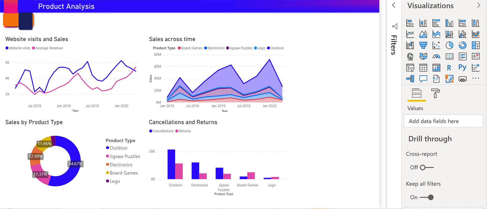

# スマート説明の概要を作成する (プレビュー)

[!INCLUDE[consumer-appliesto-nyyn](../includes/consumer-appliesto-nyyn.md)]    

[!INCLUDE [power-bi-visuals-desktop-banner](../includes/power-bi-visuals-desktop-banner.md)]

スマート説明の視覚化を使用すると、視覚エフェクトとレポートをすばやく要約することができます。 関連する画期的な分析情報が提供され、カスタマイズすることができます。

レポートにスマート説明を使用すると、重要な点に対応し、傾向を指摘し、特定の対象ユーザー向けに言語と形式を編集することができます。 PowerPoint では、レポートの重要な点のスクリーンショットを貼り付けるのではなく、改訂するたびに更新される説明を追加できます。 対象ユーザーは、この概要を使用してデータを理解し、重要な点をすばやく把握し、データを他のユーザーに説明できるようになります。

>[!NOTE]
> スマート説明機能はプレビュー段階なので、使用する場合は有効にする必要があります。 Power BI で、 **[ファイル]**  >  **[オプションと設定]**  >  **[オプション]**  >  **[プレビュー機能]** に移動します。 次に、 **[Smart narrative visual]\(スマート説明の視覚化\)** を選択します。
>
>![Power BI の [オプション] を示すスクリーンショット。 [Smart narrative visual]\(スマート説明の視覚化\) が選択されています。](media/power-bi-visualization-smart-narratives/2.png)

このチュートリアルを続けるには、オンライン販売シナリオの[サンプル ファイル](https://github.com/microsoft/powerbi-desktop-samples/blob/master/Monthly%20Desktop%20Blog%20Samples/2020/2020SU09%20Blog%20Demo%20-%20September.pbix)をダウンロードしてください。

## はじめに 

**[視覚化]** ペインで、 **[Smart narrative]\(スマート説明\)** アイコンを選択して、概要を自動的に生成します。

![[視覚化] ペインを示すスクリーンショット。 [Smart narrative]\(スマート説明\) アイコンが選択されています。](media/power-bi-visualization-smart-narratives/3.png)

ページ上のすべての視覚エフェクトに基づいた説明が表示されます。 たとえば、このサンプル ファイルでは、スマート説明を使用すると、収益、Web サイトへのアクセス、および売上に対応するレポートの視覚エフェクトの概要を自動的に生成できます。 Power BI によって傾向が自動的に分析され、収益とアクセスの両方が増加したことが示されます。 成長率も計算されます。この場合は 72% です。
 

 
視覚化のスマート説明を生成するには、右クリックして **[Summarize]\(要約\)** を選択します。 たとえば、サンプル ファイルで、さまざまな取引を示す散布図を要約してみてください。 Power BI によってデータが分析され、取引あたりの収益が最も高く、取引数が最も多い市区町村または地域が示されます。 スマート説明には、これらのメトリックの予想される値の範囲も示されます。 ほとんどの市区町村では、取引あたりの収益が 45 ドル未満であり、取引数は 10 未満であることがわかります。
 
  

 
## 概要を編集する
 
スマート説明の概要は高度なカスタマイズが可能です。 テキスト ボックスのコマンドを使用して、既存のテキストを編集または追加できます。 たとえば、テキストを太字にしたり、色を変更したりできます。
 

  
概要をカスタマイズしたり、独自の分析情報を追加したりするには、"*動的な値*" を使用します。 テキストを既存のフィールドやメジャーにマップしたり、自然言語を使用してテキストにマップする新しいメジャーを定義したりできます。 たとえば、サンプル ファイルで返された項目数に関する情報を追加するには、値を追加します。 

値の名前を入力すると、Q&A 視覚エフェクトの場合と同様に、提案の一覧から選択できます。 そのため、Q&A 視覚エフェクトでデータについて質問するだけでなく、データ分析式 (DAX) を使用せずに独自の計算を作成できるようになりました。 
  

  
動的な値の書式を設定することもできます。 たとえば、サンプル ファイルでは、値を通貨形式で表示し、小数点以下の桁数を指定し、桁区切り記号を選択することができます。 
   

   
動的な値の書式を設定するには、概要の値を選択して、 **[確認]** タブに編集オプションを表示します。または、テキスト ボックスで、編集する値の横にある編集ボタンを選択します。 
   
![[値] タブが選択されたテキスト ボックスを示すスクリーンショット。 値の名前の横にある [編集] ボタンが強調表示されています。](media/power-bi-visualization-smart-narratives/9.png)
   
**[確認]** タブを使用して、以前に定義した値の確認、削除、再利用を行うこともできます。 値を概要に挿入するには、プラス記号 (+) を選択します。 **[確認]** タブの下部にあるオプションをオンにして、自動生成された値を表示することもできます。

場合によっては、非表示の概要記号がスマート説明に表示されることがあります。 これは、現在のデータとフィルターによって値の結果が生成されないことを示します。 分析情報を使用できない場合、概要は空になります。 たとえば、サンプル ファイルの折れ線グラフでは、グラフの折れ線が平坦な場合、高い値と低い値の概要は空になることがあります。 ただし、他の条件では概要が表示される場合があります。 非表示の概要記号は、概要を編集しようとした場合にのみ表示されます。

   
## ビジュアル対話
概要は動的です。 クロスフィルターを使用すると、生成されたテキストと動的な値が自動的に更新されます。 たとえば、サンプル ファイルのドーナツ グラフで Electronics 製品を選択すると、レポートの残りの部分はクロスフィルターされます。概要もクロスフィルターされて Electronics 製品に焦点が当てられます。  

この場合、訪問者数と収益の傾向が異なるため、その傾向を反映するように概要のテキストが更新されます。 追加した返品数の値は $4196 に更新されます。 クロスフィルターを使用すると、空の概要を更新できます。
   

   
さらに高度なフィルター処理を行うこともできます。 たとえば、サンプル ファイルで、複数の製品の傾向を視覚的に確認します。 特定の四半期の傾向のみに関心がある場合は、関連するデータ ポイントを選択して、その傾向の概要を更新します。
   

   
## 制限事項

スマート説明機能は、次の機能をサポートしていません。
- ダッシュボードへのピン留め 
- 動的な値と条件付き書式設定 (データ バインドされたタイトルなど) の使用。
- Azure Analysis Services、オンプレミスの AS
- KPI、カード、複数行のカード、マップ、テーブル、マトリックス、R ビジュアルまたは Python ビジュアル、カスタムの視覚エフェクト 
- 列が他の列によってグループ化されている視覚エフェクト、およびデータ グループ フィールドに基づいて作成された視覚エフェクトの概要 
- 視覚エフェクトからのクロスフィルター処理
- 動的な値の名前変更、または自動生成された動的な値の編集
- QnA 演算や総計の割合などの実行中の計算を含む視覚エフェクトの概要 
   

