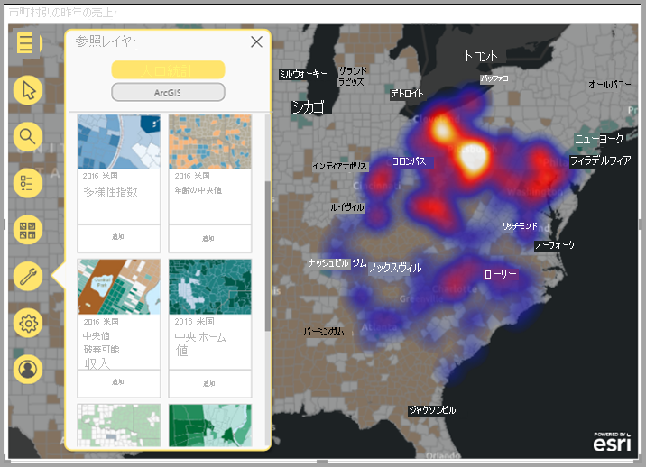
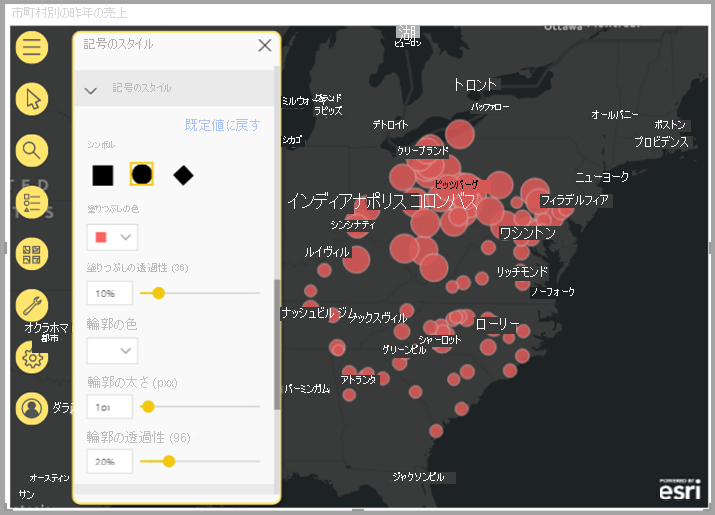
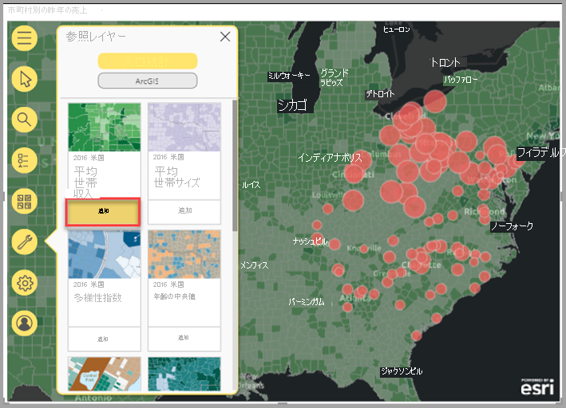
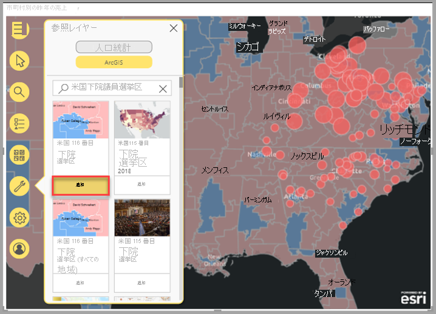
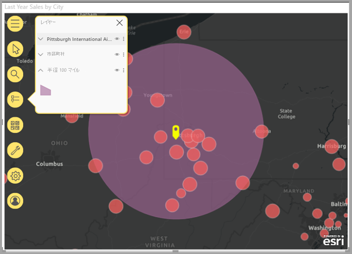

# Power BI で ArcGIS マップを作成する

[!INCLUDE[consumer-appliesto-yyyn](../includes/consumer-appliesto-yyyn.md)]    

> [!NOTE]
> これらのビジュアルは、Power BI Desktop と Power BI サービスの両方で作成および表示できます。 この記事の手順と図は、Power BI Desktop のものです。

この概要は、ArcGIS for Power BI マップを作成するユーザーの視点で書かれています。 "_デザイナー_" が同僚と ArcGIS for Power BI マップを共有すると、その同僚はマップを表示および操作できますが、変更を保存することはできません。 ArcGIS マップの表示方法の詳細については、[ArcGIS for Power BI マップの操作](https://doc.arcgis.com/en/power-bi/use/explore-maps.htm)に関するページを参照してください。

ArcGIS マップと Power BI を組み合わせると、マッピングをマップ上のポイントの表現を越える、まったく新しいレベルに引き上げることができます。 基本マップ、場所の種類、テーマ、記号のスタイル、および参照レイヤーから選択して、すばらしい有益なマップの視覚エフェクトを作成します。 空間分析を使用してマップ上で権限のあるデータのレイヤーを組み合わせることで、より深く理解できる視覚化されたデータを伝達します。 モバイル デバイスでは、ArcGIS for Power BI マップを作成することはできませんが、表示して操作することはできます。

> [!NOTE]
> ArcGIS for Power BI は、オンライン環境でのみ Power BI Report Server をサポートします。オフライン環境ではサポートされていません。

> [!TIP]
> GIS は Geographic Information System (地理情報システム) の略です。

次の例では、濃い灰色のキャンバスを使用して、2016 年の平均可処分所得の人口統計レイヤーに対するヒートマップとして、地域の売上を示しています。 読み進めるとわかるように、ArcGIS for Power BI を使用すると、強化されたマッピング機能、人口統計データ、さらにより説得力のあるマップの視覚エフェクトが提供されるため、最適なストーリーを伝えることができます。

> [!TIP]
> 多くの例やユーザーの声を参照するには、[**Esri の ArcGIS for Power BI に関するページ**](https://www.esri.com/powerbi)にアクセスしてください。 また、Esri の **[ArcGIS Maps for Power BI オンライン](https://doc.arcgis.com/en/power-bi/get-started/about-maps-for-power-bi.htm) ヘルプ** も参照してください。

## ユーザーの同意

ArcGIS for Power BI は Esri ([https://www.esri.com](https://www.esri.com/)) によって提供されます。 ArcGIS for Power BI のご利用の際には、Esri の[使用条件](https://go.microsoft.com/fwlink/?LinkID=826322)および[プライバシー ポリシー](https://go.microsoft.com/fwlink/?LinkID=826323)が適用されます。 ArcGIS for Power BI 視覚化の使用を希望される Power BI ユーザーは、同意ダイアログを受け入れる必要があります。 このダイアログは、初めて ArcGIS for Power BI を使用するときにのみ表示されます。

## 前提条件

このチュートリアルでは、Power BI Desktop と PBIX の[小売の分析のサンプル](https://download.microsoft.com/download/9/6/D/96DDC2FF-2568-491D-AAFA-AFDD6F763AE3/Retail%20Analysis%20Sample%20PBIX.pbix)を使用します。 また、Power BI サービスを使用して ArcGIS for Power BI マップを作成することもできます。

1. メニュー バーの左上にある **[ファイル]**  >  **[レポートを開く]** を選択します。
2. ローカル コンピューターに保存されている **小売の分析のサンプル PBIX ファイル** を見つけます。
3. **小売りの分析のサンプル** をレポート ビュー  で開きます。
4. 選択  を選択して、レポートに新しいページを追加します。

## ArcGIS for Power BI マップの視覚エフェクトを作成する

レポートにマップを追加するには、次の手順を実行します。

1. [視覚化] ペインで、ArcGIS for Power BI アイコンを選択します。

    ![[視覚化] ペインの ArcGIS マップ アイコン](media/power-bi-visualizations-arcgis/arcgis-tutorial-02.png)

2. Power BI では、レポート キャンバスに空のマップ テンプレートが追加されます。 この概要では、Power BI に含まれる **Standard** バージョンを使用します。 適切なライセンスを持つ有効な ArcGIS アカウントにサインインすると、より多くの機能にアクセスできるようになります。詳細については、[ArcGIS for Power BI オンライン ヘルプ](https://doc.arcgis.com/en/power-bi/get-started/account-types.htm)を参照してください。

    

3. **[フィールド]** ペインで、データ フィールドを **[場所]** にドラッグするか、または座標を適切な **[緯度]** や **[経度]** バケットにドラッグします。 この例では、 **[ストア] > [市区町村]** を使用しています。

    > [!NOTE]
    > 選択したフィールドがマップの図形またはポイントとして最適に表示されているかどうかは、ArcGIS for Power BI によって自動的に検出されることに注意してください。 既定値は設定で調整できます ([ArcGIS for Power BI の視覚化の書式設定](#format-the-arcgis-for-power-bi-visualization)に関するページを参照してください)。

    ![ArcGIS の [City] フィールド](media/power-bi-visualizations-arcgis/arcgis-tutorial-04.png)

4. **[フィールド]** ウィンドウで、メジャーを **[サイズ]** バケットにドラッグして、データの表示方法を調整します。 この例では、 **[Sales]\(売上\) > [Last Year Sales]\(昨年の売上高\)** を使用しています。

    

最初の ArcGIS for Power BI マップを作成しました。 ここで、ベース マップ、場所の種類、テーマなどを使用してマップを調整し、書式設定してみましょう。

## ArcGIS for Power BI の視覚化の書式を設定する

**ArcGIS for Power BI** の書式設定機能にアクセスするには、次の手順を実行します。

1. [視覚化] ペインで **[書式]** タブをクリックして、書式設定オプションを表示します。

    ![[書式] タブ](media/power-bi-visualizations-arcgis/arcgis-tutorial-06.png)

    ArcGIS マップの書式設定には次のようなオプションがあります。

    * **レイヤー:** [レイヤー] リスト (ToC) のタイトルを変更したり、レイヤー リストをオンまたはオフにしたり、リストをマップ上に固定したり、固定されたリストの位置を定義したりできます。 [レイヤー] リストは既定でオンになっており、展開されたマップ ツール  で使用できます。
    * **マップ ツール:** ナビゲーション ツールをオンまたはオフにしたり、マップ範囲を現在の位置でロックしたり、マップ上でのインフォグラフィックス カードの位置を定義したりできます。 既定では、[拡大] ボタンと [縮小] ボタンはオフになっています。
    * **位置情報の種類:** データが配置されている国/地域を指定すると、マップ上の場所の精度を向上させることができます。 データが 1 つの国/地域にある場合は、ドロップダウン リストから国/地域を選択します。 データがグローバルである場合は、[世界] を選択します。
    * **検索:** 検索機能をオンまたはオフにしたり、ピンの既定の色を変更したりできます。 検索は既定でオンになっており、展開されたマップ ツール  で使用できます。

### ArcGIS for Power BI マップを編集する

マップの視覚化にデータを追加すると、マップ ツールが使用できるようになります。

> [!NOTE]
> このチュートリアルでは、**Standard** バージョンの ArcGIS for Power BI で使用できる機能とオプションについてのみ説明します。 適切なライセンスを使って有効な [ArcGIS アカウント](https://doc.arcgis.com/en/power-bi/get-started/account-types.htm)にサインインすれば、より多くの機能にアクセスできます。

マップ ツールを展開するには:

1. [マップ ツール] ボタンをクリックして、ツールを展開します。

    

マップ ツールが展開され、使用可能な機能が表示されます。 各機能を選択すると、詳細なオプションを示す作業ウィンドウが開きます。

> [!TIP]
> Esri は、ArcGIS for Power BI の使用方法に関する[包括的なドキュメント](https://go.microsoft.com/fwlink/?LinkID=828772)を提供します。

#### ベース マップを変更する

ベースマップは、マップ内のデータに対して背景 (視覚化コンテキスト) を提供するものです。 たとえば、道路を示すベースマップでは、住所データのコンテキストを提供できます。 **Standard** アカウントを使用すると、次の 4 つのベース マップが提供されます。キャンバス (ダーク グレー)、キャンバス (ライト グレー)、オープン ストリート マップ、ストリート。

ベースマップを変更するには、次の手順を実行します。

1. **[ベース マップ]** ボタン  をクリックして、ギャラリーを表示します。
2. **[ダーク グレーのキャンバス]** ベースマップを選択します。

    

    新しいベースマップを使用してマップが更新されます。

詳細については、ArcGIS for Power BI オンライン ヘルプの「[ベースマップの変更](https://doc.arcgis.com/en/power-bi/design/change-the-basemap.htm)」を参照してください。

#### マップ レイヤーを表示する

ArcGIS for Power BI では、レイヤーを使用して地理的データを操作します。 レイヤーは、マップの作成に使用される地理的データの論理的なコレクションです。また、レイヤーは地理的分析の基礎となります。

[レイヤー] リストを表示するには、マップ ツールの **[レイヤー]**  ボタンをクリックします。

[レイヤー] リストには、マップを構成する各レイヤーが表示されます。各レイヤーには、マップをカスタマイズして操作するための独自のオプション セットがあります。 メニューには、選択したレイヤーの種類に応じて異なるオプションが表示されます。たとえば、Power BI データを使用して作成されたレイヤー (この例で作成した **City** レイヤーなど) のシンボルと位置情報の種類は変更できますが、これらのオプションは参照レイヤーや到達圏レイヤーでは使用できません。

詳細については、ArcGIS for Power BI オンライン ヘルプの「[レイヤーの操作](https://doc.arcgis.com/en/power-bi/design/work-with-layers.htm)」を参照してください。

#### 位置情報の種類を指定する

ArcGIS for Power BI では、強力な geo 有効化テクノロジを使用して、マップ上に位置データを正確に配置し、データの種類に基づいて、項目を既定でポイントまたは境界として自動的にレンダリングできます。 たとえば、緯度と経度の座標は、マップ上のポイントとしてレンダリングされます。一方、州フィールドは、境界または多角形としてレンダリングされます。 位置情報の種類を指定することで、場所の表示方法を変更できます。

マップ上の場所の精度を向上させるには、[位置情報の種類] 機能を使用します。 この操作を簡単に行うには、視覚化の [書式] ペインで国/地域を選択 ([位置情報の種類] カテゴリを展開し、適切な国/地域を選択) するか、またはレイヤー オプション ペインで [位置情報の種類] のフル機能を使用してその他のオプションにアクセスします。

**[位置情報の種類]** のフル機能は、レイヤー オプション メニューからアクセスできます。データが配置されている国/地域を指定するだけでなく、データをポイントまたは境界 (多角形) として表すかどうかを選択できます。 通常、境界は、国、都道府県、郵便番号などの標準の地理的エリアとして定義されます。 データの場所として境界と特定の国/地域を選択した場合は、郡、人口調査標準地域、学区、市政など、さまざまな標準の境界から選択できます。 使用できる位置情報の種類は、国や地域ごとに異なります。

データの位置情報の種類を変更するには、次の手順を実行します。

1. [レイヤー] リストで、使用するデータ レイヤーを選択します。
2. **[レイヤー オプション]** ボタンをクリックし、 **[位置情報の種類]** を選択します。

    

    既定値をそのまま使用して、場所をマップ上のポイントとして表示し、 **[1 つの国] > [米国]** を指定します。

    

詳細については、ArcGIS for Power BI オンライン ヘルプの「[位置情報の種類の指定](https://doc.arcgis.com/en/power-bi/design/specify-location-type.htm)」を参照してください。

#### マップのシンボルをカスタマイズする

ArcGIS for Power BI では、[フィールド] ペインの値を使用して、マップ上での位置の表示方法がインテリジェントに決定されます。 **シンボル** 機能を使用すると、既定のスタイルを変更して、ストーリーをよりわかりやすくすることができます。 別のマップ テーマを選択し、マップ上の場所を表すために使用する記号と色をカスタマイズすることもできます。 マップ視覚エフェクトの [フィールド] ペインに追加した値に応じて、さまざまなマップ テーマとスタイル設定オプションを使用できます。

レイヤーのシンボルを変更するには、次の手順を実行します。

1. [レイヤー] リストで、使用するデータ レイヤーを選択します。

2. **[レイヤー オプション]** ボタンをクリックし、 **[シンボル]** を選択します。

[シンボル] ペインが表示され、マップ テーマのカテゴリが展開されます。

##### マップ テーマを変更する

この例では、 **[場所]** フィールドと **[サイズ]** フィールドの両方に値を追加したため、マップでは既定で **[サイズ]** テーマが使用されます。

マップ テーマを変更するには、次の手順を実行します。

1. 他のマップ テーマを選択して、マップがどのように変わるかを確認します。

    

2. **[サイズ]** テーマを選択します。

詳細については、ArcGIS for Power BI オンライン ヘルプの「[マップ テーマの変更](https://doc.arcgis.com/en/power-bi/design/change-the-map-theme.htm)」を参照してください。

##### レイヤーの透過表示

マップに複数のレイヤーが含まれている場合は、各レイヤーをある程度の透明度で表示して、他のレイヤー上のアイテムが引き続き表示されるようにすると便利です。

レイヤーの透明度の値を設定するには、次の手順を実行します。

1. **[シンボル]** ペインで、 **[透過表示]** カテゴリを展開します。

2. テキスト ボックスにパーセンテージを入力するか、スライダーを左 (透明度が低い) または右 (透明度が高い) に移動します。

##### 記号のスタイル

シンボル スタイルを使用すると、マップ上にデータを表示する方法を微調整できます。 既定のシンボル スタイルは、選択した位置情報の種類とマップ テーマに基づいており、使用可能なスタイル オプションは、値が含まれているフィールドとその値の性質によって変わります。

シンボル スタイルを変更するには、次の手順を実行します。

1. **[シンボル]** ペインで、 **[シンボル スタイル]** カテゴリを展開します。

2. シンボルの設定を必要に応じて変更します。 シンボルの形状、色、透明度、輪郭の色、太さ、透明度を選択できます。 これらのオプションを変更するには、[シンボル サイズ] カテゴリを展開します。表示されるオプションは、データの性質と選択したマップ テーマに応じて変わります。

    次の例では、マップのテーマが **サイズ** に設定され、いくつかの記号のスタイルで透過性、スタイル、サイズが調整されていることが示されています。

    

3. スタイル設定オプションの設定が完了したら、[シンボル] ペインを閉じます。

### データの分析

ArcGIS for Power BI には、データ内のパターンを検出し、マップを使用して説得力のあるストーリーを伝えるためのツールがいくつか用意されています。

分析機能には、次のようなものがあります。

- マップ上の場所を選択する
- 特定の住所、場所、または目的地を検索する
- より多くのコンテキストを提供するために参照レイヤーを追加する
- 指定した半径または到達圏内の場所を検索する
- マップに表示されたエリアに関する人口統計情報を表示するカードを追加する

#### 場所を選択する

ArcGIS for Power BI には、マップ上の場所を選択するのに役立つ、いくつかの選択ツールが用意されています。 表示されるツールは、[レイヤー] リストで現在選択されているレイヤーの種類に応じて変わります。

選択ツールを表示するには、次の手順を実行します。

1. マップ ツールで、 **[選択ツール]** ボタン  をクリックしてツールセットを展開します。

    使用できる選択ツールは 4 つあります。 **[選択ツール]** メニューに表示されるツールは、現在アクティブになっているレイヤーの種類に応じて変わる場合があります。 この例のマップにはデータ レイヤーのみが含まれているので、 **[単一選択]** ツールと **[ボックス選択]** ツールが表示されます。
    
    | **ツール** | **説明** |
    | --- | --- |
    |  | **[単一選択]** —個々の場所をクリックするために使用できる単一選択ツールです。これが既定の選択ツールです。 Ctrl キーを押しながらクリックすると、複数の場所を選択できます。マップ上のデータの場所をクリックすると、それらが選択され、他の視覚化との対話がトリガーされます。ピンまたは参照レイヤー上の場所をクリックすると、そのツールヒントが表示されます。 |
    |   | **ボックス選択** —四角形のセレクターをドラッグして複数の場所を選択するか、個々の場所をクリックして場所を個別に選択できます。選択ツールと同様に、ピンまたは参照レイヤー上の場所をクリックすると、そのツールヒントが表示されます。ボックス選択ツールがアクティブな場合、マップをパンすることはできません。 |
    |   | **参照レイヤー選択** —マップに [参照レイヤー](https://doc.arcgis.com/en/maps-for-powerbi/design/add-a-reference-layer.htm)を追加した場合は、このツールで参照レイヤー上のエリアをクリックすることにより、場所を選択できます。 参照上の区切られたエリア内の場所は、強調表示されます。マップの他のエリア内の場所は選択できません。このツールは、マップに 1 つ以上の参照レイヤーが含まれており、参照レイヤーが現在アクティブになっている場合にのみ表示されます。 |
    |   | **到達圏レイヤーから選択** —マップに [到達圏](https://doc.arcgis.com/en/maps-for-powerbi/design/find-nearby-locations.htm)を追加した場合は、[到達圏レイヤーから選択] ツールを使用して、定義されたエリア内のデータの場所を選択できます。 |
    
2. マップ上の 1 つまたは複数の場所を選択します。 一度に最大 250 のデータ ポイントを選択できます。

詳細については、ArcGIS for Power BI オンラインヘルプの「[マップ上で位置を選択](https://doc.arcgis.com/en/power-bi/design/select-features-on-the-map.htm)」を参照してください。

#### 場所をピン留めする

特定の住所、場所、または目的地をピン留めできます。 この例では、ピッツバーグ国際空港を検索します。

場所をピン留めするには、次の手順を実行します。

1. マップ ツールで **[検索]**  ボタンをクリックして、[検索] ペインを開きます。
2. 検索ボックスに、キーワードとして「**Pittsburgh international**」と入力します。

    キーワードには、住所、場所、または目的地を含めることができます。 入力中には、キーワードの類似性に基づいて、最近の類似した検索語や入力候補が表示されます。

3. 結果の一覧から **Pittsburgh International Airport** を選択し、 **[閉じる]** をクリックします。

    記号がマップに表示され、マップでは場所が自動的に拡大されます。 ピンは、現在のセッション中にのみマップ上に残ります。ピン留めされた場所をマップと共に保存することはできません。 ピン留めされた場所は、[レイヤー] リストにレイヤーとしても表示されます。他のレイヤーと同様に、レイヤーの名前を変更したり、表示/非表示を切り替えたり、マップから削除したりすることもできます。

4. ピンの色を変更するには、マップ視覚エフェクトの **[書式]** ペインで **[検索]** カテゴリを展開し、新しい色を選択します。

> [!NOTE]
> **検索** 機能は、以前 ArcGIS for Power BI で使用できたピン機能に代わるものです。

詳細については、ArcGIS for Power BI オンライン ヘルプの「[位置のピン止め](https://doc.arcgis.com/en/power-bi/design/pin-locations.htm)」を参照してください。

#### 参照レイヤーを追加する

参照レイヤーは、マップに既に表示されている Power BI データのコンテキストを提供するものです。 参照レイヤーには、世帯所得、年齢、教育水準などの人口統計データを含めることができます。 また、ArcGIS Online でパブリックに共有されているフィーチャー レイヤーを追加して、マップ上の場所の周辺地域に関する詳細情報を提供することもできます。

##### 人口統計レイヤーを追加する

ArcGIS for Power BI の Standard アカウントには、米国に関する主要な人口統計レイヤーが含まれています。これらは、Power BI からのデータにコンテキスト情報を追加するのに役立ちます。

人口統計レイヤーを追加するには、次の手順を実行します。

1. マップ ツールで、 **[分析ツール]** ボタン  をクリックしてツールセットを展開します。
2. **[参照レイヤー]** ボタン  をクリックします。

    **[参照レイヤー]** ペインが開き、 **[人口統計]** タブとそのレイヤーが表示されます。

3. ギャラリーをスクロールし、マップに追加するレイヤーのサムネイルで **[追加]** をクリックします。

    この例では、**2016 USA Average Household Income** レイヤーを見つけ、 **[追加]** をクリックします。
    
    マップが更新され、新しいレイヤーが表示されます。
    
    
    
人口統計参照レイヤーは対話型です。エリアをクリックすると、詳細情報を含むツールヒントが表示されます。 また、 **[参照レイヤーを選択]** ツールを使用して、参照レイヤー上のエリア内にある [マップ上のエリアを選択](https://doc.arcgis.com/en/power-bi/design/select-features-on-the-map.htm)することもできます。

##### ArcGIS から参照レイヤーを追加する

ArcGIS for Power BI では、ArcGIS でパブリックに共有されているフィーチャー レイヤーを検索できます。これにより、データ レイヤー上の場所の周辺地域に関する情報を提供する、数千の参照レイヤーにアクセスできます。 有効な ArcGIS アカウントを使用して ArcGIS for Power BI にサインインすると、組織内のコンテンツ、組織のグループ、またはパブリック コンテンツを検索できます。 この例では、Standard アカウントを使用しているため、検索結果にはパブリックに共有されているコンテンツのみが表示されます。

ArcGIS 参照レイヤーを追加するには、次の手順を実行します。

1. [参照] ペインで、 **[ArcGIS]** タブをクリックします。

2. 検索フィールドに「**USA Congressional districts**」と入力し、**Enter** キーを押します。

    ギャラリーに、結果の候補がいくつか表示されます。

3. USA 116th Congressional Districts レイヤーを見つけて、[追加] をクリックします。

    マップが更新され、新しいレイヤーが表示されます。
    
    
    
ArcGIS レイヤーは対話型です。エリアをクリックすると、詳細情報を含むツールヒントが表示されます。 また、 **[参照レイヤーを選択]** ツールを使用して、参照レイヤー上のエリア内にある [マップ上のエリアを選択](https://doc.arcgis.com/en/power-bi/design/select-features-on-the-map.htm)することもできます。

#### 近くの場所を検索する

マップ上の場所 (ピン留めされた場所を含む) は、マップ上の近くの場所を検索して選択するための開始点として使用できます。 たとえば、特定の目的地を検索する場合は、マップ上で、指定した到達圏 (または運転距離) 内の場所を選択できます。

この例では、前にピン留めしたピッツバーグ国際空港を使用して、空港から 100 マイル圏内の場所を見つけます。 同様の手順を使用して、指定した到達圏内の場所を検索することもできます。

出発点から特定の運転距離内の場所を見つけるには、次の手順を実行します。

1. マップ ツールで、 **[分析ツール]** ボタン  をクリックしてツールセットを展開します。

2. **[到達圏]** ボタン  をクリックします。

    **[到達圏]** ペインが表示されます。

3. 単一選択ツールをクリックし、マップで、前にピン留めした **Pittsburgh International Airport** の場所を選択します。
4. **[検索エリア]** ドロップダウン メニューから **[半径]** を選択し、距離を **100** マイルと指定します。
5. **[OK]** をクリックします。

    マップに、ピン留めされた空港の位置を囲む円が表示されます。 [到達圏] ペインが展開され、運転距離エリアのスタイル設定オプションが表示されます。
    
    
    
    運転距離エリアは、[レイヤー] リストにレイヤーとしても表示されます。他のレイヤーと同様に、レイヤーの名前を変更したり、表示/非表示を切り替えたり、マップから削除したりすることもできます。

6. [レイヤー] の一覧で、到達圏レイヤーをアクティブにし、[到達圏レイヤーから選択] ツールを使用して運転距離エリアをクリックします。

    検索エリア内の場所が選択されます。マップ上の選択されていない場所は、小さく表示されるか、透明になります。 その他の視覚化は、選択した場所を反映して更新されます。

詳細については、ArcGIS for Power BI オンライン ヘルプの「[隣接するロケーションの検索](https://doc.arcgis.com/en/power-bi/design/find-nearby-locations.htm)」を参照してください。

#### インフォグラフィックス カードを追加する

インフォグラフィックス カードは、参照レイヤーと同様、マップ上のエリアに関する追加情報を提供するものです。 インフォグラフィックス カードは、マップの上部に配置され、選択した場所の周辺地域、または現在のマップ範囲に表示されている一般エリアに関する、特定の人口統計情報を表示します。 詳細については、ArcGIS for Power BI オンライン ヘルプの「[インフォグラフィックス カードの追加](https://doc.arcgis.com/en/power-bi/design/add-infographics.htm)」を参照してください。

### ヘルプの参照

Esri は、ArcGIS for Power BI に関する包括的なオンライン ドキュメントを提供します。

視覚化から ArcGIS for Power BI のオンライン ヘルプにアクセスするには、次の手順に従います。

1. マップ ツールで、 **[設定]** ボタン  をクリックします。

2. **[設定]** ペインで、 **[ヘルプ]** ボタンをクリックします。
3. 表示される確認ウィンドウで **[OK]** をクリックします。

    ArcGIS for Power BI のオンライン ヘルプがブラウザー ウィンドウに表示されます。
    
    - ArcGIS for Power BI オンライン ヘルプでは、[よく寄せられる質問](https://doc.arcgis.com/en/power-bi/get-started/pbi-faq.htm#anchor5)への回答を参照できます。
    - [**ArcGIS for Power BI** に関する Power BI コミュニティ スレッド](https://go.microsoft.com/fwlink/?LinkID=828771)で、質問、最新情報の検索、問題の報告、および回答の検索を行うことができます。
    - 改善の提案がある場合は、[Power BI のアイデア リスト](https://ideas.powerbi.com/)に送信してください。
    
### 組織内での ArcGIS for Power BI の使用を管理する

Power BI では、デザイナー、Power BI 管理者、およびユーザー管理者が、ArcGIS for Power BI の使用を管理できます。 以下のセクションでは、各ロールが実行できる操作の概要を説明します。

#### デザイナーのオプション

Power BI Desktop では、デザイナーは [セキュリティ] タブで ArcGIS for Power BI を無効にできます。 **[ファイル]**   >   **[オプションと設定]** を選択し、 **[オプション]**   >   **[セキュリティ]** を選択します。 無効になると、ArcGIS は既定では読み込まれなくなります。

#### 管理者オプション

Power BI サービスでは、管理者はすべてのユーザーに対して ArcGIS for Power BI を無効にすることができます。 **[設定]**  >  **[管理ポータル]**  >  **[テナント設定]** を選択します。 無効にした場合、Power BI の [視覚化] ペインに ArcGIS for Power BI アイコンが表示されなくなります。

#### ユーザー管理者のオプション

Power BI Desktop では、組織に配置されているコンピューター全体で ArcGIS for Power BI を無効にするために **グループ ポリシー** を使用できます。

| **属性** | **Value** |
| --- | --- |
| Key | Software\Policies\Microsoft\Power BI Desktop |
| valueName | EnableArcGISMaps |

値が 1 (10 進数) の場合は、ArcGIS for Power BI が有効になります。

値が 0 (10 進数) の場合は、ArcGIS for Power BI が無効になります。

## 考慮事項と制限事項

ArcGIS for Power BI は、次のサービスとアプリケーションで使うことができます。

| サービスまたはアプリケーション | 可用性 |
| --- | --- |
| Power BI Desktop | はい |
| Power BI サービス (powerbi.com) | はい |
| Power BI モバイル アプリケーション\* | はい |
| Power BI (Web に公開) | はい (適切なアドオン ライセンスを使用して有効な ArcGIS アカウントにサインインしているデザイナーの場合)。 コンシューマーが公開されているコンテンツを表示する場合、アドオン ライセンスは必要ありません。 |
| Power BI Embedded | はい (適切なアドオン ライセンスを使用して有効な ArcGIS アカウントにサインインしているデザイナーの場合)。 コンシューマーが公開されているコンテンツを表示する場合、アドオン ライセンスは必要ありません。 |
| Power BI サービスの埋め込み (powerbi.com) | いいえ |
| Power BI Report Server | はい (オンライン環境のみ)。切断された環境ではサポートされていません。 |

\*モバイル環境では、Power BI ([Standard アカウント](https://doc.arcgis.com/en/maps-for-powerbi/get-started/account-types.htm)) に含まれる ArcGIS for Power BI 視覚化を使用して作成されたマップを表示できます。 ArcGIS のプレミアム コンテンツを含むマップは、モバイル環境ではサポートされていません。

ArcGIS for Power BI を使うことができないサービスまたはアプリケーションでは、視覚エフェクトが Power BI のロゴを含む空の視覚化として表示されます。

次の表は、すべての Power BI ユーザーが使用できる標準機能と、サインインした ArcGIS ユーザーが使用できる機能とを比較したものです。

|  Standard (Power BI に含まれています) |   ArcGIS アカウントを使用した場合 |
| --- | --- | --- |
| ベースマップ |
| 4 つの基本ベースマップ | すべての Esri ベースマップとユーザーの組織のベースマップ (カスタム ベースマップを含む) へのアクセス |
| ジオコーディング |
| 3,500 の場所 (マップあたり) | 10,000 の場所 (マップあたり) |
 | 10,000 の場所 (1 か月あたり) | 毎月の制限なし |
| 参照レイヤー |
| 米国の人口統計を含んだ 10個の参照レイヤー | ユーザーの ArcGIS 組織から提供されている、すべての Web マップとレイヤーへのアクセス |
 | ArcGIS でパブリックに共有されているフィーチャー レイヤー | ArcGIS でパブリックに共有されているフィーチャー レイヤー |
 | ArcGIS Living Atlas of the World のマップおよびレイヤーへのアクセス (フィーチャー サービス) |
| インフォグラフィック |
| 米国の人口統計変数のキュレーテッド ギャラリー (7 つのカテゴリ) | ArcGIS GeoEnrichment データ ブラウザーへのフル アクセス (米国およびグローバルの人口統計変数を含む) |
|

## 次の手順

- [他のユーザーから共有された ArcGIS マップとの対話](https://doc.arcgis.com/en/power-bi/use/explore-maps.htm)
- [ArcGIS for Power BI の更新プログラムを発表するブログ投稿](https://www.esri.com/arcgis-blog/?s=#ArcGIS%20for%20Power%20BI)
- その他の質問 [Power BI コミュニティで質問してみてください](https://community.powerbi.com/)。